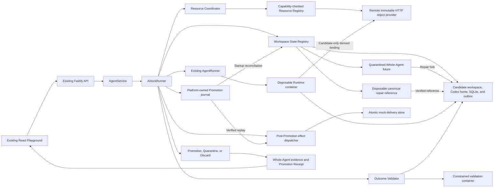
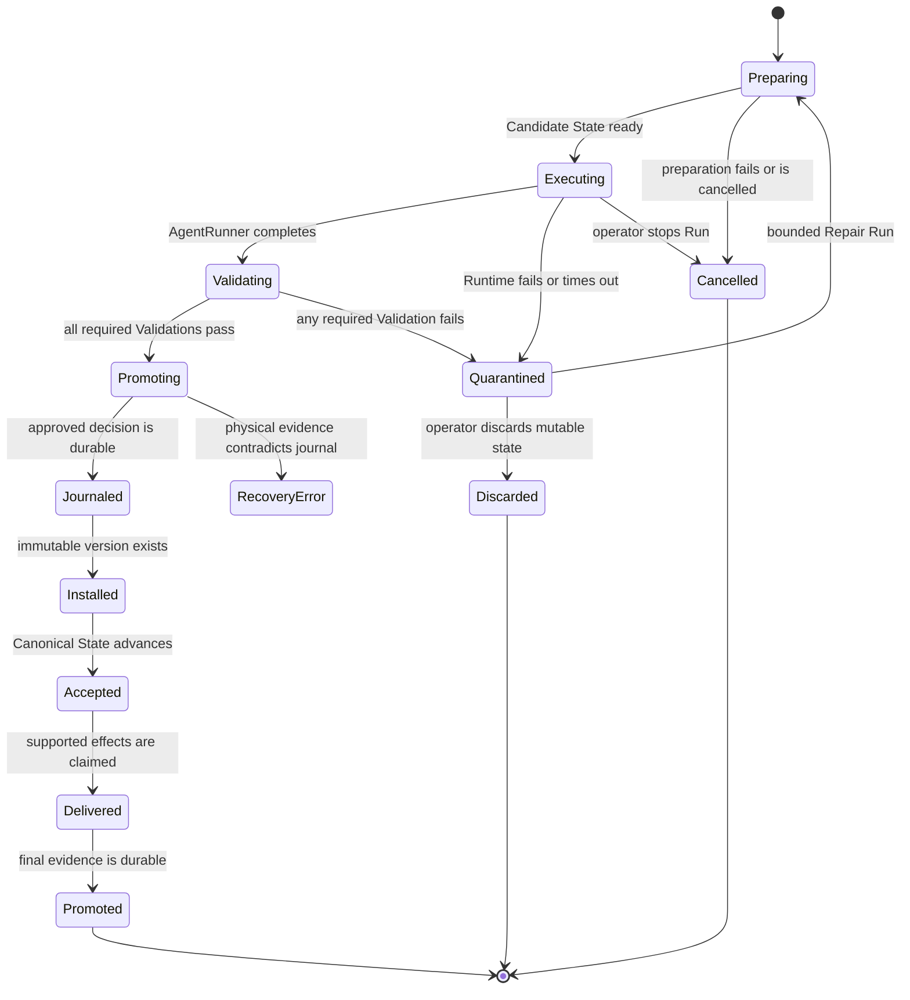

# Agent Airlock architecture

## Architectural intent

Agent Airlock adds one transactional execution seam around the starter kit's existing `AgentRunner` contract.
The control plane continues to own Agent lifecycle and Run orchestration, while Airlock owns preparation, validation, promotion, quarantine, and recovery of mutable Agent state.

## Baseline observation

The original `AgentService` passed the persistent workspace path and canonical Codex thread directly to `AgentRunner`.
The original local Runtime also bind-mounted that workspace and one shared Codex home as writable container paths.
Phase 1 isolated workspace files, but the shared Codex home remained a hidden mutation path until Phase 3.

## Implemented Phase 8 architecture



## Primary seam

`AirlockRunner` remains compatible with the existing `AgentRunner` interface from `apps/server/src/types.ts:78`.
It substitutes Candidate State paths before delegating to the existing local-process or container implementation.
The wrapper returns bounded execution output plus transactional evidence required by `AgentService`.

The target caller-facing shape is intentionally small:

```ts
interface AirlockRunner {
  run(request: AirlockRunRequest): Promise<AirlockRunResult>;
  cancel(agentId: string): Promise<boolean>;
  isAvailable(): Promise<boolean>;
}
```

Preparation, workspace coordination, validators, and receipts remain inside the module.
Additional Transactional Resource Providers register at the composition root through the provider-neutral SDK without changing `AirlockRunner` lifecycle branches.
Repair preparation, ancestry, freshness checks, and discard remain inside the same Airlock boundary.
Promotion journaling, forward recovery, and bounded retention are implemented inside that boundary.

## State layout

ADR 0002 selects immutable state-version directories with an atomically replaced canonical manifest.
ADR 0005 makes the workspace and Codex home one versioned Whole-Agent state:

```text
workspaces/
├── .resource-registry.json
├── .registry-transitions/<agent-id>.json
├── <agent-id>/
│   ├── canonical.json
│   └── versions/<state-id>/
│       ├── candidate.json (promoted Runs only)
│       ├── workspace/
│       │   └── .airlock/demo.sqlite
│       ├── codex-home/
│       ├── outbox/intents.jsonl
│       └── resources/<provider-id>/
├── .candidates/<run-id>/
│   ├── candidate.json
│   ├── workspace/
│   │   └── .airlock/demo.sqlite
│   ├── codex-home/
│   ├── outbox/
│   ├── resources/<provider-id>/
│   └── repair-reference/ (Repair Runs only, removed before Promotion)
└── .quarantine/<run-id>/
    ├── candidate.json
    ├── workspace/
    ├── codex-home/
    ├── outbox/intents.jsonl
    └── resources/<provider-id>/
```

`canonical.json` schema 4 identifies the accepted workspace path, Codex home path, Codex thread identifier, sorted provider version vector, built-in resource fingerprints, and composite state fingerprint.
`.resource-registry.json` records the accepted additive provider contract set and its monotonic generation.
Each `.registry-transitions/<agent-id>.json` record binds one verified provider addition to exact source and target state identifiers, built-in hashes, provider vectors, and registry generation before canonical advancement.
Recovery gives that journal no deletion authority until its exact schema, deterministic transition and target identifiers, additive evolution, credential-free verification set, and source and target fingerprints have all been validated.
Provider onboarding copies the complete immutable source state into a new immutable target, changes only the provider vector and composite fingerprint, and atomically replaces `canonical.json` after the target is verified.
Startup removes an unaccepted target or recognizes an exact already-accepted target before completing the transition.
The registry generation advances only after every existing Agent converges.
An unresolved Promotion from the prior generation prevents both Registry Transition execution and generation commit.
Agent creation and new ordinary or Repair Runs remain unavailable while that generation is uncommitted, preventing a partially onboarded provider set from becoming an execution boundary.
Creating the first Agent after a provider contract is registered performs the same exact immutable-source reconciliation before writing that Agent's initial canonical manifest.
A Candidate State is mutable only while its Run Transaction is active.
A promoted state version becomes immutable and may be used as the source for a later candidate.
Airlock verifies the workspace hash, session hash, and composite hash whenever Canonical State is resolved.
Candidate preparation copies both resources and refreshes only the generated provider configuration file from a platform-owned template.
Promotion moves the complete candidate root before one atomic manifest replacement, while Quarantine preserves the same complete root without changing the manifest.
An approved Agent Run records a Promotion journal outside every Runtime mount before the candidate root moves.
Repair copies a selected Quarantine into a new Candidate State, resumes its rejected Codex thread, creates a fresh empty outbox, and adds a disposable copy of the exact matching Canonical workspace as a repair reference.
The container Runtime mounts that reference read-only, and every provider must pass a required reference-integrity Validation before Promotion.
Airlock removes the reference before installing the repaired immutable version.
Discard removes only the internally resolved mutable Quarantine root and retains bounded evidence in the control-plane store.
`npm run test:codex-session-container` reproduces the pinned CLI storage boundary with container networking disabled and a fake credential.

The platform data layout adds one journal record per approved Run:

```text
APP_DATA_DIR/
├── launchpad.json
├── mock-deliveries.json
└── promotion-journal/<run-id>.json
```

Each record advances atomically through `validated`, `version-installed`, `canonical-advanced`, `effects-delivered`, and `completed`.
Provider Promotion plans, exact target versions, Capability Claims, and bounded lifecycle events are part of the same record.
The record contains bounded redacted transaction evidence and a neutral recovery result, not a duplicate of arbitrary Runtime output.

## Run Transaction lifecycle



Repair may start only when the selected Quarantine is available, its recorded Canonical State still exactly matches current reality, its parent has no existing repair child, and the configured ancestry bound is not exhausted.
Each Repair Run uses the original snapshotted Outcome Contract and follows the ordinary execution, Validation, Promotion, and Quarantine path.
Server startup reconciles journaled Promotions before generic active-Run handling.
An interrupted pre-decision Candidate is retained in Quarantine when its manifest is valid and is cancelled only when no Candidate exists.

## Outcome Contract evaluation

Validation proceeds in a deterministic order so evidence remains understandable:

1. Validate candidate path containment and symlink safety.
2. Calculate the bounded workspace and resource change set.
3. Reject changes to protected paths.
4. Confirm required paths and structural invariants.
5. Enforce change-count and added-byte limits.
6. Scan changed content for configured secret patterns.
7. Execute operator-defined validation commands in a constrained container.
All required Validations must pass before promotion begins.
The Candidate Codex home is also rejected before Promotion if it contains any symbolic link or if the returned thread has no matching rollout artifact.

Outcome Contract schema version 1 is a bounded data model rather than a policy language.
Its default requires `AGENTS.md` and `README.md`, protects `AGENTS.md`, limits a Run to 200 changed files and 2 MiB of candidate payload across added or modified files, scans for Ark key assignments and bearer tokens, and defines no command Validations until the operator adds them.
The complete contract is snapshotted into the Run Transaction, so a later contract update cannot change a historical decision.
Operator-defined commands run against disposable Candidate State copies in fresh containers with no network, no application credentials, a read-only root, dropped capabilities, and resource limits.
Command build artifacts are deleted with the validation copy and can never enter Promotion.

Candidate inventory is limited to 10,000 entries and persisted change evidence is limited to 200 paths.
Changed files larger than 1 MiB fail the secret scan.
Command output is terminated above 65,536 bytes, redacted, and persisted up to 16,384 bytes.
Command duration is bounded by the contract between 1 second and 300 seconds.

## Transactional Resources

Phase 8 implements a provider-neutral lifecycle package and a trusted core coordinator:

```ts
interface TransactionalResourceProvider {
  readonly manifest: ResourceProviderManifest;
  prepare(context: ResourcePrepareContext): Promise<PreparedResource>;
  describe(context: ResourceCandidateContext): Promise<ResourceChangeEvidence>;
  validate(context: ResourceCandidateContext): Promise<ResourceValidationEvidence[]>;
  planPromotion(context: ResourceCandidateContext): Promise<ResourcePromotionPlan>;
  promote(context: ResourcePromotionContext): Promise<ResourceVersionReference>;
  quarantine(context: ResourceQuarantineContext): Promise<ResourceQuarantineHandle>;
  discard(context: ResourceDiscardContext): Promise<ResourceDiscardResult>;
  reconcile(context: ResourceReconcileContext): Promise<ResourceReconciliationResult>;
}
```

Workspace, Codex Session, SQLite, and External Action Intent behavior are implemented in Phase 4.
SQLite lives inside the versioned workspace and receives a semantic snapshot in addition to the workspace fingerprint.
The outbox is a separate candidate-owned mount so a prior accepted intent is never copied into the next candidate as a new request.

Every registered Phase 8 provider is required and must pass exact capability eligibility at startup.
Required Phase 8 providers must use `canonical-manifest` Promotion visibility.
Claims such as post-Promotion reconciliation remain representable in the SDK but are not admissible for the required all-or-nothing composition.
The core calls providers in stable provider-identifier order and derives both `AIRLOCK_RESOURCE_<PROVIDER>_PATH` and `/airlock/resources/<provider-id>/<relative-path>` from validated identifiers.
The Runtime receives only Candidate-local bindings and never a provider credential, host service object, or mutable Canonical path.
Composition rejects an access claim the selected Runtime cannot enforce, including read-only provider bindings in local-process mode.
After Runtime exit, the core rescans each provider root for symbolic links and re-resolves the binding before any trusted provider hook can inspect Candidate content.

`canonical-manifest` visibility means that an immutable provider version becomes accepted only when the Airlock manifest names its exact version identifier and fingerprint.
The HTTP object provider uses that mode and does not advance a provider-native mutable pointer.
Airlock therefore provides one recoverable acceptance decision without claiming distributed atomic commit across the filesystem and remote service.

Provider preparation failure triggers evidence-preserving Discard before Runtime.
Accepted provider preparation, Quarantine, and Discard results are persisted incrementally so partial multi-provider progress survives a later failure.
Prepare replay and null-handle Discard are Run-scoped, allowing recovery when a provider created remote state but its response was lost.
Any required provider Validation failure quarantines every built-in and registered resource under one disposition.
The Promotion journal records provider plans before immutable installation, and restart reconciliation verifies the exact installed fingerprint before canonical advancement.
Historical Promotion recovery selects the exact provider subset persisted in that plan, so adding provider B cannot strand a transaction created under `{}` or `{A}`.
Provider Discard events are persisted before local mutable state is removed so an interrupted cleanup can converge without inventing success.
Cancellation with an unavailable provider Discard moves the complete local Candidate into cleanup-only Quarantine rather than deleting its recovery handle.
Retained Quarantine cleanup likewise uses its persisted historical provider subset and never invokes a provider that was added after the Run.

An existing deployment onboards a provider through an additive Registry Transition.
The coordinator reconciles the exact configured initial version and fingerprint before the workspace manager writes a transition plan.
Provider removal, provider identity replacement, and Capability Claim replacement are rejected because Phase 8 does not yet define export-and-retire semantics.

## External Action Intent outbox

The Agent submits the strict `demo.notification.requested` type through the path named by `AIRLOCK_OUTBOX_PATH`.
The control plane validates the JSONL file after Runtime exit and before Promotion.
The complete candidate, including the validated outbox, becomes immutable before the dispatcher runs.
The dispatcher verifies the new canonical state, atomically claims the mock effect by stable idempotency key, and records a bounded receipt.

Duplicate and concurrent dispatch attempts create one local mock effect and return the same receipt.
This exactly-once claim does not extend beyond the atomic mock consumer.
The POC does not intercept arbitrary network traffic from the Agent Runtime.

## Persistence model

The version 10 JSON store remains the control-plane metadata source for Agents, messages, Runs, Outcome Contracts, Candidate Sets, Assurance Proposals, and operator-visible evidence.
Immutable state versions and quarantined candidates live on disk outside the JSON document.
Promotion moves the complete workspace and Codex-session candidate to an immutable version and atomically replaces `canonical.json`.
Startup reconciliation treats an ordinary Run journal or the conjunction of a replayed Candidate Set decision and its matching journal authority as the approved decision, the immutable version as installed state, `canonical.json` as accepted reality, and the atomic mock-delivery store as effect truth.
It verifies physical fingerprints before repairing cached workspace, state, thread, Run, message, receipt, and effect metadata in the JSON store.
Phase 5 persists repair ancestry, mutable Quarantine availability, discard timestamps, and the same lineage in each Promotion Receipt.
Phase 6 persists Promotion journal position, recovered-after-restart evidence, and bounded recovery errors.
Phase 8 persists provider resource records, Capability Claims, immutable source and installed versions, Validation evidence, Quarantine handles, dispositions, and bounded lifecycle events.
Phase 9 persists exact Candidate Set source and contract snapshots, per-competitor Run links, seals, bounded criterion inputs, deterministic scorecards, one-winner or no-winner Selection Decisions, and loser cleanup progress.
Promotion journal schema 2 additionally persists the exact Candidate Set winner authority, including decision and seal digests, and startup validates it before physical recovery.
Phase 10 persists versioned Assurance evidence, deterministic monotonic proposals, historical simulation results, explicit operator decisions, and append-only Outcome Contract history.
Phase 11 derives Portable Promotion Envelopes from complete versioned durable evidence and requires a separate append-only Decision Authority record captured before terminal control-plane metadata.
One immutable Candidate Set Decision Authority is captured before mutable Selection, and final Candidate Set-bound Run authorities are published before that Selection becomes visible.
Immutable historical Canonical manifests let export recompute the complete physical Whole-Agent state for every referenced accepted state identifier.
Terminal progress is withheld from the mutable store until the child Run and corresponding lifecycle projection are ready, and Candidate Set terminal branches publish their own authority without completion-time synthesis.
The Agent remains busy until the aggregate Candidate Set finishes Selection, winner Promotion, and loser cleanup.
Promotion and Registry Transition historical manifests reuse timestamps from their durable Candidate or transition source so interruption recovery derives byte-identical immutable content.
Receipt and transparency private keys remain separate operator-owned files, and the optional transparency log persists only portable receipt digests and signed checkpoint evidence.

Schema evolution must increment the database version and include a tested migration path from the starter kit's version 1 data.

## Failure semantics

| Failure | Required result |
| --- | --- |
| Candidate preparation fails | Do not invoke the AgentRunner and leave Canonical State unchanged. |
| AgentRunner fails or times out | Quarantine bounded evidence and leave Canonical State unchanged. |
| Validation fails | Quarantine Candidate State and identify the failing Validation. |
| Repair source is stale, missing, exhausted, or already has a child | Reject the operation before scheduling and leave both realities unchanged. |
| Repair reference changes | Fail its required Validation and quarantine the Repair Run. |
| Operator discards Quarantine | Remove only mutable Quarantine state and retain bounded evidence with `discarded` disposition. |
| Evidence persistence fails before promotion | Fail closed without promotion. |
| Process stops after an approved journal | Reconcile the same decision forward to one target version and at most one supported mock effect. |
| Journal and physical state contradict | Preserve current Canonical State, dispatch no new effect, and surface `recovery-error`. |
| Candidate or Quarantine retention expires | Remove only unprotected mutable state and retain bounded control-plane evidence. |
| Resource Provider preparation fails | Do not invoke Runtime, discard every possible provider Candidate idempotently, and retain a composite Quarantine when cleanup cannot finish. |
| Provider onboarding source cannot be verified | Preserve the prior canonical manifest and Resource Registry generation and place the affected Agent in an explicit error state. |
| Registry Transition is interrupted | Reconcile the journal against exact installed and canonical fingerprints, then either retry from the prior state or finish the accepted transition. |
| Registry Transition journal is malformed or forged | Reject it before deleting any state or rewriting Canonical State. |
| Prior-generation Promotion recovery fails | Preserve its historical state, defer every Registry Transition and registry-generation commit, and surface `recovery-error`. |
| Provider removal or contract replacement is configured | Reject the non-additive registry evolution before changing Canonical State. |
| Required provider Validation fails | Quarantine every built-in and provider resource while leaving the canonical manifest unchanged. |
| Provider Promotion or reconciliation contradicts the durable plan | Preserve current Canonical State and surface `recovery-error`. |
| Provider cleanup is unavailable | Retain local mutable state and retry before removal. |
| Local Quarantine is missing without complete provider Discard evidence | Fail recovery closed and do not claim remote cleanup. |
| Candidate Set admission or preparation conflicts with another Agent operation | Reject the set before sibling Runtime execution and leave Canonical State unchanged. |
| A competitor fails required Validation | Exclude that Candidate from Selection regardless of its ranking inputs and dispatch none of its effects. |
| Every competitor is invalid or incomplete | Persist `no-winner`, leave Canonical State unchanged, and reconcile every loser disposition. |
| Process stops before Candidate Set Selection | Preserve complete seals, mark partial evaluations ineligible without replaying Runtime, and deterministically select only from persisted evidence. |
| Process stops after immutable Candidate Set Decision Authority but before mutable Selection | Restore the exact authorized Selection and never recompute a different winner. |
| Process stops after Candidate Set Selection | Resume Promotion for only the exact persisted winner, then reconcile loser cleanup idempotently. |
| Candidate Set and Promotion-journal authorities disagree | Reject physical Promotion recovery before installation, canonical advancement, or effect dispatch and surface `recovery-error`. |
| Selected Candidate seal, source, resource fingerprint, or Promotion evidence contradicts physical state | Surface `recovery-error`, preserve evidence, dispatch no new effect, and never select a runner-up. |
| A new provider is configured while an older Candidate Set is unresolved | Recover the Candidate Set with its historical provider subset before Registry Transition or generation commit. |
| Candidate Set recovery fails while a new provider is configured | Keep the prior Resource Registry generation authoritative and refuse onboarding or generation commit. |
| Portable receipt evidence is incomplete, legacy, or contradictory | Return a retryable conflict without signing an interpretation or changing Canonical State. |
| Terminal Run authority exists while its mutable Run projection still appears active | Verify stable identity and required physical Quarantine, then replay the exact terminal transaction or enter `recovery-error`. |
| Portable Decision Authority or a historical Canonical manifest is missing or contradictory | Fail export closed without reconstructing authority from mutable database content. |
| Portable signing identity is missing, substituted, malformed, or weakly permissioned | Fail export closed without revealing a local path or silently rotating the identity. |
| Optional transparency state is malformed | Fail anchored export closed while leaving signature-only export available. |

The exact recovery sequence and fault matrix are documented in the [recovery guide](../../docs/RECOVERY.md).

The implemented Phase 9 split between reversible Candidate evaluation, deterministic one-winner Selection, and irreversible Promotion is documented in the [Competing Futures architecture](../../docs/architecture/competing-futures.md) and ADR 0011.
The implemented Phase 10 separation between evidence-backed assurance advice and operator policy authority is documented in the [Adaptive Assurance architecture](../../docs/architecture/adaptive-assurance.md) and ADR 0012.
The implemented Phase 11 signed receipt and optional anchoring protocol is documented in the [Portable Trust architecture](../../docs/architecture/portable-trust.md) and ADR 0013.
The authority-first Selection, terminal replay, and append-only transparency lock-turn decisions are documented in [ADR 0014](../../docs/adr/0014-publish-selection-and-terminal-authority-before-mutable-projections.md).

## Live ModelArk judge conformance

- [x] Add a mutually exclusive live ModelArk demo profile that requires loopback control-plane binding, HTTPS provider inference, real Codex, and a container Runtime.
- [x] Add a persistent one-command launcher with a marker-protected reset root and fail-fast provider preflight.
- [x] Seed one `Live ModelArk Proof` Agent with an exact file-and-database Outcome Contract plus one typed deferred effect.
- [x] Add a one-action judge guide and reuse the compact independent proof surface after a terminal decision.
- [x] Keep deterministic fixture proof and live provider proof visibly separate.
- [x] Force the guided provider preflight even when the generic POC skip flag is present.
- [x] Test exact Agent seeding, exact Outcome Contract installation, restart reuse, policy-drift refusal, and the one-click browser request.
- [x] Require the reproducible real-Codex and credentialed ModelArk judge paths to prove workspace, Codex session, SQLite, and external actions under one Promotion decision.
- [x] Automatically preserve the next complete live Promotion as a private credential-free signed packet and verify it offline without weakening the current-provider preflight.
- [x] Gate both judge launchers on a reproducible credential-safe readiness report that never returns the configured provider URL or model identifier.
- [x] Require live preflight success to include non-empty assistant `output_text` so an HTTP success or provider `completed` status alone cannot unlock the judge path.
- [x] Carry a fresh credential-free preflight handoff into server admission, visible readiness, and signed execution-profile evidence while keeping it explicitly an Airlock attestation.
- [ ] Rerun the complete provider-backed browser transaction when free ModelArk capacity is available.

## Phase 12 federated acceptance

- [x] Define canonical workspace change-set and signed Federated Work Bundle protocols with strict path, byte, digest, state-transition, and signature binding.
- [x] Persist immutable receiver-controlled Federated Admission Policy generations with exact chained activation and deterministic fail-closed evaluation.
- [x] Publish digest-protected Admission Records before Candidate materialization and pin redacted receiver evidence plus the evaluated policy generation.
- [x] Recover plan, record publication, Candidate creation, Candidate journaling, and completed replay without creating a second Candidate.
- [x] Apply the verified workspace artifact through the production WorkspaceManager Candidate boundary.
- [x] Run receiver-owned Outcome Contract Validation and local Promotion for admitted work.
- [x] Prove credential-free export, transfer, admission, Validation, and Promotion between two independently configured Airlock instances through the browser.

## Phase 19 receiver custody acceptance

- [x] Define a strict version 1 receiver custody manifest, packet, typed record roles, and custody-specific signature domain.
- [x] Retain the exact producer Federated Work Bundle and receiver Admission and Approval evidence required to close the path after restart.
- [x] Export one receiver-signed packet only for a terminal promoted or quarantined federated Run with unambiguous durable authority.
- [x] Carry a privacy-bounded terminal Decision Authority commitment instead of the raw Run Transaction or Runtime evidence.
- [x] Verify producer and receiver signatures, exact record commitments, reviewed-context binding, terminal authority, Outcome Contract, Validation root, disposition, and Canonical State handoff offline.
- [x] Keep producer and receiver organizational trust under distinct evaluator-controlled policies that remain outside the packet.
- [x] Verify and download the packet independently in the browser and prove the real two-instance path at a 390 CSS pixel viewport.
- [x] Reject omitted, duplicated, uncommitted, substituted, role-confused, unsafe, contradictory, and unsupported evidence without exporting a partial closure.

## Phase 20 offline custody proof room

- [x] Map the existing zero-upload verifier, custody checks, trust-policy flow, mobile layout, and missing custody-file dispatch.
- [x] Define a protocol-owned verified-story projection that remains absent for invalid evidence.
- [x] Separate mathematical validity, evidence completeness, and evaluator-controlled producer and receiver trust in the interaction model.
- [x] Define promoted, quarantined, invalid, tampered, trust-unevaluated, and role-trust screen states.
- [x] Bound three disposable in-memory tamper demonstrations and their expected first failed commitments.
- [x] Extend the receiver custody browser report with the verified-story projection.
- [x] Add receiver custody import and the five-node causal story to the independent verifier.
- [x] Add separate producer and receiver evaluator trust controls.
- [x] Add the bounded tamper lab with immutable-original reset behavior.
- [x] Prove backend-disconnected verification, mobile presentation, two-instance download reopening, and hosted release gates.

## Phase 21 one-command live ModelArk proof

- [x] Map the existing preflight, managed launcher, production Chrome action, Run authority, signed packet capture, and offline verifier seams.
- [x] Define the eight-gate success contract, safe failure taxonomy, privacy boundary, result schema, cleanup model, and release matrix.
- [x] Extract structured recorded-evidence verification behind the existing human CLI.
- [x] Add the browser-driven proof core, credential-safe result capsule, and one-command entry point.
- [x] Add deterministic tests for success, Quarantine, timeout, browser failure, invalid evidence, interruption, redaction, permissions, and preservation of prior success.
- [x] Align the visible product brand with Agent Airlock for recording consistency.
- [x] Pass the complete local quality and real Runtime regression gates.
- [x] Pass the exact hosted release workflow on the delivered Phase 21 revision.
- [ ] Complete the live provider-backed browser proof while Free Credits Only Mode has available capacity.

## Phase 22 canonical real Runtime recording proof

The recording boundary is resolved by [Define the recording-grade real Runtime proof contract](https://github.com/Kk120306/agent-airlock/issues/36).
Implementation and acceptance are tracked by [Build the recording-grade real Runtime proof path](https://github.com/Kk120306/agent-airlock/issues/37).

- [x] Fix the core story on the existing real Codex container Runtime with a local deterministic Responses fixture.
- [x] Keep the recording independent of ModelArk capacity, federation, receiver custody, blockchain publication, Competing Futures, Adaptive Assurance, and every new authority.
- [x] Add `npm run prove:runtime -- --reset --headed` as the canonical recording entry point without replacing the persistent `npm run demo:runtime -- --reset` path.
- [x] Open production Chrome at 1280 by 720 and present one primary `Prove this release is safe` action.
- [x] Snapshot durable Run authority at proof start and require exactly three fresh Runs afterward.
- [x] Require the ordered dispositions valid Promotion, destructive Quarantine, and promoted Repair from that retained Quarantine.
- [x] Derive the Outcome Brief only from persisted Run evidence, four-resource dispositions, Validation results, Canonical fingerprints, effect receipts, and Repair lineage.
- [x] Withhold the final verdict until the quarantined parent and promoted Repair verify as one signed two-decision chain with an intact Canonical State handoff.
- [x] Open that exact chain in the existing zero-upload verifier, deny every HTTP and WebSocket request from before its first opening through browser close, and prove `0 API calls` plus `2 signed decisions linked` without a manual file round trip.
- [x] Install one owner-only content-addressed signed chain, then atomically commit the bounded credential-free safe capsule that names it while retaining proof ownership through publication.
- [x] Reject reused Runs, wrong Run count or order, wrong disposition, missing resource evidence, early effects, broken lineage, invalid chain, viewport failure, timeout, and interruption without overwriting the last successful artifact pair.
- [x] Close only runner-owned browser and server processes on success, failure, timeout, or signal.
- [x] Fail closed without deleting an existing proof lease or legacy publication lock, and preserve a valid capsule when proof-ownership cleanup fails after its atomic rename.
- [x] Keep the absolute recording deadline armed through browser shutdown and exact pointer-outcome reconciliation.
- [x] Preserve 15 seconds of release headroom beyond the maximum Run polling and full visible-frame commitments.
- [x] Purge abandoned proof sessions only through descriptor-anchored validation and deletion after confirming their recorded owner is no longer alive.
- [x] Prove every required action and verdict at 1280 by 720 and 390 CSS pixels without horizontal overflow.
- [x] Pass focused runner and browser tests, `npm run check`, the real CodeJam Runtime proof, and existing Portable Trust gates on the final revision.

## Trust boundaries

- The Agent Runtime is untrusted and receives only the Candidate workspace, Candidate Codex home, and Candidate outbox as writable state.
- A Repair Runtime may read a disposable canonical workspace copy, but it never receives a writable path to the real Canonical State.
- Validation code from the candidate project is untrusted and runs from a disposable copy inside a constrained container.
- The Fastify control plane and Airlock state manager form the trusted POC boundary.
- The existing ordinary container remains a POC isolation mechanism rather than a hardened multi-tenant sandbox.
- The implemented outbox protects only external actions routed through its interface.
- The platform-owned mock delivery store is never mounted into the Runtime.
- The platform-owned Promotion journal is never mounted into the Runtime.
- Resource Providers run inside the trusted control plane, receive bounded lifecycle context, and never receive the application store or arbitrary environment variables.
- Provider Runtime bindings are rooted under the isolated Candidate and are derived by the trusted core.
- Resource Provider source verification and Registry Transition journals remain inside the trusted control plane and are never exposed to Runtime.
- Candidate Set orchestration and Selection remain inside the trusted control plane, while every competitor Runtime receives only its own Candidate bindings and the shared bounded objective.
- Portable receipt construction runs in the trusted control plane and accepts only the strict versioned durable evidence projection, never mutable Candidate files, Runtime output, environment values, or provider-private state.
- The portable signing key and non-secret identity marker remain outside Runtime, the control-plane database, portable envelopes, and browser responses.
- An independent verifier trusts the envelope's mathematics but must apply its own organizational policy to the included public key identity.
- The optional local transparency log can provide witnessed append-only evidence only to observers that retain and compare checkpoints.
- The optional EVM encoder is a network-free formatting boundary and has no wallet, RPC, publication, confirmation, timestamp, or Promotion authority.
- The deterministic Selection engine accepts only persisted trusted evidence and has no access to time, randomness, locale ordering, network, filesystem, environment variables, or model judgment.
- A sealed Candidate is a commitment for later re-verification, not authority to promote itself.

## Evidence model

Each Run Transaction records:

- Agent, Run, Candidate State, Canonical State, and Outcome Contract identifiers.
- Lifecycle timestamps and terminal disposition.
- Bounded resource change summaries.
- Validation names, statuses, durations, and redacted output.
- Resulting canonical version for promoted Runs.
- Independent workspace and Agent-memory fingerprints with one shared terminal disposition.
- SQLite before, candidate, and final semantic snapshots.
- Typed intent identities, idempotency keys, statuses, and bounded post-Promotion delivery receipts.
- Root Run identifier, parent Run identifier, repair depth, configured depth bound, and mutable Quarantine availability.
- Monotonic Promotion journal phase, recovered-after-restart status, and bounded fail-closed recovery error.
- Provider identity, Capability Claim, immutable source and target references, fingerprint transition, bounded Validation evidence, Quarantine handle, disposition, and lifecycle events.
- Candidate Set identifier, exact shared source, snapshotted Outcome and Selection Contracts, competitor Run links, bounded integer criterion values, exclusions, ordered scorecard, stable tie-break, Selection Decision digest, winner, and loser dispositions.

## Open architectural decisions

The [Wayfinder map](https://github.com/Kk120306/agent-airlock/issues/1) owns the unresolved judging cutoff decision.
Codex session isolation is resolved by ADR 0005.
External action ordering and idempotency are resolved by ADR 0006.
Repair ancestry, canonical freshness, fresh outbox, canonical reference, and discard semantics are resolved by ADR 0007.
Promotion journal ordering, forward recovery, contradiction handling, and bounded retention are resolved by ADR 0008.
The public Resource Provider contract, capability eligibility, and canonical-manifest consistency model are resolved by ADR 0010.
Outcome Contract semantics and Validation containment are resolved by ADR 0003 and ADR 0004.
