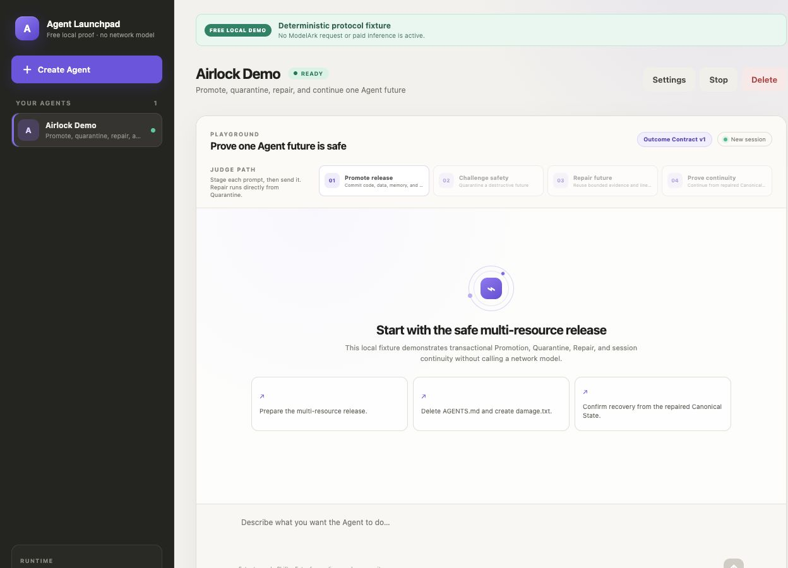
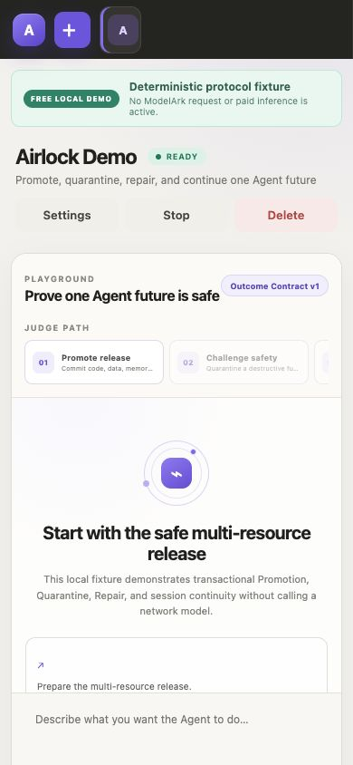
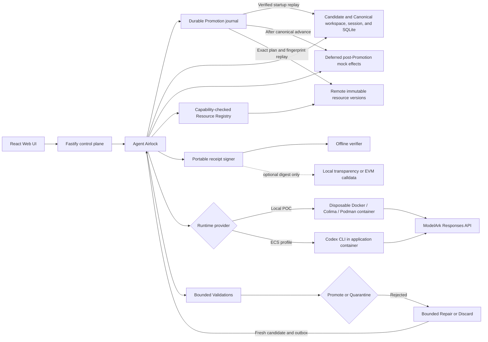

# Agent Airlock

Agent Airlock is transactional execution middleware built inside the CodeJam Agent Launchpad starter kit.
Every Agent task runs against isolated Candidate State, and only an outcome that satisfies its versioned Outcome Contract may become Canonical State.
Rejected work remains inspectable and can be repaired without contaminating accepted files, Agent memory, SQLite data, or supported external actions.

> Agents may explore many futures, but only validated futures become reality.

Read the [product requirements](docs/product/PRD.md), [outcome roadmap](docs/product/OUTCOME_ROADMAP.md), [architecture](docs/architecture/agent-airlock.md), [Phase 0-2 plan](.omx/plans/phases-0-2-execution.md), [Phase 3-4 plan](.omx/plans/phases-3-4-execution.md), [Phase 5-7 plan](.omx/plans/phases-5-7-execution.md), and [Phase 8-11 plan](.omx/plans/phases-8-11-execution.md) before extending Airlock.
Unresolved product and architecture decisions are coordinated through the [Agent Airlock Wayfinder map](https://github.com/Kk120306/agent-airlock/issues/1).

## Free one-command demo

The judge-ready demo uses the real production React, Fastify, Airlock, workspace, SQLite, outbox, journal, and persistence paths with a deterministic local Codex protocol fixture.
It binds only to loopback and makes no ModelArk request or paid inference call.

```bash
npm install
npm run demo -- --reset
```

Open <http://127.0.0.1:3199> and follow the numbered buttons in the `Judge path` strip.
The complete path promotes a four-resource release, quarantines a destructive future, repairs that retained future, and proves session continuity from the repaired Canonical State.
Restart with `npm run demo` to preserve the story, or use `npm run demo -- --reset` for a clean rehearsal.

ModelArk credentials are needed only for the separate live conformance path described below.
The project will not silently switch the deterministic demo to paid inference.

> [!WARNING]
> This is a single-user proof of concept, not a production multi-tenant sandbox.
> Do not use production data or credentials.
> See [SECURITY.md](SECURITY.md).

## Phase 8 provider extension demo

Phase 8 adds a capability-checked Transactional Resource SDK and a credential-free remote versioned-object provider without changing the frozen Phase 7 judge path.
The provider runs as a separate local HTTP process and its Candidate-only `object.json` binding participates in the same Promotion, Quarantine, Discard, Repair, journal, and canonical fingerprint decision as the four built-in resources.
When a provider is added to an existing deployment, Airlock verifies its exact immutable source and completes a crash-recoverable additive Registry Transition for every Agent before accepting the next registry generation.
Interrupted older Promotions and retained Quarantines continue through their persisted historical provider subset before onboarding can advance.
Strict journal admission prevents a malformed transition record from authorizing state deletion, and every provider-controlled evidence string is bounded and credential-checked before persistence or display.

```bash
npm run demo:phase8 -- --reset
```

Open <http://127.0.0.1:3199> and complete the first two guided steps.
The `Transactional Resources` panel shows the provider identity, immutable source and target fingerprints, disposition, Capability Claim, bounded Validation evidence, and lifecycle evidence.
No ModelArk key, provider credential, blockchain transaction, or paid request is used.

Provider authors can execute the shared contract directly:

```bash
npm run check:phase8:conformance
```

The command emits readable case results and a schema-versioned JSON conformance report.

## Phase 9 Competing Futures demo

Phase 9 lets one operator objective explore three isolated Candidate States from the same exact Canonical State and Outcome Contract.
Required Validation is an absolute eligibility boundary, so a fast unsafe future cannot win regardless of its score.
Airlock persists a deterministic integer scorecard and exact winner before the existing Promotion journal begins, then promotes only that sealed winner and retains or discards every loser according to the operator's snapshotted policy.
Admission reserves the aggregate token budget across every trusted Runtime before execution, requires a Runner capability that enforces each allowance before or at inference, and rejects unsupported production Runners before any competitor starts.
The bundled zero-cost demo fixture enforces the transported allowance before simulated execution, while the ordinary Codex and container Runners remain unavailable for Competing Futures until their provider path supplies an equivalent hard total-token control.
The Playground reads that capability from `/api/system`, disables Explore futures when unavailable, and explains the provider-boundary requirement inline instead of offering an action that can only fail.
The versioned Promotion journal binds the Candidate Set, decision digest, winner Run, seal digest, and source, so restart recovery cannot reinterpret the selected future.
If the selected winner changes after sealing, Airlock fails recovery closed and never falls through to a runner-up.

```bash
npm run demo:phase9 -- --reset
```

Open <http://127.0.0.1:3199>, select an Agent, and choose `Explore futures`.
The deterministic local fixture compares `unsafe-fast`, `broad-valid`, and `focused-valid`, explains every exclusion and normalized score, and promotes `focused-valid` with exactly one supported effect.
The launcher includes the Phase 8 remote-object fixture and makes no ModelArk request, paid inference call, provider purchase, or public blockchain transaction.

Run the focused no-cost contract with:

```bash
npm run check:phase9:selection
npm run check:phase9:boundaries
```

## Phase 10 Adaptive Assurance demo

Phase 10 turns recurring bounded Run evidence into deterministic Outcome Contract advice without giving the detector authority to change policy.
Every suggestion identifies its exact base contract, cites distinct root Run lineages and evidence hashes, and simulates every bounded historical result as exact, conservative, or unknown.
Missing evidence is never guessed, arbitrary commands and regular expressions cannot enter generated advice, and a stale proposal cannot be silently rebased.
Only an explicit operator acceptance can atomically create the next contract version.
Rejection leaves policy unchanged, and rollback creates another immutable version while preserving every historical Run, contract, proposal, decision, and receipt.

```bash
npm run demo:phase10 -- --reset
```

Open <http://127.0.0.1:3199>, send `Delete README.md and record why.` three times, then open `Assurance` and select `Scan retained evidence`.
Inspect the proposed protection, three independent supporting lineages, exact historical impact, unknown inputs, and simulation digest before accepting or rejecting it.
The deterministic detector and simulator run in the trusted local control plane and make no ModelArk request, paid inference call, provider purchase, or public blockchain transaction.

Run the focused no-cost contract with:

```bash
npm run check:phase10:assurance
```

## Phase 11 Portable Trust demo

Phase 11 turns complete durable Run evidence into a strict Portable Promotion Envelope that can be verified without the Airlock server or database.
The envelope signs canonical receipt content with an operator-held Ed25519 key and can disclose selected redacted evidence through Merkle proofs without including unselected leaves.
Promoted Runs, retained or discarded Quarantines, Repair ancestry, exact Candidate Selection, and accepted Assurance provenance use the same bounded protocol.
The verification report separates mathematical integrity from unsupported claims about Runtime isolation, Validation correctness, signer trust, or policy sufficiency.
A valid signature proves that the included public key matches the signature over the exact receipt content.
It proves key possession, not the human or organization behind the key, and it does not make an incorrect statement true.

Every receipt necessarily includes stable Run and Agent identifiers, decision timestamps, state and resource fingerprints, and evidence commitments.
It never includes prompts, Runtime output, raw Validation output, file contents, environment values, credentials, local paths, or provider-private metadata.
Individual bounded redacted evidence leaves are additional opt-in disclosures.

```bash
npm run demo:phase11 -- --reset
```

Open <http://127.0.0.1:3199>, complete a guided Run, and use its `Portable Trust` panel.
The panel starts with no evidence disclosed, previews safe evidence identities, and regenerates after privacy choices change.
It downloads the independently verifiable envelope, optional local anchor proof, and optional offline EVM payload as separate bounded artifacts.
Optional local transparency adds a signed checkpoint and inclusion proof over the receipt digest.
Optional EVM output only encodes `anchor(bytes32)` calldata offline and performs no network request, wallet operation, transaction, or spend.
Use the signature alone for ordinary offline exchange with a known key.
Use independently retained local checkpoints when cooperating observers need evidence that one operator did not silently rewrite its published sequence.
Publish the digest to a shared public ledger only when mutually distrusting organizations need common publication evidence.
Neither a local checkpoint nor a blockchain publication becomes Promotion authority or proves that the Agent result is correct.

Install dependencies with Node.js 22+ and npm 10+.
The core browser gate also requires installed Google Chrome.
The complete release gate requires a Docker-compatible `docker` CLI, as provided by Docker Desktop, Docker Engine, or Colima.
Podman users must enable Docker CLI and Compose compatibility before running the aggregate gate.

Run the focused no-cost protocol, server, browser, and container contracts with:

```bash
npm run check:phase11:protocol
npm run test -w @launchpad/server -- --run src/phase-eleven-acceptance.test.ts
npm run test:phase11:ui
npm run check:phase11:docker
```

Run the inherited Phase 0 through Phase 11 core, production-image, and clean-clone release gate with:

```bash
npm run check:phase11
```

These commands require no ModelArk key, paid inference, provider purchase, wallet, RPC, or public blockchain.

## Screenshots

### Four-step judge path



### Mobile evidence



## Features

- React and TypeScript Web UI
- Agent create, edit, start, stop, delete, and multi-turn chat
- Fastify control plane with asynchronous Run state
- Transactional Agent workspaces and Codex sessions
- Validated SQLite snapshots and typed deferred notification intents
- Immutable Whole-Agent Candidate and Canonical versions with Promotion or Quarantine
- Versioned Outcome Contracts with bounded, redacted Validation evidence
- Compact Airlock timeline, four-resource disposition, change summary, canonical fingerprint, and Promotion Receipt
- Bounded Repair Runs that preserve useful quarantined work, resume rejected Agent memory, and use a fresh outbox
- Canonical freshness checks, receipt lineage, and idempotent Quarantine discard with retained evidence
- Durable five-phase Promotion journal with forward startup reconciliation and visible fail-closed errors
- Provider-neutral Transactional Resource SDK with strict Capability Claims and executable conformance
- Credential-free remote versioned-object provider with bounded HTTP, immutable versions, and forward reconciliation
- Compact provider registry evidence with explicit unsupported distributed-atomicity claims
- Additive provider onboarding with immutable-source verification, crash journaling, and generation-wide convergence
- Durable Candidate Sets with bounded sibling isolation, shared-source enforcement, and snapshotted Outcome Contracts
- Reversible sealed-Candidate evaluation before deterministic one-winner Selection and irreversible Promotion
- Explainable integer scorecards, absolute Validation eligibility, stable byte-order tie-breaking, and no automatic runner-up fallback
- Restart-safe winner Promotion and idempotent loser retention or Discard across historical provider generations
- Deterministic Assurance Proposals with lineage-deduplicated citations and exact, conservative, or unknown historical simulation
- Explicit operator acceptance, durable rejection, stale-base protection, immutable Outcome Contract history, and version-creating rollback
- Crash-recoverable Agent deletion with credential-free Run, Candidate Set, Assurance, contract-history, and receipt digests
- Strict canonical Portable Promotion Envelopes with Ed25519 signatures and independent offline verification
- Private-by-default Merkle evidence disclosure with exact Candidate Selection, accepted Assurance, and Repair ancestry commitments
- Fail-closed signing-key identity markers, historical rotation verification, and an operator rotation and compromise runbook
- Optional signed local transparency proofs and zero-network EVM calldata over receipt digests only
- Root-confined Candidate and Quarantine retention with active-Run protection
- Disposable Docker, Colima, or Podman container for each local turn
- Docker and Terraform deployment paths for Volcengine ECS

## Requirements

- Free demo: Node.js 22+, npm 10+, and installed Google Chrome for browser verification.
- Live ModelArk POC: the free-demo requirements plus Docker, Colima, or Podman and organizer-provided ModelArk credentials.

Codex CLI is included in the Runtime image and is not required on the host for the credentialed container path.
The deterministic demo uses the checked-in protocol fixture and does not require a container engine.

## Credentialed ModelArk browser SOP

Use this path only after organizer credentials arrive.
The free demo above is the default development and judging rehearsal path.

- Node.js 22+
- npm 10+
- Docker, Colima, or Podman
- A ModelArk API key and endpoint or model that supports the Responses API

The automated proof does not require ModelArk credentials or paid inference.
Run `npm run test:demo:e2e` to exercise the exact four-step production browser story locally.
Organizer-provided credentials are needed only for the final live ModelArk conformance journey.

### 1. Check the local tools

Install Node.js 22+ and one supported container engine, then verify them:

```bash
node --version
npm --version
docker --version        # Docker Desktop, Docker Engine, or Colima
podman --version        # Use this instead when running Podman
```

Only one container engine is required. Codex CLI is already included in the
Runtime image.

### 2. Clone the repository

```bash
git clone <repository-url> volc-agent-launchpad
cd volc-agent-launchpad
```

Skip this step when already working from the repository root.

### 3. Start the POC

```bash
cp .env.example .env
# Fill ARK_API_KEY, ARK_MODEL, and the region-matching ARK_BASE_URL.
npm run poc
```

The first run loads `.env`, installs Node.js dependencies, and builds the Runtime image.
Explicit process environment variables take precedence over `.env`.
The script automatically selects Docker, Colima, or Podman.

### 4. Open the browser

Visit <http://localhost:3000>, or open it from the terminal:

```bash
open http://localhost:3000       # macOS
xdg-open http://localhost:3000   # Linux desktop
```

In the Web UI:

1. Select **Create Agent**.
2. Enter a name, description, and workspace instructions.
3. Select **Create Agent** again.
4. Enter a task in the Playground, for example:

   ```text
   Create a TypeScript hello-world CLI, add a test, and run it.
   ```

The Agent can write files, run commands, and continue the same Codex session in
later messages.

### 5. Stop and resume

Press `Ctrl+C` in the startup terminal. The script removes temporary Runtime
containers but keeps Agent workspaces and conversations.

- macOS state: `~/.volc-agent-launchpad/`
- Linux state: `.local/`
- Custom location: set `LOCAL_POC_DATA_ROOT`

Run the same `npm run poc` command to continue later.

### Select a specific container engine

Force Podman when multiple engines are installed:

```bash
CONTAINER_ENGINE=podman \
ARK_API_KEY=your-ark-api-key \
ARK_MODEL=ep-your-endpoint-id \
npm run poc
```

Colima uses `CONTAINER_ENGINE=docker` because it exposes the Docker CLI.

For a clean Linux host, follow the
[rootless Podman setup](docs/LOCAL_POC.md#rootless-podman-on-linux).

## Docker Compose

Create and edit the configuration:

```bash
./scripts/bootstrap-local.sh
```

Required values in `.env`:

```dotenv
ARK_API_KEY=your-ark-api-key
ARK_MODEL=ep-your-endpoint-id
APP_AUTH_TOKEN=replace-with-at-least-24-random-characters
```

Start the application:

```bash
docker compose up --build
```

Open <http://localhost:3000>. Stop it without deleting Agent data:

```bash
docker compose down
```

## Development

```bash
npm install
cp .env.example .env
npm install --global @openai/codex@0.111.0
npm run dev
```

- Web UI: <http://localhost:5173>
- API: <http://localhost:3000>

Use local paths in `.env` when running outside Docker:

```dotenv
APP_DATA_DIR=.data
AGENT_WORKSPACE_ROOT=workspaces
CODEX_HOME=codex-home
```

## Deployment

- [Existing Linux ECS with Docker](docs/DEPLOYMENT.md#existing-linux-ecs)
- [Complete Volcengine environment with Terraform](docs/DEPLOYMENT.md#terraform-deployment)
- [Local Docker, Colima, and Podman details](docs/LOCAL_POC.md)

The existing-ECS script deploys from the current source tree:

```bash
cp .env.example .env.production
./scripts/deploy-existing-ecs.sh .env.production
```

The Terraform path provisions VPC, subnet, security group, ECS, and EIP:

```bash
cp deploy/volcengine/terraform.tfvars.example \
  deploy/volcengine/terraform.tfvars
./scripts/deploy-volcengine.sh
```

## Configuration

| Variable | Default | Purpose |
| --- | --- | --- |
| `ARK_API_KEY` | Required | Ark model API key. |
| `ARK_MODEL` | Required | Responses-capable endpoint or model ID. |
| `ARK_BASE_URL` | Beijing v3 endpoint | Region-matching Ark API URL; BytePlus AP uses `https://ark.ap-southeast.bytepluses.com/api/v3`. |
| `APP_AUTH_TOKEN` | Empty on loopback | Shared demo token; use 24+ random characters remotely. |
| `RUNTIME_PROVIDER` | `local-process` | `container` for disposable local Runtime containers. |
| `CODEX_SANDBOX_MODE` | `workspace-write` | Codex inner sandbox mode. |
| `CODEX_TIMEOUT_MS` | `600000` | Maximum duration of one turn. |
| `AIRLOCK_MAX_REPAIR_DEPTH` | `2` | Maximum bounded Repair Runs in one Quarantine lineage. |
| `AIRLOCK_CANDIDATE_RETENTION_HOURS` | `24` | Mutable Candidate retention window in positive hours. |
| `AIRLOCK_QUARANTINE_RETENTION_HOURS` | `168` | Mutable Quarantine retention window in positive hours while bounded evidence remains. |
| `AIRLOCK_HTTP_OBJECT_URL` | Unset | Base URL for the optional credential-free versioned-object provider. |
| `AIRLOCK_HTTP_OBJECT_VERSION_ID` | Unset | Trusted immutable source version registered with the HTTP object provider. |
| `AIRLOCK_HTTP_OBJECT_FINGERPRINT` | Unset | Exact 64-character lowercase SHA-256 fingerprint of the registered source. |
| `AIRLOCK_HTTP_OBJECT_SOCKET` | Unset | Optional local Unix socket for the HTTP object provider. |
| `AIRLOCK_PORTABLE_SIGNING_KEY_PATH` | Under `APP_DATA_DIR/keys` | Owner-readable Ed25519 private key used only for portable receipt signatures. |
| `AIRLOCK_TRANSPARENCY_SIGNING_KEY_PATH` | Under `APP_DATA_DIR/keys` | Separate owner-readable Ed25519 private key used only for optional local checkpoints. |
| `AIRLOCK_TRANSPARENCY_LOG_PATH` | Under `APP_DATA_DIR/transparency` | Optional local append-only receipt-digest log. |
| `AIRLOCK_DEMO_MODE` | `false` | Internal fixture-mode marker set by `npm run demo`; do not enable it for a credentialed POC. |
| `AIRLOCK_DEMO_PORT` | `3199` | Loopback port used by the deterministic demo launcher. |
| `AIRLOCK_DEMO_DATA_ROOT` | `.local/airlock-demo` | Persistent isolated state used by the deterministic demo launcher. |
| `LOCAL_POC_DATA_ROOT` | Platform-specific | Local metadata, workspace, and session directory. |

See [.env.example](.env.example) for all Runtime and resource-limit options.

## How it works



The first turn uses `codex exec`; later turns resume the stored Codex thread.
Deleting an Agent archives its workspace under `workspaces/.deleted/` with a credential-free lifecycle evidence tombstone.
Deletion is refused while Promotion recovery or retained Quarantine remains unresolved.

See [docs/ARCHITECTURE.md](docs/ARCHITECTURE.md) for component and extension
boundaries.

## Validation

```bash
npm run check
npm run test:e2e
npm run test:demo
npm run test:demo:e2e
npm run audit:release
npm run test:codex-session-container
npm run test:validation-container
terraform fmt -check -recursive deploy/volcengine
docker compose config
```

`npm run test:e2e` runs the production React and Fastify path in installed Google Chrome against a deterministic Codex protocol fixture.
Use `npm run check:phase0` to run the starter checks and this complete baseline journey together.
Use `npm run check:phase2` to run the full qualifying proof, browser journey, and dependency audit.
Use `npm run check:phase3` to add the pinned Codex session-isolation and real validation-container proofs.
Use `npm run check:phase4` for the complete no-cost four-resource proof.
Use `npm run check:phase5` for the complete no-cost Quarantine, Repair, lineage, and discard proof.
Use `npm run check:phase6` to add all eight Promotion interruption seams, repeated restart convergence, retention, and path-abuse proof.
Use `npm run check:phase7` for the complete prior suite, launcher lifecycle proof, four-step production demo, mobile layout check, and release audit.
Use `npm run check:phase8:provider` and `npm run check:phase8:conformance` for capability-checked Resource Provider lifecycle and contract proof.
Use `npm run check:phase9:selection` and `npm run check:phase9:boundaries` for deterministic Candidate Selection and historical recovery proof.
Use `npm run check:phase10:assurance` for evidence-backed proposal, operator authority, rollback, and deletion recovery proof.
Use `npm run check:phase11:protocol` for cross-process signature, tamper, transparency, and zero-network EVM proof.
Use `npm run test:phase11:ui` for complete desktop and 390-pixel mobile export, download, and independent verification journeys.
Use `npm run check:phase11:docker` for the production image, non-root UID, writable-data, package-resolution, and live-health proof.
Use `npm run check:phase11` for the complete inherited core, Docker, and exact clean-clone release gate.
Build `volc-agent-runtime:local` from `Dockerfile.runtime` before running either container proof.
The network-disabled Codex probe proves that a copied `CODEX_HOME` resumes the accepted thread without mutating its source and that an empty home cannot resume it.
The validation-container test proves a real validation container has a read-only root, no Ark key, and only a disposable validation copy as its writable project mount.
The credentialed ModelArk acceptance journey remains the browser SOP documented above.

## Documentation

- [Architecture](docs/ARCHITECTURE.md)
- [Agent Airlock architecture](docs/architecture/agent-airlock.md)
- [One-page judging architecture](docs/demo/architecture-one-page.md)
- [Three-minute live demo](docs/demo/three-minute-demo.md)
- [Judge checklist](docs/demo/JUDGE_CHECKLIST.md)
- [Product requirements](docs/product/PRD.md)
- [Outcome roadmap](docs/product/OUTCOME_ROADMAP.md)
- [Local POC](docs/LOCAL_POC.md)
- [Recovery guide](docs/RECOVERY.md)
- [Portable Trust architecture](docs/architecture/portable-trust.md)
- [Portable receipt key runbook](docs/operations/PORTABLE_RECEIPT_KEYS.md)
- [Deployment](docs/DEPLOYMENT.md)
- [Hackathon extension guide](docs/HACKATHON_EXTENSION_GUIDE.md)
- [Security policy](SECURITY.md)
- [Contributing](CONTRIBUTING.md)

## License

[MIT](LICENSE)
