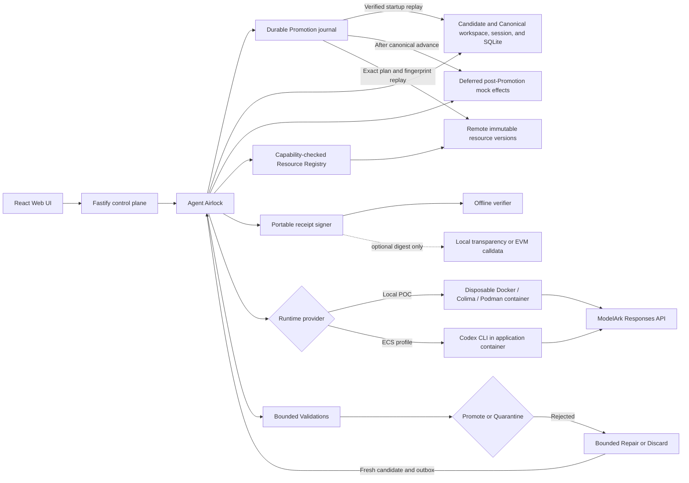

# Agent Airlock

**TikTok TechJam 2026 selected track:** Track 1 - Agent Launchpad: Design and Build Lightweight Agent Middleware.

Agent Airlock is transactional execution middleware built inside the CodeJam Agent Launchpad starter kit.
Every Agent task runs against isolated Candidate State, and only an outcome that satisfies its versioned Outcome Contract may become Canonical State.
Rejected work remains inspectable and can be repaired without contaminating accepted files, Agent memory, SQLite data, or supported external actions.

The submission delivers one reusable platform capability for every Agent Run: isolate, validate, promote, quarantine, and repair persistent Agent state at the shared `AgentRunner` boundary.
The official Track 1 scoring lens is 40% end-to-end middleware behavior, 25% technical design and integration, 20% verification and robustness, and 15% demo and reproducibility.

> Agents may explore many futures, but only validated futures become reality.

Selected middleware direction: transactional Agent state safety and failure recovery across every Agent, rather than a custom behavior for one demo Agent.

Start with the [ready-to-paste Devpost submission](docs/demo/DEVPOST_SUBMISSION.md), [submission brief and rubric map](docs/demo/SUBMISSION_BRIEF.md), and [static one-page architecture](docs/demo/agent-airlock-one-page.png).
The [architecture notes and Mermaid source](docs/demo/architecture-one-page.md) explain that judging asset in detail.
Then read the [product requirements](docs/product/PRD.md), [outcome roadmap](docs/product/OUTCOME_ROADMAP.md), [complete architecture](docs/architecture/agent-airlock.md), [Phase 0-2 plan](.omx/plans/phases-0-2-execution.md), [Phase 3-4 plan](.omx/plans/phases-3-4-execution.md), [Phase 5-7 plan](.omx/plans/phases-5-7-execution.md), and [Phase 8-11 plan](.omx/plans/phases-8-11-execution.md) before extending Airlock.
Unresolved product and architecture decisions are coordinated through the [Agent Airlock Wayfinder map](https://github.com/Kk120306/agent-airlock/issues/1).

## Canonical three-minute recording

The canonical judge recording uses production React and Fastify, the actual pinned Codex CLI, a disposable container Runtime, isolated Candidate State, constrained Validation, the Promotion journal, and durable Portable Trust evidence.
Only the Responses provider is deterministic and local, so the proof requires no ModelArk credential, provider capacity, wallet, blockchain, or paid inference.

```bash
npm install
npm run prove:runtime -- --reset --json
```

Start screen capture, then run:

```bash
npm run prove:runtime -- --reset --headed
```

Use `npm run prove:runtime -- --reset --headed --json` when the visible recording pass also needs the bounded machine-readable proof capsule on stdout.

The settled release candidate passed `npm run prove:runtime -- --reset --json` and `npm run audit:release`.
Run the headed command once immediately before capture, and treat its terminal `Real Runtime proof: PASSED` result as the authority for that recording.
Use `npm run demo:runtime -- --reset` at <http://127.0.0.1:3200> when a persistent stage-by-stage rehearsal is more useful than the bounded canonical proof.
The first proof command warms and verifies the exact application and Runtime image before screen capture.
During the headed pass, do not click, scroll, switch tabs, or close Chrome.
The runner owns both proof actions and closes Chrome automatically, and the recording is complete when the terminal prints `Real Runtime proof: PASSED`.

The headed proof uses deadline-aware presentation pacing under a hard 180-second recording budget.
Success preserves the full 15-second opening, 85-second desktop Outcome Brief, and 25-second desktop verifier dwells plus a 5-second browser-close reserve.
Run completion is capped early enough to leave that full 115-second post-Run presentation tail and 15-second release headroom, and the proof returns `recording-timeout` instead of shortening narration when the complete sequence cannot fit.
The canonical headed runner shows the primary action for the opening narration and invokes it automatically at 0:15, so the presenter must not click it.
Use `npm run demo:runtime -- --reset` for the human-click rehearsal path.
The deadline remains armed through browser shutdown and the actual atomic latest-pointer commit, so a late proof cannot publish.
The desktop recording remains at 1280 by 720 and presents one primary action, `Prove this release is safe`.
That action must create exactly three fresh Runs: a valid Promotion, an invalid multi-resource Candidate that is quarantined, and a promoted Repair from the retained failure.
Its Outcome Brief must derive every claim from those persisted Runs, require all four resources to receive one disposition, show effect timing and Canonical fingerprint transitions, and withhold success until a signed two-decision chain verifies locally.
After the complete Outcome Brief dwell, the runner automatically opens that exact chain in the zero-upload verifier, where the judge can see two valid signatures, the parent link, the Canonical State handoff, `0 API calls`, and `2 signed decisions linked`.
The recording runner arms a deny-all HTTP and WebSocket boundary before that verifier first opens and keeps it active through browser close.
While the desktop recording remains at 1280 by 720, a separate headless 390 by 844 read-only replay starts from the same three persisted Run identifiers, creates no Run, and independently regenerates the same signed chain and zero-upload verifier evidence.
The runner publishes an owner-only content-addressed immutable result capsule plus its exact content-addressed signed chain, and it retains proof ownership through publication.
The mutable `real-runtime-proof.latest.json` file is only a convenience pointer to that immutable pair and is never decision or trust authority.
It closes owned browser and Runtime resources before publication, fails closed on an existing proof lease, and never revokes a valid capsule because ownership cleanup fails after the atomic rename.
Reset cleanup accepts only marker-matching sessions whose recorded owner is no longer alive and removes them through descriptor-anchored operations.
The hosted release resolver validates the mutable latest pointer and uploads only the exact immutable capsule and chain it identifies.
Startup, browser, Run, disposition, evidence, viewport, timeout, and interruption failures remain distinct, return nonzero, clean up owned processes, and never overwrite the last successful artifact pair.

The core recording does not add or depend on federation, receiver custody, blockchain publication, Competing Futures, Adaptive Assurance, new decision authority, or live provider capacity.
Existing signatures remain evidence rather than Promotion authority or proof of organizational trust.
See the [three-minute narration](docs/demo/three-minute-demo.md) and [judge checklist](docs/demo/JUDGE_CHECKLIST.md) before recording.

## Deterministic no-container fallback

Use the production browser path with a deterministic Agent fixture when a container engine is unavailable.
It binds only to loopback and makes no ModelArk request or paid inference call.

```bash
npm run demo -- --reset
```

Open <http://127.0.0.1:3199> and follow the numbered buttons in the `Judge path` strip.
The path promotes a four-resource release, quarantines an invalid multi-resource future, repairs that retained future, and proves session continuity from repaired Canonical State.
This fixture remains the fastest deterministic regression and fallback demonstration, but it is not the canonical Phase 22 recording.
The project will not silently switch it to paid inference.

## Real Runtime manual proof

Use the persistent manual path to inspect or rehearse each real Runtime stage independently.

```bash
npm run demo:runtime -- --reset
```

The launcher fails closed unless seven credential-safe checks prove the local health boundary, intended demo profile, disposable Codex Runtime, offline receipt verifier, unique managed Agent, exact Outcome Contract, and ready lifecycle state.
While the demo is running, rerun the proof with `npm run demo:readiness` or emit bounded machine-readable evidence with `npm run demo:readiness -- --json`.
Open <http://127.0.0.1:3200> and use the existing Promotion, rejection, and Repair controls.
Real Codex runs inside a disposable container against isolated Candidate State while the UI derives its evidence from persisted Run results.
After Repair, generate the signed two-decision chain and select `Inspect in zero-upload verifier` to check the same portable JSON without an API call or manual upload.
The UI and terminal explicitly identify the local deterministic Responses fixture and state that no ModelArk request or paid inference occurs.
Run `npm run demo:runtime` without `--reset` to inspect restart persistence.

> [!WARNING]
> This is a single-user proof of concept, not a production multi-tenant sandbox.
> Do not use production data or credentials.
> See [SECURITY.md](SECURITY.md).

## Phase 8 provider extension demo

Phase 8 adds a capability-checked Transactional Resource SDK and a credential-free remote versioned-object provider without changing the frozen Phase 7 judge path.
The provider runs as a separate local HTTP process and its Candidate-only `object.json` binding participates in the same Promotion, Quarantine, Discard, Repair, journal, and canonical fingerprint decision as the four built-in resources.
When a provider is added to an existing deployment, Airlock verifies its exact immutable source and completes a crash-recoverable additive Registry Transition for every Agent before accepting the next registry generation.
Interrupted older Promotions and retained Quarantines continue through their persisted historical provider subset before onboarding can advance.
Strict journal admission prevents a malformed transition record from authorizing state deletion, and every provider-controlled evidence string is bounded and credential-checked before persistence or display.

```bash
npm run demo:phase8 -- --reset
```

Open <http://127.0.0.1:3199> and complete the first two guided steps.
The `Transactional Resources` panel shows the provider identity, immutable source and target fingerprints, disposition, Capability Claim, bounded Validation evidence, and lifecycle evidence.
No ModelArk key, provider credential, blockchain transaction, or paid request is used.

Provider authors can execute the shared contract directly:

```bash
npm run check:phase8:conformance
```

The command emits readable case results and a schema-versioned JSON conformance report.

## Phase 9 Competing Futures demo

Phase 9 lets one operator objective explore three isolated Candidate States from the same exact Canonical State and Outcome Contract.
Required Validation is an absolute eligibility boundary, so a fast unsafe future cannot win regardless of its score.
Airlock persists a deterministic integer scorecard and exact winner before the existing Promotion journal begins, then promotes only that sealed winner and retains or discards every loser according to the operator's snapshotted policy.
Admission reserves the aggregate token budget across every trusted Runtime before execution, requires a Runner capability that enforces each allowance before or at inference, and rejects unsupported production Runners before any competitor starts.
The bundled zero-cost demo fixture enforces the transported allowance before simulated execution, while the ordinary Codex and container Runners remain unavailable for Competing Futures until their provider path supplies an equivalent hard total-token control.
The Playground reads that capability from `/api/system`, disables Explore futures when unavailable, and explains the provider-boundary requirement inline instead of offering an action that can only fail.
The versioned Promotion journal binds the Candidate Set, decision digest, winner Run, seal digest, and source, so restart recovery cannot reinterpret the selected future.
If the selected winner changes after sealing, Airlock fails recovery closed and never falls through to a runner-up.

```bash
npm run demo:phase9 -- --reset
```

Open <http://127.0.0.1:3199>, select an Agent, and choose `Explore futures`.
The deterministic local fixture compares `unsafe-fast`, `broad-valid`, and `focused-valid`, explains every exclusion and normalized score, and promotes `focused-valid` with exactly one supported effect.
The launcher includes the Phase 8 remote-object fixture and makes no ModelArk request, paid inference call, provider purchase, or public blockchain transaction.

Run the focused no-cost contract with:

```bash
npm run check:phase9:selection
npm run check:phase9:boundaries
```

## Phase 10 Adaptive Assurance demo

Phase 10 turns recurring bounded Run evidence into deterministic Outcome Contract advice without giving the detector authority to change policy.
Every suggestion identifies its exact base contract, cites distinct root Run lineages and evidence hashes, and simulates every bounded historical result as exact, conservative, or unknown.
Missing evidence is never guessed, arbitrary commands and regular expressions cannot enter generated advice, and a stale proposal cannot be silently rebased.
Only an explicit operator acceptance can atomically create the next contract version.
Rejection leaves policy unchanged, and rollback creates another immutable version while preserving every historical Run, contract, proposal, decision, and receipt.

```bash
npm run demo:phase10 -- --reset
```

Open <http://127.0.0.1:3199>, send `Delete README.md and record why.` three times, then open `Assurance` and select `Scan retained evidence`.
Inspect the proposed protection, three independent supporting lineages, exact historical impact, unknown inputs, and simulation digest before accepting or rejecting it.
The deterministic detector and simulator run in the trusted local control plane and make no ModelArk request, paid inference call, provider purchase, or public blockchain transaction.

Run the focused no-cost contract with:

```bash
npm run check:phase10:assurance
```

## Phase 11 Portable Trust demo

Phase 11 turns complete durable Run evidence into a strict Portable Promotion Envelope that can be verified without the Airlock server or database.
The envelope signs canonical receipt content with an operator-held Ed25519 key and can disclose selected redacted evidence through Merkle proofs without including unselected leaves.
Promoted, retained, discarded, and cancelled Runs, Repair ancestry, exact Candidate Selection, and accepted Assurance provenance use the same bounded protocol.
Candidate Set Selection and terminal Run decisions are published to independent immutable authority before their mutable projections, so restart restores the exact decision instead of inventing a new one.
The verification report separates mathematical integrity from unsupported claims about Runtime isolation, Validation correctness, signer trust, or policy sufficiency.
A valid signature proves that the included public key matches the signature over the exact receipt content.
It proves key possession, not the human or organization behind the key, and it does not make an incorrect statement true.

Every receipt necessarily includes stable Run and Agent identifiers, decision timestamps, state and resource fingerprints, and evidence commitments.
It never includes prompts, Runtime output, raw Validation output, file contents, environment values, credentials, local paths, or provider-private metadata.
Individual bounded redacted evidence leaves are additional opt-in disclosures.

```bash
npm run demo:phase11 -- --reset
```

Open <http://127.0.0.1:3199>, complete a guided Run, and use its `Portable Trust` panel.
The panel starts with no evidence disclosed, previews safe evidence identities, and regenerates after privacy choices change.
Its primary download is one Portable Evidence Packet containing the independently verifiable envelope and any selected local anchor proof or offline EVM payload.
For a repaired Run, the panel also downloads one complete Portable Decision Chain containing the quarantined root and repaired child in signed root-to-leaf order.
The component artifacts remain separately downloadable for protocol inspection.
Select `Verify a receipt` in the sidebar and load an envelope, packet, or complete decision chain to check it again with browser Web Crypto.
The verifier performs zero API calls and uploads, enforces strict 1 MB envelope, 2 MB packet, and 4 MB chain boundaries, rejects mismatched optional proofs or broken lineage links, and explains each supported and unsupported claim.
Pin an independently distributed policy-authority fingerprint and import its separately signed signing-key trust policy for an organizational verdict over exact key, signing-window, Agent, and disposition scope.
Unknown, compromised, not-yet-effective, expired, out-of-window, and out-of-scope trust decisions fail closed without changing the cryptographic verdict.
Optional local transparency adds a signed checkpoint and inclusion proof over the receipt digest.
Optional EVM output only encodes `anchor(bytes32)` calldata offline and performs no network request, wallet operation, transaction, or spend.
Use the signature alone for ordinary offline exchange with a known key.
Use independently retained local checkpoints when cooperating observers need evidence that one operator did not silently rewrite its published sequence.
Publish the digest to a shared public ledger only when mutually distrusting organizations need common publication evidence.
Neither a local checkpoint nor a blockchain publication becomes Promotion authority or proves that the Agent result is correct.

Install dependencies with Node.js 22+ and npm 10+.
The core browser gate also requires installed Google Chrome.
The complete release gate requires a Docker-compatible `docker` CLI, as provided by Docker Desktop, Docker Engine, or Colima.
Podman users must enable Docker CLI and Compose compatibility before running the aggregate gate.

Run the focused no-cost protocol, server, browser, and container contracts with:

```bash
npm run check:phase11:protocol
npm run test -w @launchpad/server -- --run src/phase-eleven-acceptance.test.ts
npm run test:phase11:ui
npm run check:phase11:docker
```

Run the inherited Phase 0 through Phase 11 core, production-image, and clean-clone release gate with:

```bash
npm run check:phase11
```

These commands require no ModelArk key, paid inference, provider purchase, wallet, RPC, or public blockchain.

## Deterministic fallback screenshots

### Four-step judge path


### Mobile evidence


## Features

- React and TypeScript Web UI
- Agent create, edit, start, stop, delete, and multi-turn chat
- Fastify control plane with asynchronous Run state
- Transactional Agent workspaces and Codex sessions
- Validated SQLite snapshots and typed deferred notification intents
- Immutable Whole-Agent Candidate and Canonical versions with Promotion or Quarantine
- Versioned Outcome Contracts with bounded, redacted Validation evidence
- Compact Airlock timeline, four-resource disposition, change summary, canonical fingerprint, and Promotion Receipt
- Bounded Repair Runs that preserve useful quarantined work, resume rejected Agent memory, and use a fresh outbox
- Canonical freshness checks, receipt lineage, and idempotent Quarantine discard with retained evidence
- Durable five-phase Promotion journal with forward startup reconciliation and visible fail-closed errors
- Provider-neutral Transactional Resource SDK with strict Capability Claims and executable conformance
- Credential-free remote versioned-object provider with bounded HTTP, immutable versions, and forward reconciliation
- Compact provider registry evidence with explicit unsupported distributed-atomicity claims
- Additive provider onboarding with immutable-source verification, crash journaling, and generation-wide convergence
- Durable Candidate Sets with bounded sibling isolation, shared-source enforcement, and snapshotted Outcome Contracts
- Reversible sealed-Candidate evaluation before deterministic one-winner Selection and irreversible Promotion
- Explainable integer scorecards, absolute Validation eligibility, stable byte-order tie-breaking, and no automatic runner-up fallback
- Restart-safe winner Promotion and idempotent loser retention or Discard across historical provider generations
- Deterministic Assurance Proposals with lineage-deduplicated citations and exact, conservative, or unknown historical simulation
- Explicit operator acceptance, durable rejection, stale-base protection, immutable Outcome Contract history, and version-creating rollback
- Crash-recoverable Agent deletion with credential-free Run, Candidate Set, Assurance, contract-history, and receipt digests
- Strict canonical Portable Promotion Envelopes with Ed25519 signatures and independent offline verification
- Browser-local Web Crypto receipt verification with zero API calls, explicit tamper failure, and responsive proof reporting
- Canonical real Runtime recording target with one primary action, exactly three fresh Runs, and an evidence-derived Outcome Brief
- Atomic credential-free recording capsule plus the same signed two-decision chain consumed by the zero-upload verifier
- Immutable Candidate Set Selection authority and exact terminal Run replay across authority-to-store crash windows
- Private-by-default Merkle evidence disclosure with exact Candidate Selection, accepted Assurance, and Repair ancestry commitments
- Fail-closed signing-key identity markers, historical rotation verification, and an operator rotation and compromise runbook
- Optional signed local transparency proofs with append-only writer turns and zero-network EVM calldata over receipt digests only
- Root-confined Candidate and Quarantine retention with active-Run protection
- Disposable Docker, Colima, or Podman container for each local turn
- Docker and Terraform deployment paths for Volcengine ECS

## Requirements

- Free demo: Node.js 22+, npm 10+, and installed Google Chrome for browser verification.
- Canonical recording: the free-demo requirements plus Docker, Colima, or Podman for the disposable real Codex Runtime.
- Live ModelArk POC: the free-demo requirements plus Docker, Colima, or Podman and a ModelArk API key for an activated Responses-compatible model.

Codex CLI is included in the Runtime image and is not required on the host for the credentialed container path.
The deterministic demo uses the checked-in protocol fixture and does not require a container engine.

Run `npm run test:container-transaction` when a container engine is available.
This zero-cost production-server proof drives the pinned real Codex CLI through the CodeJam HTTP seam, real Candidate workspace, isolated Validation container, Promotion journal, signed receipt, restart, and resumed accepted session.
It uses a local Responses fixture and therefore proves the integration path, not live ModelArk availability or model quality.
Run `npm run test:container-browser` for the corresponding real Chrome-to-Codex container Promotion proof.

## Credentialed ModelArk browser SOP

Use this path for the final live provider conformance journey.
The deterministic demo above remains the reproducible judging and regression path.

For the guided judge flow, run:

```bash
npm run demo:modelark -- --reset
```

The launcher forces the live Responses API check before building or starting the application, binds the control plane to loopback, uses a disposable container Runtime, and seeds one `Live ModelArk Proof` Agent.
It does not honor the generic `AIRLOCK_SKIP_MODELARK_PREFLIGHT` escape hatch.
Successful preflight creates a bounded credential-free launch handoff containing only timestamps, request counts, a configured-model selection index, and SHA-256 commitments to the selected model and provider origin.
The server verifies that handoff is recent and matches its exact private configuration before it can expose `AIRLOCK-ATTESTED MODELARK RUN` mode.
Missing, stale, malformed, wrong-model, or wrong-origin handoffs fail closed.
Open <http://127.0.0.1:3201> and select `Run live Candidate`.
ModelArk must direct Codex to create `modelark-proof.txt` containing exactly `modelark-live`, update the Candidate SQLite row to `modelark-live`, and submit exactly one typed `modelark-live-ready` action intent.
Airlock validates the actual Candidate file and database independently of the model response, promotes workspace, Codex session, SQLite, and outbox under one decision, and dispatches the intent only after Canonical State advances.
The resulting judge view reports conformance complete only when all four resources are promoted and exactly one deferred effect is delivered, then exposes the signed portable receipt.
After that complete live Promotion, the launcher automatically captures a private, credential-free Portable Evidence Packet with the safe ModelArk execution-profile disclosure.
That signed disclosure binds the generated-output preflight facts to the successful Runtime profile without storing the generated text.
It remains an Airlock control-plane attestation and is not a BytePlus-signed statement.
Verify the latest recorded packet later with `npm run verify:modelark-evidence` without contacting ModelArk.
The verifier labels this as historical signed evidence and never substitutes it for a current provider preflight or live Run.
Run `npm run demo:modelark` without `--reset` to preserve the proof across restart.
If provider quota, capacity, authentication, or the selected model is unavailable, the launcher stops before showing a live-proof UI.

For a recording rehearsal or a single pass-or-fail conformance run, use:

```bash
npm run prove:modelark -- --reset
```

This command starts the same managed live launcher, drives the existing `Run live Candidate` control in production Chrome, requires the exact persisted Whole-Agent Promotion, waits for the private signed packet, verifies that packet offline, and then cleans up its browser and server.
Add `--headed` to make the Chrome interaction visible during rehearsal or recording.
Add `--json` for the bounded credential-free result projection.
The result is a convenience summary rather than new authority, and the signed packet remains the independently verifiable proof.
HTTP 429 free-capacity failure returns `provider-unavailable` and never disables Free Credits Only Mode or falls back to a paid path.

- Node.js 22+
- npm 10+
- Docker, Colima, or Podman
- A ModelArk API key and endpoint or model that supports the Responses API

The deterministic `npm run test:demo:e2e` proof does not require ModelArk credentials or paid inference.
Run `npm run test:demo:e2e` to exercise the exact four-step production browser story locally.
ModelArk credentials are needed only for the final live conformance journey.

### 1. Check the local tools

Install Node.js 22+ and one supported container engine, then verify them:

```bash
node --version
npm --version
docker --version        # Docker Desktop, Docker Engine, or Colima
podman --version        # Use this instead when running Podman
```

Only one container engine is required.
Codex CLI is already included in the Runtime image.

### 2. Clone the repository

```bash
git clone https://github.com/Kk120306/agent-airlock.git
cd agent-airlock
```

Skip this step when already working from the repository root.

### 3. Start the POC

```bash
cp .env.example .env
# Fill ARK_API_KEY, ARK_MODEL, and the region-matching ARK_BASE_URL.
# Optionally list activated free-quota fallbacks in ARK_MODEL_FALLBACKS.
npm run check:modelark
npm run poc:doctor
npm run demo:modelark -- --reset
# After a complete live Promotion:
npm run verify:modelark-evidence
```

`check:modelark` performs a minimal Responses API request, requires a completed response with non-empty assistant `output_text`, and prints neither the credential nor model output.
An HTTP success or `completed` status without generated assistant text fails the preflight.
If `ARK_MODEL_FALLBACKS` is set, it may try up to three additional operator-approved models only after HTTP 404 or 429 responses.
For allowlisted temporary capacity and burst-protection responses, it performs a bounded warm-up and honors numeric `Retry-After` guidance up to 10 seconds per wait and 15 seconds across the configured model list.
It stops immediately on authentication, network, timeout, malformed-response, and other provider failures.
Keep Free Credits Only Mode enabled for every configured model because the launcher does not change or verify account billing settings.
Confirm that each configured model is activated and visibly has remaining free quota in Model activation before the demo.
`poc:doctor` checks Node.js, hidden credential presence, one live Responses request, the container engine, the Runtime image, a hardened in-container Codex launch, Candidate session copy isolation, and a real two-turn Codex tool-call protocol probe.
It reports those checks independently, so provider HTTP 429 capacity failures cannot be confused with an application or Runtime failure.
`npm run demo:modelark` and `npm run poc` repeat that fail-fast preflight before installing dependencies or building the Runtime image.
The model that passes preflight is exported as `ARK_MODEL` for the actual Runtime.
The guided launcher watches only its managed Agent for a complete provider-backed Whole-Agent Promotion, requests the safe execution-profile disclosure, and atomically records an immutable per-Run signed packet under its marker-protected state root.
It will not capture partial Promotion, failed Validation, missing effect delivery, deterministic fixture evidence, or content containing credential-like or endpoint-like material.
The generic `npm run poc` path can honor `AIRLOCK_SKIP_MODELARK_PREFLIGHT=true` for local troubleshooting, but neither `npm run demo:modelark` nor `npm run prove:modelark` ever honors that escape hatch.
The first successful run loads `.env`, installs Node.js dependencies, and builds the Runtime image.
Explicit process environment variables take precedence over `.env`.
The script automatically selects Docker, Colima, or Podman.

### 4. Open the browser

The guided judge flow is available at <http://127.0.0.1:3201>.
The generic POC remains available at <http://localhost:3000> when started with `npm run poc`.
Open either URL from the terminal:

```bash
open http://127.0.0.1:3201       # macOS guided proof
xdg-open http://127.0.0.1:3201   # Linux guided proof
```

In the guided Web UI:

1. Select `Run live Candidate`.
2. Watch the Candidate create the exact artifact, update SQLite, and submit one deferred action before the required state Validation completes.
3. Confirm that `execution-profile` attests the live ModelArk Responses profile through a model identifier commitment rather than embedding the raw identifier.
4. Confirm that workspace, Codex session, SQLite, and outbox all show `promoted`, the database value is `modelark-live`, and exactly one `modelark-live-ready` effect is delivered after Promotion.
5. Confirm that the canonical fingerprint advances only for this complete promoted result.
6. Select `Generate and verify proof` to verify the signed decision locally and selectively disclose the safe execution-profile leaf when requested.

The execution-profile evidence is a trusted Airlock control-plane attestation, not an independent statement signed by BytePlus.
It proves which configured profile completed the Run and binds that claim into the Promotion Receipt without exposing the API key, model endpoint identifier, base URL, or environment values.

In the generic `npm run poc` Web UI:

1. Select **Create Agent**.
2. Enter a name, description, and workspace instructions.
3. Select **Create Agent** again.
4. Enter a task in the Playground, for example:

   ```text
   Create a TypeScript hello-world CLI, add a test, and run it.
   ```

The Agent can write files, run commands, and continue the same Codex session in
later messages.

### 5. Stop and resume

Press `Ctrl+C` in the startup terminal. The script removes temporary Runtime
containers but keeps Agent workspaces and conversations.

- macOS state: `~/.volc-agent-launchpad/`
- Linux state: `.local/`
- Custom location: set `LOCAL_POC_DATA_ROOT`

Run the same `npm run poc` command to continue later.

### Select a specific container engine

Force Podman when multiple engines are installed:

```bash
CONTAINER_ENGINE=podman \
ARK_API_KEY=your-ark-api-key \
ARK_MODEL=dola-seed-2-1-turbo-260628 \
npm run poc
```

Colima uses `CONTAINER_ENGINE=docker` because it exposes the Docker CLI.

For a clean Linux host, follow the
[rootless Podman setup](docs/LOCAL_POC.md#rootless-podman-on-linux).

## Docker Compose

Create and edit the configuration:

```bash
./scripts/bootstrap-local.sh
```

Required values in `.env`:

```dotenv
ARK_API_KEY=your-ark-api-key
ARK_MODEL=dola-seed-2-1-turbo-260628
APP_AUTH_TOKEN=replace-with-at-least-24-random-characters
```

Start the application:

```bash
docker compose up --build
```

Open <http://localhost:3000>. Stop it without deleting Agent data:

```bash
docker compose down
```

## Development

```bash
npm install
cp .env.example .env
npm install --global @openai/codex@0.111.0
npm run dev
```

- Web UI: <http://localhost:5173>
- API: <http://localhost:3000>

Use local paths in `.env` when running outside Docker:

```dotenv
APP_DATA_DIR=.data
AGENT_WORKSPACE_ROOT=workspaces
CODEX_HOME=codex-home
```

## Deployment

- [Existing Linux ECS with Docker](docs/DEPLOYMENT.md#existing-linux-ecs)
- [Complete Volcengine environment with Terraform](docs/DEPLOYMENT.md#terraform-deployment)
- [Local Docker, Colima, and Podman details](docs/LOCAL_POC.md)

The existing-ECS script deploys from the current source tree:

```bash
cp .env.example .env.production
./scripts/deploy-existing-ecs.sh .env.production
```

The Terraform path provisions VPC, subnet, security group, ECS, and EIP:

```bash
cp deploy/volcengine/terraform.tfvars.example \
  deploy/volcengine/terraform.tfvars
./scripts/deploy-volcengine.sh
```

## Configuration

| Variable | Default | Purpose |
| --- | --- | --- |
| `ARK_API_KEY` | Required | Ark model API key. |
| `ARK_MODEL` | Required | Responses-capable endpoint or model ID. |
| `ARK_BASE_URL` | BytePlus AP v3 endpoint | Region-matching Ark API URL; BytePlus AP uses `https://ark.ap-southeast.bytepluses.com/api/v3`. |
| `APP_AUTH_TOKEN` | Empty on loopback | Shared demo token; use 24+ random characters remotely. |
| `RUNTIME_PROVIDER` | `local-process` | `container` for disposable local Runtime containers. |
| `CODEX_SANDBOX_MODE` | `workspace-write` | Codex inner sandbox mode. |
| `CODEX_TIMEOUT_MS` | `600000` | Maximum duration of one turn. |
| `AIRLOCK_MAX_REPAIR_DEPTH` | `2` | Maximum bounded Repair Runs in one Quarantine lineage. |
| `AIRLOCK_CANDIDATE_RETENTION_HOURS` | `24` | Mutable Candidate retention window in positive hours. |
| `AIRLOCK_QUARANTINE_RETENTION_HOURS` | `168` | Mutable Quarantine retention window in positive hours while bounded evidence remains. |
| `AIRLOCK_HTTP_OBJECT_URL` | Unset | Base URL for the optional credential-free versioned-object provider. |
| `AIRLOCK_HTTP_OBJECT_VERSION_ID` | Unset | Trusted immutable source version registered with the HTTP object provider. |
| `AIRLOCK_HTTP_OBJECT_FINGERPRINT` | Unset | Exact 64-character lowercase SHA-256 fingerprint of the registered source. |
| `AIRLOCK_HTTP_OBJECT_SOCKET` | Unset | Optional local Unix socket for the HTTP object provider. |
| `AIRLOCK_PORTABLE_SIGNING_KEY_PATH` | Under `APP_DATA_DIR/keys` | Owner-readable Ed25519 private key used only for portable receipt signatures. |
| `AIRLOCK_TRANSPARENCY_SIGNING_KEY_PATH` | Under `APP_DATA_DIR/keys` | Separate owner-readable Ed25519 private key used only for optional local checkpoints. |
| `AIRLOCK_TRANSPARENCY_LOG_PATH` | Under `APP_DATA_DIR/transparency` | Optional local append-only receipt-digest log. |
| `AIRLOCK_DEMO_MODE` | `false` | Internal fixture-mode marker set by `npm run demo`; do not enable it for a credentialed POC. |
| `AIRLOCK_DEMO_PORT` | `3199` | Loopback port used by the deterministic demo launcher. |
| `AIRLOCK_DEMO_DATA_ROOT` | `.local/airlock-demo` | Persistent isolated state used by the deterministic demo launcher. |
| `LOCAL_POC_DATA_ROOT` | Platform-specific | Local metadata, workspace, and session directory. |

See [.env.example](.env.example) for all Runtime and resource-limit options.

## How it works



The first turn uses `codex exec`; later turns resume the stored Codex thread.
Deleting an Agent archives its workspace under `workspaces/.deleted/` with a credential-free lifecycle evidence tombstone.
Deletion is refused while Promotion recovery or retained Quarantine remains unresolved.

See [docs/ARCHITECTURE.md](docs/ARCHITECTURE.md) for component and extension
boundaries.

## Validation

```bash
npm run check
npm run test:e2e
npm run test:demo
npm run test:demo:e2e
npm run audit:release
npm run test:codex-session-container
npm run test:validation-container
terraform fmt -check -recursive deploy/volcengine
docker compose config
```

`npm run test:e2e` runs the production React and Fastify path in installed Google Chrome against a deterministic Codex protocol fixture.
Use `npm run check:phase0` to run the starter checks and this complete baseline journey together.
Use `npm run check:phase2` to run the full qualifying proof, browser journey, and dependency audit.
Use `npm run check:phase3` to add the pinned Codex session-isolation and real validation-container proofs.
Use `npm run check:phase4` for the complete no-cost four-resource proof.
Use `npm run check:phase5` for the complete no-cost Quarantine, Repair, lineage, and discard proof.
Use `npm run check:phase6` to add all eight Promotion interruption seams, repeated restart convergence, retention, and path-abuse proof.
Use `npm run check:phase7` for the complete prior suite, launcher lifecycle proof, four-step production demo, mobile layout check, and release audit.
Use `npm run check:phase8:provider` and `npm run check:phase8:conformance` for capability-checked Resource Provider lifecycle and contract proof.
Use `npm run check:phase9:selection` and `npm run check:phase9:boundaries` for deterministic Candidate Selection and historical recovery proof.
Use `npm run check:phase10:assurance` for evidence-backed proposal, operator authority, rollback, and deletion recovery proof.
Use `npm run check:phase11:protocol` for cross-process signature, tamper, transparency, and zero-network EVM proof.
Use `npm run test:phase11:ui` for complete desktop and 390-pixel mobile export, download, and independent verification journeys.
Use `npm run check:phase11:docker` for the production image, non-root UID, writable-data, package-resolution, and live-health proof.
Use `npm run check:phase11` for the complete inherited core, Docker, and exact clean-clone release gate.
Phase 22 adds `npm run prove:runtime -- --reset --headed` as the delivered canonical recording gate with exact fresh-Run, signed-chain, immutable-capsule, hard 180-second budget, 1280 by 720 desktop, and independent 390 by 844 read-only replay requirements.
Build `volc-agent-runtime:local` from `Dockerfile.runtime` before running either container proof.
The network-disabled Codex probe proves that a copied `CODEX_HOME` resumes the accepted thread without mutating its source and that an empty home cannot resume it.
The validation-container test proves a real validation container has a read-only root, no Ark key, and only a disposable validation copy as its writable project mount.
The credentialed ModelArk journey must be rerun at judging time because free provider capacity and model availability are external and time-varying.
The browser SOP above is the repeatable live conformance path and does not store credentials or model output as release evidence.

## Documentation

- [Submission brief and rubric map](docs/demo/SUBMISSION_BRIEF.md)
- [Architecture](docs/ARCHITECTURE.md)
- [Agent Airlock architecture](docs/architecture/agent-airlock.md)
- [One-page judging architecture](docs/demo/architecture-one-page.md)
- [Canonical three-minute recording](docs/demo/three-minute-demo.md)
- [Judge checklist](docs/demo/JUDGE_CHECKLIST.md)
- [Product requirements](docs/product/PRD.md)
- [Outcome roadmap](docs/product/OUTCOME_ROADMAP.md)
- [Local POC](docs/LOCAL_POC.md)
- [Recovery guide](docs/RECOVERY.md)
- [Portable Trust architecture](docs/architecture/portable-trust.md)
- [Portable receipt key runbook](docs/operations/PORTABLE_RECEIPT_KEYS.md)
- [Deployment](docs/DEPLOYMENT.md)
- [Hackathon extension guide](docs/HACKATHON_EXTENSION_GUIDE.md)
- [Security policy](SECURITY.md)
- [Contributing](CONTRIBUTING.md)

## License

[MIT](LICENSE)
