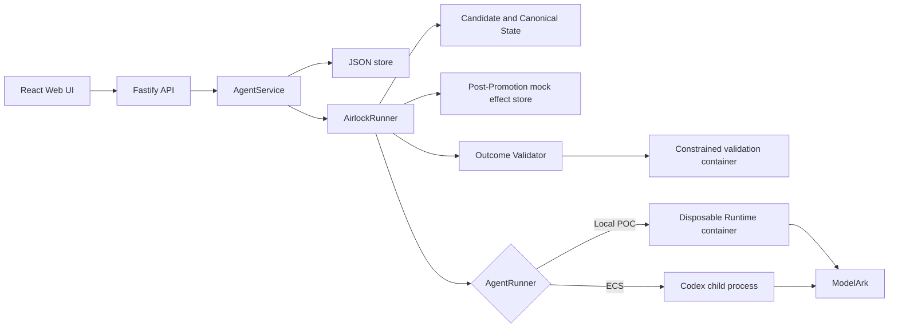

# Architecture

Volc Agent Launchpad is a single-node control plane for hackathon use.



## Components

### Web UI

Lists Agents, manages lifecycle actions, submits prompts, and polls asynchronous
Runs. It never receives the Ark API key.

### Fastify API

Validates requests, protects remote demos with a shared bearer token, and
serves the compiled Web UI. The token is not user identity or authorization.

### AgentService

Coordinates lifecycle state, persistence, workspaces, and Runs.
One Agent can have only one active Run.
It snapshots the active Outcome Contract into each admitted Run Transaction.

### AirlockRunner

Copies the current immutable Canonical State into run-owned Candidate State before invoking the existing `AgentRunner`.
It validates the resulting candidate and either promotes it as a new immutable version or moves it to Quarantine.
Rejected, failed, and cancelled Runs preserve the prior canonical identifier and content hash.

```text
ready -> busy -> ready
  |       |
  v       v
stopped  error
```

Interrupted Runs become `cancelled` after a restart.

### Storage

```text
data/launchpad.json                         Agent, message, Run, contract, and evidence metadata
workspaces/AgentID/canonical.json           Accepted state pointer and content hash
data/mock-deliveries.json                    Idempotent mock external effects
workspaces/AgentID/versions/StateID/         Immutable workspace, Codex home, data, and outbox evidence
workspaces/.candidates/RunID/                Mutable workspace, Codex home, and dedicated outbox for one Run
workspaces/.quarantine/RunID/                Rejected Candidate State
workspaces/.deleted/                         Archived deleted Agents
codex-home/                                  Codex configuration and sessions
```

`JsonStore` serializes writes and atomically replaces one JSON file. It supports
one process only.

### Runtime providers

- `CodexRunner` runs Codex inside the application container for ECS.
- `ContainerCodexRunner` starts one disposable Docker, Colima, or Podman
  container for every local turn.

Both providers use argv-only process execution, bound output and time, resume the stored Codex thread, and escalate termination after a grace period.
Airlock passes only a Candidate State workspace, Codex home, and dedicated outbox path to either provider.
The platform-owned delivery store is never mounted into the Runtime.

### Outcome Validator

Runs deterministic path, symlink, protected-path, required-path, change-limit, and secret-pattern checks against Candidate State.
It also validates the SQLite database with integrity, schema, size, row-count, field-size, and semantic secret checks.
Typed action intents receive strict schema, size, count, duplicate-ID, and supported-type checks before Promotion.
Operator-defined commands run in fresh containers with no network, no application credentials, a read-only root, dropped capabilities, and resource limits.
Each command receives a disposable copy of Candidate State as its only project mount, so build artifacts can never enter Promotion.
Every terminal Run stores bounded evidence and a Promotion Receipt.

### Post-Promotion effects

The candidate-owned outbox accepts only `demo.notification.requested` intents in Phase 4.
Airlock derives a stable idempotency key, promotes the complete candidate, verifies that the canonical manifest advanced, and then calls the atomic mock consumer.
Rejected candidates produce no mock delivery.
The exactly-once claim applies only to the mock consumer, and unrestricted Runtime networking remains a disclosed bypass outside the supported outbox path.

## Deployment profiles

| Profile | Control plane | Agent execution |
| --- | --- | --- |
| Local POC | Host Node.js | Disposable local container |
| ECS | Application container | Codex process in the same container |
| Local development | Host Node.js | Host Codex process |

## Extension seams

| Track | Primary seam | Expected change |
| --- | --- | --- |
| Glass Box | `AgentRunner`, `AgentRun` | Emit and display correlated execution events. |
| Bouncer | API routes, Agent ownership | Add identity and server-side authorization. |
| Kill Switch | `AgentRunner` | Add threat-specific policy or a stronger sandbox. |

The Fastify control plane, Airlock state manager, and structural validator form the trusted POC boundary.
The Agent Runtime and candidate project commands are untrusted.
Ordinary containers are not hardened multi-tenant isolation.
