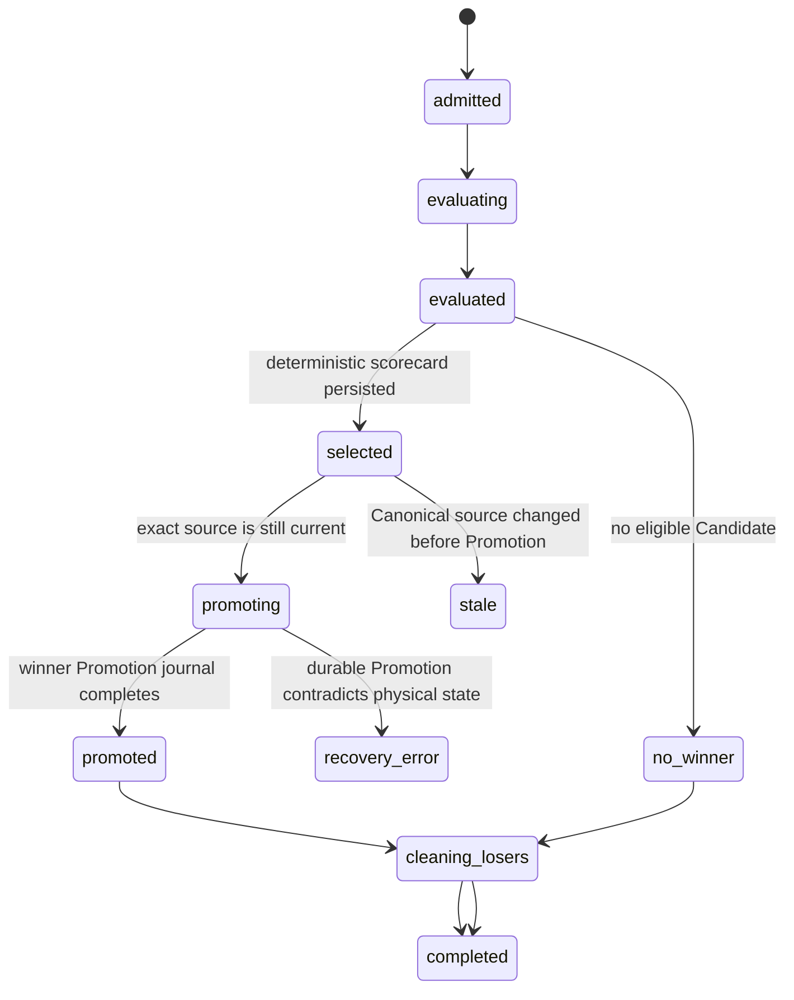

# ADR 0011: Select one sealed Candidate from a durable Candidate Set

## Status

Accepted for Phase 9 implementation on 2026-08-26.
Wayfinder ratification is tracked by [Ratify the Phase 8 through 11 trust boundaries](https://github.com/Kk120306/agent-airlock/issues/11).

## Context

The existing Run Transaction executes, validates, and promotes one Candidate State inside one `AirlockRunner.run` call.
That shape protects Canonical State, but it makes Promotion inseparable from evaluation and therefore cannot safely compare sibling futures.

Competing Futures must let several strategies explore the same objective without letting any competitor observe a sibling, advance Canonical State early, dispatch an External Action Intent, or change the Outcome Contract used by another competitor.
The winner must be reproducible from persisted evidence rather than a later model judgment.
Crash recovery must never select a second winner after one selection decision becomes durable.

ADR 0007 permits one Repair child from a retained Quarantine.
Treating competing siblings as Repair children would silently weaken that lineage rule and make ownership of the retained mutable source ambiguous.

## Decision

Airlock introduces a `Candidate Set` as a durable aggregate owned by one Agent and one exact Canonical State snapshot.
The aggregate snapshots one objective, one Outcome Contract, one Selection Contract, one sorted provider-version vector, one bounded competitor list, and one loser-disposition policy before any competitor starts.
Admission deterministically reserves a positive trusted Runtime total-token allowance for every competitor, and the reservations cannot exceed the snapshotted aggregate token budget.

Every competitor receives a unique Run identifier, Candidate State, Codex home, outbox, provider Candidate set, and Runtime binding set.
All siblings are prepared from the same immutable source version through a set-scoped preparation operation.
No sibling path, handle, output, thread artifact, outbox, or provider Candidate identifier is supplied to another sibling.

`AirlockRunner` is split into a reversible evaluation boundary and an irreversible Promotion boundary.
Evaluation executes Runtime and all required Validations but cannot create a Promotion journal, install an immutable target, advance `canonical.json`, or dispatch an External Action Intent.
A passing evaluation is sealed with exact built-in and provider Candidate fingerprints and retained outside Runtime reach.
Immediately before Promotion, Airlock re-verifies the seal, source freshness, Outcome Contract snapshot, provider plans, and deferred outbox.

The Selection Contract is versioned, schema-validated, bounded, and deterministic.
Required Validation eligibility is an absolute gate rather than a score component.
Eligible candidates are ordered by a declared lexicographic list of bounded integer criteria.
Each criterion defines its source, direction, bound, and trusted evaluator version.
The final tie-break is the persisted competitor identifier in ascending byte order.
Runtime self-reported quality cannot enter ranking without an independently declared trusted evaluator.

Airlock persists the complete ordered scorecard and one winner decision before starting winner Promotion.
After that decision is durable, recovery may only promote or reconcile that exact winner.
Airlock never falls through to a runner-up automatically after a selected winner encounters a Promotion contradiction.

The selected competitor enters Promotion journal schema 2 with a versioned authority that binds the Candidate Set, competitor, winner Run, Selection Decision digest, seal digest, and exact source.
Startup replays the Selection Decision and requires exact agreement with this authority before forward recovery may install state, advance Canonical State, or dispatch effects.
Only its immutable state may become Canonical State, and only its External Action Intents may be dispatched.
Losing candidates are retained as Quarantine or discarded according to the snapshotted policy after the winner becomes recoverably selected.
Interrupted loser cleanup is idempotent and cannot change the selected winner.

Phase 9 Candidate Sets start only from current Canonical State.
They cannot use a Quarantine as a Repair source and do not change ADR 0007's single-child Repair lineage.
A later decision may add competing repairs with an explicit ownership and ancestry model.

## Durable phases

The transition from `evaluated` to `selected` is the one-winner decision point.
The transition from `selected` to `promoting` does not create new selection authority because it names the same exact competitor and seal.

## Consequences

Ordinary Runs remain a compatibility wrapper that evaluates one Candidate and immediately selects it when every required Validation passes.
This keeps existing Agent CRUD, lifecycle controls, Playground chat, persistent workspaces, persistent Codex sessions, model execution, and Promotion recovery behavior stable.

Candidate Set orchestration owns the Agent-level execution lease while bounded sibling evaluations may run concurrently underneath it.
The existing one-active-Run guard cannot be reused as the sibling scheduler because it would serialize or reject the competitors.

Sealed Candidate storage, Candidate Set aggregates, scorecards, and loser cleanup add durable state that requires schema migration, retention protection, restart reconciliation, and bounded operator evidence.
The system gains optimization through safe exploration without treating isolation or Validation as optional ranking preferences.

Database version 9 persists Candidate Sets and links each competitor to an ordinary Run Transaction while migrating version 8 history without inventing competition.
The implementation retains ordinary `AirlockRunner.run` compatibility and adds a deferred sealed branch, exact winner Promotion, and sealed loser disposal.
Startup reconciles unresolved Candidate Sets before additive Resource Registry Transition so historical provider vectors remain sufficient for winner Promotion and loser cleanup.
Any unresolved Candidate Set recovery failure defers provider onboarding and Resource Registry generation commit.
The strict no-cost acceptance suite proves one real HTTP-to-CodexRunner three-process selection, aggregate token reservation, all-invalid completion, terminal cancellation, seal tamper failure, journal-authority contradiction, winner restart recovery, historical-provider onboarding, Registry Transition blocking, and exactly one supported winner effect.
The unrestricted production Chrome and clean-clone repetitions remain release-environment gates because the current sandbox cannot bind loopback listeners or keep Chrome alive.

## Alternatives rejected

### Let every competitor call the current `AirlockRunner.run`

The first valid competitor could promote before the others finish, so later competitors would no longer share one source and exactly-once winner selection would be impossible.

### Ask a model to choose from raw outputs

The decision would not be reproducible, raw output could contain sensitive content, and a failed required Validation could influence or manipulate the judge.

### Rank before required Validation

This would turn safety into a weighted preference and allow a high-scoring invalid Candidate to win.

### Promote the next candidate when winner Promotion fails

Once selection is durable, silently changing winners would create two possible authorized futures and make crash recovery dependent on timing.

### Model siblings as Repair children

This would conflict with ADR 0007's single-child lineage and would not describe ordinary exploration from current Canonical State.
