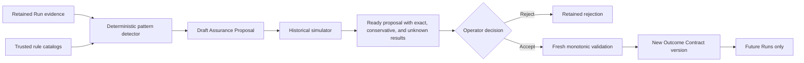

# Adaptive Assurance architecture

## Purpose

Phase 10 converts repeated bounded failure evidence into explainable Outcome Contract proposals while keeping every policy change explicit, simulated, versioned, and reversible by an operator.

ADR 0012 is accepted locally and this document describes implemented Phase 10 behavior.

## Authority flow



No arrow leads directly from detection or simulation to the active Outcome Contract.
The proposal worker has write authority only over proposal records.
The operator acceptance handler is the only path that may create a new contract version from a proposal.

## Durable proposal model

An Assurance Proposal contains:

- Schema version, proposal identifier, Agent identifier, and lifecycle state.
- Exact base Outcome Contract version, canonical encoding hash, and creation timestamp.
- Generator identifier and version.
- Sorted monotonic operation list with catalog references where required.
- Sorted citations with Run identifier, disposition, evidence selector, evidence hash, and derivation rule.
- Simulation engine identifier and version.
- Complete ordered historical impact results and simulation digest.
- Stable proposal digest over every field that can affect meaning.
- Operator decision, bounded reason, decision timestamp, and resulting contract version when accepted.

Proposal states are `draft`, `ready`, `accepted`, `rejected`, `superseded`, and `stale`.
Only `ready` may be accepted or rejected.
A current-contract mismatch changes `ready` to `stale` and requires a new derivation instead of mutation.

## Detection rules

The initial deterministic detector uses only persisted fields and closed rule identifiers.
It never scans raw prompts, Runtime output, environment values, arbitrary logs, expired Candidate files, or provider-private metadata.
Every current Run Transaction carries `assuranceEvidenceVersion: 1` only after the complete Phase 10 evidence envelope has passed strict recursive validation.
Version 9 migration assigns that marker only after validating the complete source database, while older unversioned evidence remains inspectable but is excluded from derivation and simulation.
Every migration from versions 1 through 9 must pass the complete version 10 parser before replacement, and the persisted result must reopen under the same binary.

| Evidence pattern | Minimum support | Proposed operation |
| --- | --- | --- |
| Same required path missing in at least three Runs | Three distinct Run Transactions | Add required path from retained safe path evidence. |
| Same protected path changed in at least three Runs | Three distinct Run Transactions | Add protected path. |
| Repeated changed-file overflow with a disjoint promoted support cohort | Five compatible Runs | Lower `maxChangedFiles` to the maximum exact value in the cited promoted cohort. |
| Repeated added-byte overflow with a disjoint promoted support cohort | Five compatible Runs | Lower `maxAddedBytes` to the maximum exact value in the cited promoted cohort. |
| Same catalog secret detector reports a leak in at least two Runs | Two distinct Run Transactions | Add that exact catalog secret pattern. |
| Same optional Validation fails in at least three otherwise eligible Runs | Three distinct Run Transactions | Make that unchanged command required. |

Support counts use unique Run Transaction identifiers and exact evidence hashes so duplicated records cannot inflate confidence.
A repair lineage contributes at most one support unit per root lineage for the same pattern.
Resource-limit operations require two exact metric-specific overflow lineages and three disjoint promoted support lineages, and the proposed bound is calculated only from that cited cohort.
Optional command failures count only when the historical Outcome Contract preserves the exact current command hash, timeout, and optionality.
Trusted catalog observation is optional and capped at 100 changed files and 4 MiB of aggregate reads; exhausting either budget records incomplete evidence rather than a pass.
The generator bounds proposals per Agent, operations per proposal, citations per operation, path length, explanation length, and total serialized bytes.

## Monotonic-strengthening relation

Given base contract `B` and proposed contract `P`, acceptance requires all of these conditions:

- Every required path in `B` appears unchanged in `P`.
- Every protected path in `B` appears unchanged in `P`.
- `P.maxChangedFiles` is less than or equal to `B.maxChangedFiles`.
- `P.maxAddedBytes` is less than or equal to `B.maxAddedBytes`.
- Every secret rule in `B` appears with the same name and pattern in `P`.
- Every Validation command in `B` appears with the same name, command, and timeout in `P`.
- A required command in `B` remains required in `P`.
- Every added secret rule exactly matches its trusted catalog entry and catalog version.
- Generated advice cannot add a new Validation command.
- At least one field is strictly stronger.

The comparison is structural and does not rely on names such as `strict` or `secure`.
Catalog evolution creates new immutable catalog versions and cannot change a proposal already in `ready` state.

## Historical simulation

The simulator evaluates each retained Run against each proposed operation independently and then combines only compatible exact results.

| Operation | Exact when | Otherwise |
| --- | --- | --- |
| Add protected path | Complete change evidence proves whether that path changed. | `unknown` when paths were truncated or absent. |
| Add required path | Complete retained deletion evidence proves the exact path was deleted. | `unknown` when retained evidence cannot prove final existence for that exact path. |
| Lower changed-file limit | `totalChangedFiles` is retained under the same counting semantics. | `unknown` on incompatible schema. |
| Lower added-byte limit | The complete aggregate `totalAddedBytes` is retained under the same counting semantics. | `unknown` when aggregate byte evidence is absent or incompatible; truncating only the path list does not truncate the aggregate. |
| Add catalog secret pattern | A matching detector result and detector version are retained. | `unknown` because redacted evidence cannot be rescanned. |
| Make existing command required | That exact command name, command hash, timeout, and result are retained. | `unknown` when command semantics differ. |

The simulator does not reopen a workspace, rerun a command, recover a secret, or infer a file from an unrelated summary.
Each Run result records its evidence classification, prior disposition, counterfactual disposition when exact, named missing inputs, and result hash.

## Acceptance transaction

Acceptance uses optimistic concurrency:

1. Load the `ready` proposal and current Agent contract inside one store mutation boundary.
2. Verify proposal and simulation digests from canonical fields.
3. Require the current contract version and hash to equal the proposal base.
4. Resolve every catalog reference to the exact snapshotted catalog version.
5. Apply operations to a copy and re-run ordinary Outcome Contract validation.
6. Prove the structural monotonic relation.
7. Create the next immutable contract version through the existing contract update path.
8. Mark the proposal `accepted` with the resulting version and decision evidence.

An interruption before the store mutation leaves both proposal and contract unchanged.
The atomic JSON store mutation updates both records together in the current POC.
A later database backend must preserve the same transaction boundary.

## Rollback

Rollback selects a historical Outcome Contract version and creates a new version with the same rule content and new provenance fields.
The UI must show removed required paths, protected paths, secret detectors, required Validation commands, and raised limits compared with current policy and require explicit confirmation.
Rollback cannot delete or relabel the proposal, the accepted version, or any Run that used it.

## Agent deletion and retained policy evidence

Agent deletion is a recoverable two-phase control-plane transaction.
Before renaming a workspace, Airlock persists an exact bounded archive audit under `APP_DATA_DIR/agent-deletion-journal` through atomic replacement.
The deterministic archive destination is derived from the Agent identifier and the journal's immutable timestamp, so restart can recognize a rename that completed before metadata advanced.
Only after the archive exists does Airlock remove the Agent, messages, Runs, Candidate Sets, Assurance Proposals, and Outcome Contract version records in one store mutation.
Proposal derivation, acceptance, rejection, manual contract updates, rollback, and Agent deletion share the same per-Agent configuration lease so the immutable deletion audit cannot omit a concurrent policy mutation.
Once the durable deletion journal is prepared, a separate deletion lock remains active across later I/O failures and restart recovery until deletion completes.
The archived schema 2 tombstone retains deterministic bounded summary samples, complete aggregate counts, a digest over every aggregate summary, and a digest over each operator decision.
It retains no prompts, Runtime output, Validation output, file content, command content, secret pattern, credential, or environment value.
Startup completes deletion recovery before Promotion, Candidate Set, or Resource Registry transition recovery and fails closed if the prepared audit or physical archive state contradicts the journal.
An existing deterministic archive destination is accepted only when it is a regular directory containing a regular, bounded, exactly matching tombstone.
The active workspace root must also be a real confined directory rather than a symbolic link before Airlock writes the tombstone or renames it.

## API and interface

The initial HTTP boundary is:

```text
GET  /api/agents/:agentId/assurance-proposals
POST /api/agents/:agentId/assurance-proposals/derive
POST /api/assurance-proposals/:proposalId/accept
POST /api/assurance-proposals/:proposalId/reject
POST /api/agents/:agentId/outcome-contract/rollback
```

The Playground Assurance inbox shows the proposed contract diff, exact base version, motivating Runs, support counts, simulator classifications, counterfactual dispositions, unknown inputs, authority boundary, and decision history.
It never shows raw secret matches, unredacted Validation output, expired Candidate files, or arbitrary command output.
The server binds unauthenticated local use to loopback and requires a strong bearer token before listening on a non-loopback interface.

## Required acceptance matrix

- Identical evidence sets produce the same proposal identifier, operation order, citation order, and digest.
- Duplicate Runs, duplicate citations, and repair siblings cannot inflate support.
- A generated operation that removes a rule, raises a limit, changes a command, or makes a command optional is rejected.
- Arbitrary command strings and regular expressions cannot enter a generated proposal.
- Truncated path, byte, secret, or command evidence becomes `unknown` rather than a counterfactual pass or failure.
- A stale base contract cannot be accepted or silently rebased.
- Proposal acceptance has no effect on a Run already admitted under an older contract snapshot.
- Proposal acceptance affects the next Run through an ordinary new contract version.
- Rejection changes no contract field and survives restart.
- Rollback creates a later version and changes no historical contract or receipt.
- Tampering with an operation, citation, simulation result, catalog version, or digest fails before acceptance.
- Proposal and simulation evidence remains credential-free and within every count and byte bound.
- All proofs run with deterministic local evidence and no paid inference or external service.
