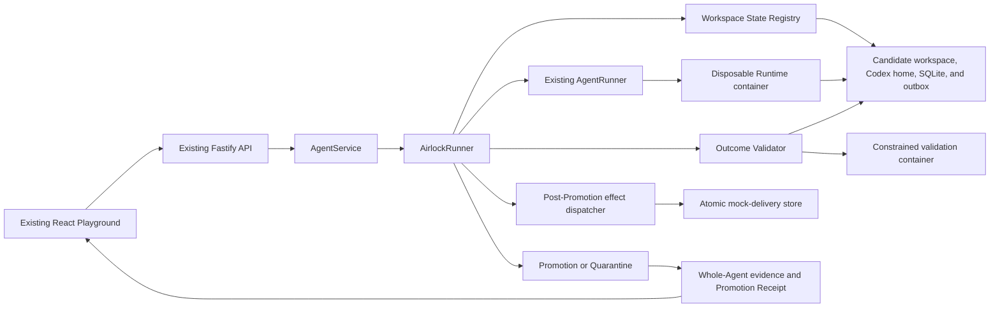
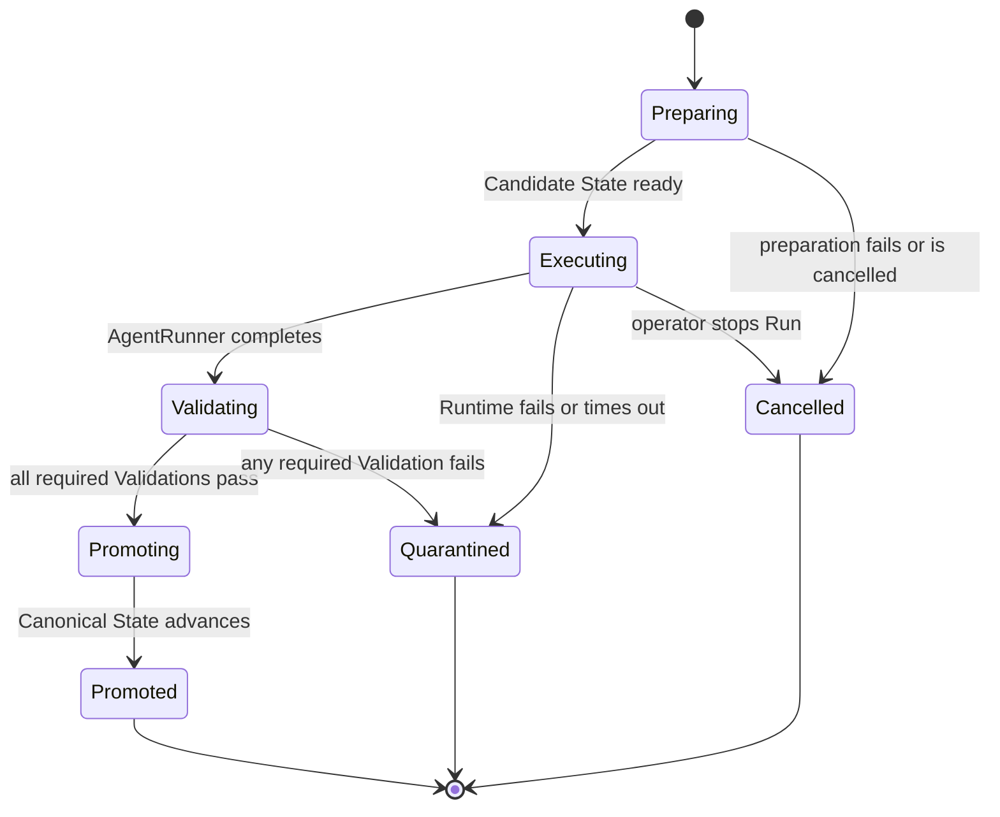

# Agent Airlock architecture

## Architectural intent

Agent Airlock adds one transactional execution seam around the starter kit's existing `AgentRunner` contract.
The control plane continues to own Agent lifecycle and Run orchestration, while Airlock owns preparation, validation, promotion, quarantine, and recovery of mutable Agent state.

## Baseline observation

The original `AgentService` passed the persistent workspace path and canonical Codex thread directly to `AgentRunner`.
The original local Runtime also bind-mounted that workspace and one shared Codex home as writable container paths.
Phase 1 isolated workspace files, but the shared Codex home remained a hidden mutation path until Phase 3.

## Implemented Phase 4 architecture



## Primary seam

`AirlockRunner` remains compatible with the existing `AgentRunner` interface from `apps/server/src/types.ts:78`.
It substitutes Candidate State paths before delegating to the existing local-process or container implementation.
The wrapper returns bounded execution output plus transactional evidence required by `AgentService`.

The target caller-facing shape is intentionally small:

```ts
interface AirlockRunner {
  run(request: AirlockRunRequest): Promise<AirlockRunResult>;
  cancel(agentId: string): Promise<boolean>;
  isAvailable(): Promise<boolean>;
}
```

Preparation, workspace coordination, validators, and receipts remain inside the module.
Recovery journals, retention, and additional Transactional Resource adapters remain later-phase extension seams.

## State layout

ADR 0002 selects immutable state-version directories with an atomically replaced canonical manifest.
ADR 0005 makes the workspace and Codex home one versioned Whole-Agent state:

```text
workspaces/
├── <agent-id>/
│   ├── canonical.json
│   └── versions/<state-id>/
│       ├── candidate.json (promoted Runs only)
│       ├── workspace/
│       │   └── .airlock/demo.sqlite
│       ├── codex-home/
│       └── outbox/intents.jsonl
├── .candidates/<run-id>/
│   ├── candidate.json
│   ├── workspace/
│   │   └── .airlock/demo.sqlite
│   ├── codex-home/
│   └── outbox/
└── .quarantine/<run-id>/
    ├── candidate.json
    ├── workspace/
    ├── codex-home/
    └── outbox/intents.jsonl
```

`canonical.json` identifies the accepted workspace path, Codex home path, Codex thread identifier, resource fingerprints, and composite state fingerprint.
A Candidate State is mutable only while its Run Transaction is active.
A promoted state version becomes immutable and may be used as the source for a later candidate.
Airlock verifies the workspace hash, session hash, and composite hash whenever Canonical State is resolved.
Candidate preparation copies both resources and refreshes only the generated provider configuration file from a platform-owned template.
Promotion moves the complete candidate root before one atomic manifest replacement, while Quarantine preserves the same complete root without changing the manifest.
`npm run test:codex-session-container` reproduces the pinned CLI storage boundary with container networking disabled and a fake credential.

## Run Transaction lifecycle



Crash-journal reconciliation, explicit discard, and Repair Runs remain later roadmap phases.

## Outcome Contract evaluation

Validation proceeds in a deterministic order so evidence remains understandable:

1. Validate candidate path containment and symlink safety.
2. Calculate the bounded workspace and resource change set.
3. Reject changes to protected paths.
4. Confirm required paths and structural invariants.
5. Enforce change-count and added-byte limits.
6. Scan changed content for configured secret patterns.
7. Execute operator-defined validation commands in a constrained container.
All required Validations must pass before promotion begins.
The Candidate Codex home is also rejected before Promotion if it contains any symbolic link or if the returned thread has no matching rollout artifact.

Outcome Contract schema version 1 is a bounded data model rather than a policy language.
Its default requires `AGENTS.md` and `README.md`, protects `AGENTS.md`, limits a Run to 200 changed files and 2 MiB of candidate payload across added or modified files, scans for Ark key assignments and bearer tokens, and defines no command Validations until the operator adds them.
The complete contract is snapshotted into the Run Transaction, so a later contract update cannot change a historical decision.
Operator-defined commands run against disposable Candidate State copies in fresh containers with no network, no application credentials, a read-only root, dropped capabilities, and resource limits.
Command build artifacts are deleted with the validation copy and can never enter Promotion.

Candidate inventory is limited to 10,000 entries and persisted change evidence is limited to 200 paths.
Changed files larger than 1 MiB fail the secret scan.
Command output is terminated above 65,536 bytes, redacted, and persisted up to 16,384 bytes.
Command duration is bounded by the contract between 1 second and 300 seconds.

## Transactional Resources

The current release implements the workspace lifecycle directly.
The planned Transactional Resource seam will apply the same lifecycle to other mutable resources:

```ts
interface TransactionalResource {
  prepare(context: PrepareContext): Promise<CandidateResource>;
  describe(candidate: CandidateResource): Promise<ResourceChangeSet>;
  validate(candidate: CandidateResource, contract: ResourceContract): Promise<Validation[]>;
  finalize(candidate: CandidateResource): Promise<ResourceVersion>;
  discard(candidate: CandidateResource): Promise<void>;
}
```

Workspace, Codex Session, SQLite, and External Action Intent behavior are implemented in Phase 4.
SQLite lives inside the versioned workspace and receives a semantic snapshot in addition to the workspace fingerprint.
The outbox is a separate candidate-owned mount so a prior accepted intent is never copied into the next candidate as a new request.

## External Action Intent outbox

The Agent submits the strict `demo.notification.requested` type through the path named by `AIRLOCK_OUTBOX_PATH`.
The control plane validates the JSONL file after Runtime exit and before Promotion.
The complete candidate, including the validated outbox, becomes immutable before the dispatcher runs.
The dispatcher verifies the new canonical state, atomically claims the mock effect by stable idempotency key, and records a bounded receipt.

Duplicate and concurrent dispatch attempts create one local mock effect and return the same receipt.
This exactly-once claim does not extend beyond the atomic mock consumer.
The POC does not intercept arbitrary network traffic from the Agent Runtime.

## Persistence model

The version 5 JSON store remains the control-plane metadata source for Agents, messages, Runs, Outcome Contracts, and operator-visible evidence.
Immutable state versions and quarantined candidates live on disk outside the JSON document.
Phase 3 Promotion moves the complete workspace and Codex-session candidate to an immutable version and atomically replaces `canonical.json`.
Startup reconciliation treats that manifest as authoritative and repairs cached workspace, state, and thread references in the JSON store.
A durable promotion journal and crash-point reconciliation remain later work.

Schema evolution must increment the database version and include a tested migration path from the starter kit's version 1 data.

## Failure semantics

| Failure | Required result |
| --- | --- |
| Candidate preparation fails | Do not invoke the AgentRunner and leave Canonical State unchanged. |
| AgentRunner fails or times out | Quarantine bounded evidence and leave Canonical State unchanged. |
| Validation fails | Quarantine Candidate State and identify the failing Validation. |
| Evidence persistence fails before promotion | Fail closed without promotion. |

Interruption during Promotion does not yet have full journal-based reconciliation and is a documented Phase 2 limitation.

## Trust boundaries

- The Agent Runtime is untrusted and receives only the Candidate workspace, Candidate Codex home, and Candidate outbox as writable state.
- Validation code from the candidate project is untrusted and runs from a disposable copy inside a constrained container.
- The Fastify control plane and Airlock state manager form the trusted POC boundary.
- The existing ordinary container remains a POC isolation mechanism rather than a hardened multi-tenant sandbox.
- The implemented outbox protects only external actions routed through its interface.
- The platform-owned mock delivery store is never mounted into the Runtime.

## Evidence model

Each Run Transaction records:

- Agent, Run, Candidate State, Canonical State, and Outcome Contract identifiers.
- Lifecycle timestamps and terminal disposition.
- Bounded resource change summaries.
- Validation names, statuses, durations, and redacted output.
- Resulting canonical version for promoted Runs.
- Independent workspace and Agent-memory fingerprints with one shared terminal disposition.
- SQLite before, candidate, and final semantic snapshots.
- Typed intent identities, idempotency keys, statuses, and bounded post-Promotion delivery receipts.

Promotion journal position and Repair Run ancestry join this model in later phases.

## Open architectural decisions

The [Wayfinder map](https://github.com/Kk120306/agent-airlock/issues/1) owns unresolved decisions about Promotion recovery, the operator experience, and the judging cutoff.
Codex session isolation is resolved by ADR 0005.
External action ordering and idempotency are resolved by ADR 0006.
Outcome Contract semantics and Validation containment are resolved by ADR 0003 and ADR 0004.
This document must be revised when those tickets close.
