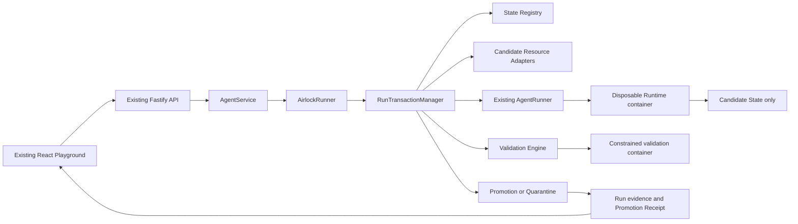
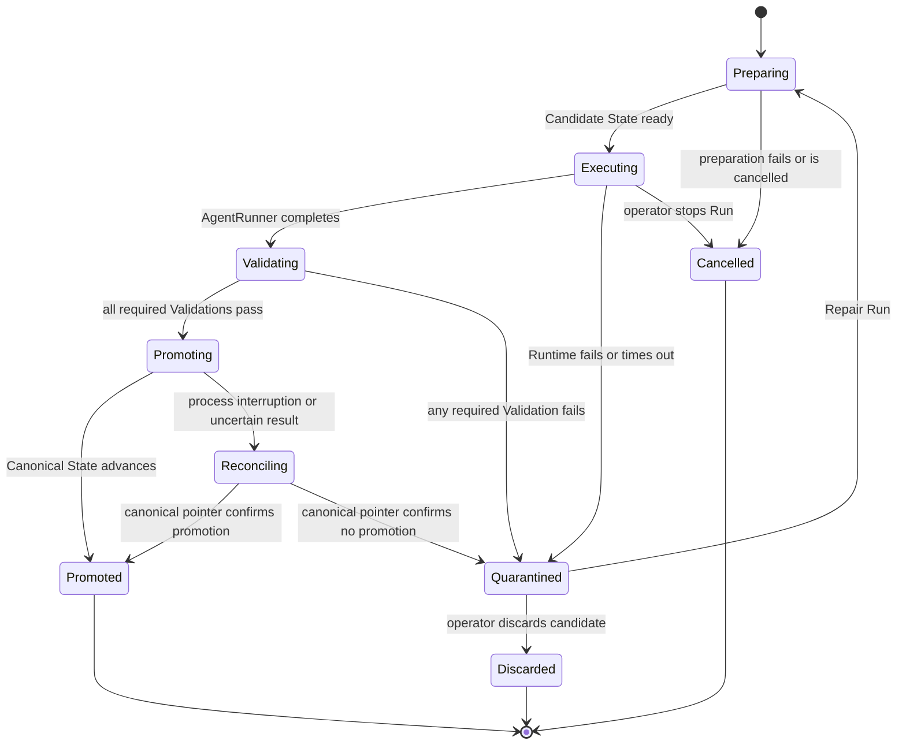

# Agent Airlock architecture

## Architectural intent

Agent Airlock adds one transactional execution seam around the starter kit's existing `AgentRunner` contract.
The control plane continues to own Agent lifecycle and Run orchestration, while Airlock owns preparation, validation, promotion, quarantine, and recovery of mutable Agent state.

## Baseline observation

The existing `AgentService` passes the persistent workspace path and canonical Codex thread directly to `AgentRunner` in `apps/server/src/agent-service.ts:235`.
The local Runtime then bind-mounts that workspace and the shared Codex home as writable container paths in `apps/server/src/container-codex-runner.ts:38`.
Container disposal therefore contains the process but does not make its persistent state changes transactional.

## Target architecture



## Primary seam

`AirlockRunner` remains compatible with the existing `AgentRunner` interface from `apps/server/src/types.ts:78`.
It substitutes Candidate State paths before delegating to the existing local-process or container implementation.
The wrapper returns bounded execution output plus transactional evidence required by `AgentService`.

The target caller-facing shape is intentionally small:

```ts
interface AirlockRunner {
  run(request: AirlockRunRequest): Promise<AirlockRunResult>;
  cancel(agentId: string): Promise<boolean>;
  isAvailable(): Promise<boolean>;
}
```

Preparation, resource coordination, validators, receipts, recovery journals, and retention remain inside the module.

## State layout

ADR 0002 selects immutable state-version directories with an atomically replaced canonical manifest:

```text
airlock-state/
├── agents/<agent-id>/
│   ├── canonical.json
│   └── versions/<state-id>/
│       ├── workspace/
│       ├── codex-home/
│       └── resources/
├── .candidates/<run-id>/
├── .quarantine/<run-id>/
├── receipts/<run-id>.json
└── promotion-journal/
```

`canonical.json` identifies the accepted resource versions.
A Candidate State is mutable only while its Run Transaction is active.
A promoted state version becomes immutable and may be used as the source for a later candidate.
Phase 1 verifies the manifest content hash whenever Canonical State is resolved.

## Run Transaction lifecycle



## Outcome Contract evaluation

Validation proceeds in a deterministic order so evidence remains understandable:

1. Validate candidate path containment and symlink safety.
2. Calculate the bounded workspace and resource change set.
3. Reject changes to protected paths.
4. Confirm required paths and structural invariants.
5. Enforce change-count and added-byte limits.
6. Scan changed content for configured secret patterns.
7. Execute operator-defined validation commands in a constrained container.
8. Validate queued External Action Intents against their schemas and limits.

All required Validations must pass before promotion begins.

## Transactional Resources

The internal Transactional Resource seam lets Airlock apply one lifecycle to different mutable resources:

```ts
interface TransactionalResource {
  prepare(context: PrepareContext): Promise<CandidateResource>;
  describe(candidate: CandidateResource): Promise<ResourceChangeSet>;
  validate(candidate: CandidateResource, contract: ResourceContract): Promise<Validation[]>;
  finalize(candidate: CandidateResource): Promise<ResourceVersion>;
  discard(candidate: CandidateResource): Promise<void>;
}
```

The POC requires Workspace, Codex Session, SQLite, and External Action Intent implementations.
Only the first two define the platform's Canonical State continuity.
SQLite and the outbox prove that the model is extensible beyond file diffs.

## External Action Intent outbox

The Agent must submit irreversible operations as typed intents through a platform-controlled interface.
An intent is stored with Candidate State and is validated before promotion.
After promotion, a dispatcher executes the intent with a stable idempotency key and records delivery evidence.

The POC provides at-least-once dispatch with idempotent mock consumers.
It does not claim to intercept arbitrary network traffic from the Agent Runtime.

## Persistence model

The version 2 JSON store remains the control-plane metadata source for Agents, messages, Runs, and operator-visible evidence.
Immutable state versions and quarantined candidates live on disk outside the JSON document.
Promotion uses a durable journal so startup reconciliation can distinguish completed, incomplete, and impossible transitions.

Schema evolution must increment the database version and include a tested migration path from the starter kit's version 1 data.

## Failure semantics

| Failure | Required result |
| --- | --- |
| Candidate preparation fails | Do not invoke the AgentRunner and leave Canonical State unchanged. |
| AgentRunner fails or times out | Quarantine bounded evidence and leave Canonical State unchanged. |
| Validation fails | Quarantine Candidate State and identify the failing Validation. |
| Promotion is interrupted | Reconcile from the journal and canonical pointer before accepting another Run. |
| Evidence persistence fails before promotion | Fail closed without promotion. |
| Evidence persistence fails after the canonical pointer changes | Reconstruct evidence from the promotion journal during reconciliation. |
| Outbox delivery fails | Preserve the promoted intent and retry with the same idempotency key. |

## Trust boundaries

- The Agent Runtime is untrusted and receives Candidate State only.
- Validation code from the candidate project is untrusted and runs inside a constrained container.
- The Fastify control plane and Airlock state manager form the trusted POC boundary.
- The existing ordinary container remains a POC isolation mechanism rather than a hardened multi-tenant sandbox.
- The outbox protects only external actions routed through its interface.

## Evidence model

Each Run Transaction records:

- Agent, Run, Candidate State, Canonical State, and Outcome Contract identifiers.
- Lifecycle timestamps and terminal disposition.
- Bounded resource change summaries.
- Validation names, statuses, durations, and redacted output.
- Promotion journal position and resulting canonical version.
- External Action Intent identifiers and delivery state.
- Repair Run ancestry.

## Open architectural decisions

The [Wayfinder map](https://github.com/Kk120306/agent-airlock/issues/1) owns unresolved decisions about Codex session isolation, contract semantics, validator containment, Promotion recovery, outbox delivery, and the operator experience.
This document must be revised when those tickets close.
