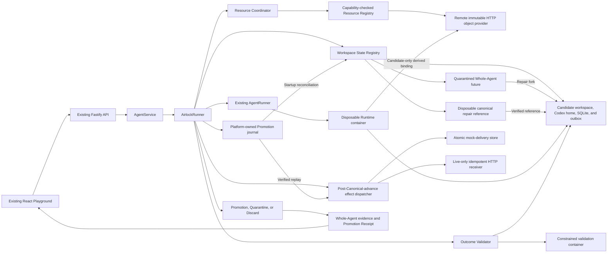
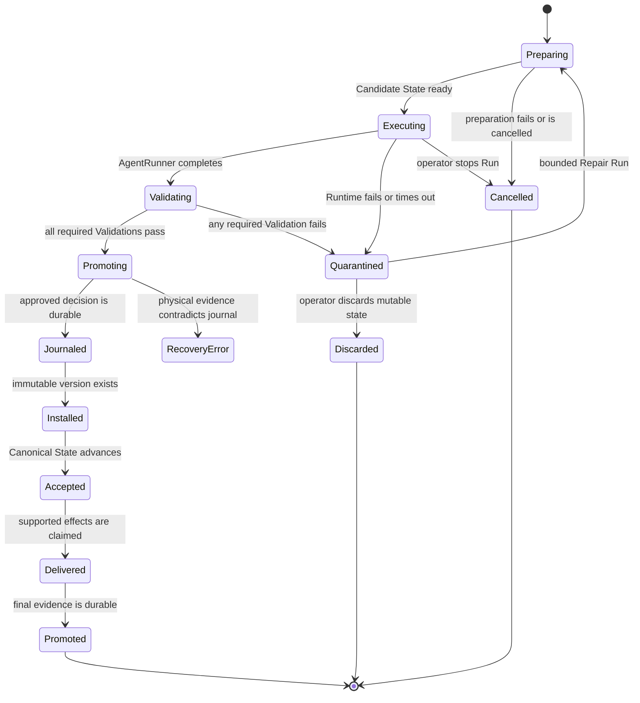
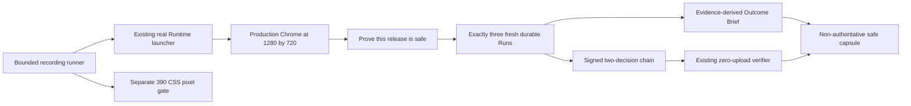

# Agent Airlock architecture

## Architectural intent

Agent Airlock adds one transactional execution seam around the starter kit's existing `AgentRunner` contract.
The control plane continues to own Agent lifecycle and Run orchestration, while Airlock owns preparation, validation, promotion, quarantine, and recovery of mutable Agent state.

## Baseline observation

The original `AgentService` passed the persistent workspace path and canonical Codex thread directly to `AgentRunner`.
The original local Runtime also bind-mounted that workspace and one shared Codex home as writable container paths.
Phase 1 isolated workspace files, but the shared Codex home remained a hidden mutation path until Phase 3.

## Implemented Phase 8 architecture



## Primary seam

`AirlockRunner` remains compatible with the existing `AgentRunner` interface from `apps/server/src/types.ts:78`.
It substitutes Candidate State paths before delegating to the existing local-process or container implementation.
The wrapper returns bounded execution output plus transactional evidence required by `AgentService`.

The target caller-facing shape is intentionally small:

```ts
interface AirlockRunner {
  run(request: AirlockRunRequest): Promise<AirlockRunResult>;
  cancel(agentId: string): Promise<boolean>;
  isAvailable(): Promise<boolean>;
}
```

Preparation, workspace coordination, validators, and receipts remain inside the module.
Additional Transactional Resource Providers register at the composition root through the provider-neutral SDK without changing `AirlockRunner` lifecycle branches.
Repair preparation, ancestry, freshness checks, and discard remain inside the same Airlock boundary.
Promotion journaling, forward recovery, and bounded retention are implemented inside that boundary.

## State layout

ADR 0002 selects immutable state-version directories with an atomically replaced canonical manifest.
ADR 0005 makes the workspace and Codex home one versioned Whole-Agent state:

```text
workspaces/
├── .resource-registry.json
├── .registry-transitions/<agent-id>.json
├── <agent-id>/
│   ├── canonical.json
│   └── versions/<state-id>/
│       ├── candidate.json (promoted Runs only)
│       ├── workspace/
│       │   └── .airlock/demo.sqlite
│       ├── codex-home/
│       ├── outbox/intents.jsonl
│       └── resources/<provider-id>/
├── .candidates/<run-id>/
│   ├── candidate.json
│   ├── workspace/
│   │   └── .airlock/demo.sqlite
│   ├── codex-home/
│   ├── outbox/
│   ├── resources/<provider-id>/
│   └── repair-reference/ (Repair Runs only, removed before Promotion)
└── .quarantine/<run-id>/
    ├── candidate.json
    ├── workspace/
    ├── codex-home/
    ├── outbox/intents.jsonl
    └── resources/<provider-id>/
```

`canonical.json` schema 4 identifies the accepted workspace path, Codex home path, Codex thread identifier, sorted provider version vector, built-in resource fingerprints, and composite state fingerprint.
`.resource-registry.json` records the accepted additive provider contract set and its monotonic generation.
Each `.registry-transitions/<agent-id>.json` record binds one verified provider addition to exact source and target state identifiers, built-in hashes, provider vectors, and registry generation before canonical advancement.
Recovery gives that journal no deletion authority until its exact schema, deterministic transition and target identifiers, additive evolution, credential-free verification set, and source and target fingerprints have all been validated.
Provider onboarding copies the complete immutable source state into a new immutable target, changes only the provider vector and composite fingerprint, and atomically replaces `canonical.json` after the target is verified.
Startup removes an unaccepted target or recognizes an exact already-accepted target before completing the transition.
The registry generation advances only after every existing Agent converges.
An unresolved Promotion from the prior generation prevents both Registry Transition execution and generation commit.
Agent creation and new ordinary or Repair Runs remain unavailable while that generation is uncommitted, preventing a partially onboarded provider set from becoming an execution boundary.
Creating the first Agent after a provider contract is registered performs the same exact immutable-source reconciliation before writing that Agent's initial canonical manifest.
A Candidate State is mutable only while its Run Transaction is active.
A promoted state version becomes immutable and may be used as the source for a later candidate.
Airlock verifies the workspace hash, session hash, and composite hash whenever Canonical State is resolved.
Candidate preparation copies both resources and refreshes only the generated provider configuration file from a platform-owned template.
Promotion moves the complete candidate root before one atomic manifest replacement, while Quarantine preserves the same complete root without changing the manifest.
An approved Agent Run records a Promotion journal outside every Runtime mount before the candidate root moves.
Repair copies a selected Quarantine into a new Candidate State, resumes its rejected Codex thread, creates a fresh empty outbox, and adds a disposable copy of the exact matching Canonical workspace as a repair reference.
The container Runtime mounts that reference read-only, and every provider must pass a required reference-integrity Validation before Promotion.
Airlock removes the reference before installing the repaired immutable version.
Discard removes only the internally resolved mutable Quarantine root and retains bounded evidence in the control-plane store.
`npm run test:codex-session-container` reproduces the pinned CLI storage boundary with container networking disabled and a fake credential.

The platform data layout adds one journal record per approved Run:

```text
APP_DATA_DIR/
├── launchpad.json
├── mock-deliveries.json or http-delivery-receipts.json
└── promotion-journal/<run-id>.json
```

Each record advances atomically through `validated`, `version-installed`, `canonical-advanced`, `effects-delivered`, and `completed`.
Provider Promotion plans, exact target versions, Capability Claims, and bounded lifecycle events are part of the same record.
The record contains bounded redacted transaction evidence and a neutral recovery result, not a duplicate of arbitrary Runtime output.

## Run Transaction lifecycle



Repair may start only when the selected Quarantine is available, its recorded Canonical State still exactly matches current reality, its parent has no existing repair child, and the configured ancestry bound is not exhausted.
Each Repair Run uses the original snapshotted Outcome Contract and follows the ordinary execution, Validation, Promotion, and Quarantine path.
Server startup reconciles journaled Promotions before generic active-Run handling.
An interrupted pre-decision Candidate is retained in Quarantine when its manifest is valid and is cancelled only when no Candidate exists.

## Outcome Contract evaluation

Validation proceeds in a deterministic order so evidence remains understandable:

1. Record trusted execution-profile evidence after the Runtime completes and before the Promotion decision.
2. Validate candidate path containment and symlink safety.
3. Calculate the bounded workspace and resource change set.
4. Reject changes to protected paths.
5. Confirm required paths and structural invariants.
6. Enforce change-count and added-byte limits.
7. Scan changed content for configured secret patterns.
8. Execute operator-defined validation commands in a constrained container.
   All required Validations must pass before promotion begins.
   The Candidate Codex home is also rejected before Promotion if it contains any symbolic link or if the returned thread has no matching rollout artifact.

The execution-profile Validation is generated by the trusted control plane from the active configuration after the inner Runner returns successfully.
It records a safe execution mode, executor, Runtime class, Responses protocol, and SHA-256 commitment to the configured model identity.
In the guided live profile, it also records the validated launch-preflight timestamp, generated-output result, bounded attempt and request counts, retry delay, and a SHA-256 commitment to the provider origin.
It never records the API key, raw model or endpoint identifier, base URL, or environment values.
Its presence in `RunTransaction.validations` places it under both the durable Promotion Receipt evidence hash and the portable receipt Validation Merkle root.
This evidence is an Airlock attestation about its configured execution path, not independent provider-signed telemetry.

Outcome Contract schema version 1 is a bounded data model rather than a policy language.
Its default requires `AGENTS.md` and `README.md`, protects `AGENTS.md`, limits a Run to 200 changed files and 2 MiB of candidate payload across added or modified files, scans for Ark key assignments and bearer tokens, and defines no command Validations until the operator adds them.
The complete contract is snapshotted into the Run Transaction, so a later contract update cannot change a historical decision.
Operator-defined commands run against disposable Candidate State copies in fresh containers with no network, no application credentials, a read-only root, dropped capabilities, and resource limits.
Command build artifacts are deleted with the validation copy and can never enter Promotion.

Candidate inventory is limited to 10,000 entries and persisted change evidence is limited to 200 paths.
Changed files larger than 1 MiB fail the secret scan.
Command output is terminated above 65,536 bytes, redacted, and persisted up to 16,384 bytes.
Command duration is bounded by the contract between 1 second and 300 seconds.

## Transactional Resources

Phase 8 implements a provider-neutral lifecycle package and a trusted core coordinator:

```ts
interface TransactionalResourceProvider {
  readonly manifest: ResourceProviderManifest;
  prepare(context: ResourcePrepareContext): Promise<PreparedResource>;
  describe(context: ResourceCandidateContext): Promise<ResourceChangeEvidence>;
  validate(
    context: ResourceCandidateContext,
  ): Promise<ResourceValidationEvidence[]>;
  planPromotion(
    context: ResourceCandidateContext,
  ): Promise<ResourcePromotionPlan>;
  promote(context: ResourcePromotionContext): Promise<ResourceVersionReference>;
  quarantine(
    context: ResourceQuarantineContext,
  ): Promise<ResourceQuarantineHandle>;
  discard(context: ResourceDiscardContext): Promise<ResourceDiscardResult>;
  reconcile(
    context: ResourceReconcileContext,
  ): Promise<ResourceReconciliationResult>;
}
```

Workspace, Codex Session, SQLite, and External Action Intent behavior are implemented in Phase 4.
SQLite lives inside the versioned workspace and receives a semantic snapshot in addition to the workspace fingerprint.
The outbox is a separate candidate-owned mount so a prior accepted intent is never copied into the next candidate as a new request.

Every registered Phase 8 provider is required and must pass exact capability eligibility at startup.
Required Phase 8 providers must use `canonical-manifest` Promotion visibility.
Claims such as post-Promotion reconciliation remain representable in the SDK but are not admissible for the required all-or-nothing composition.
The core calls providers in stable provider-identifier order and derives both `AIRLOCK_RESOURCE_<PROVIDER>_PATH` and `/airlock/resources/<provider-id>/<relative-path>` from validated identifiers.
The Runtime receives only Candidate-local bindings and never a provider credential, host service object, or mutable Canonical path.
Composition rejects an access claim the selected Runtime cannot enforce, including read-only provider bindings in local-process mode.
After Runtime exit, the core rescans each provider root for symbolic links and re-resolves the binding before any trusted provider hook can inspect Candidate content.

`canonical-manifest` visibility means that an immutable provider version becomes accepted only when the Airlock manifest names its exact version identifier and fingerprint.
The HTTP object provider uses that mode and does not advance a provider-native mutable pointer.
Airlock therefore provides one recoverable acceptance decision without claiming distributed atomic commit across the filesystem and remote service.

Provider preparation failure triggers evidence-preserving Discard before Runtime.
That compensation is scoped to providers whose preparation was attempted, including the provider that failed, and never invokes later providers that could not have created Candidate state.
Accepted provider preparation, Quarantine, and Discard results are persisted incrementally so partial multi-provider progress survives a later failure.
Prepare replay and null-handle Discard are Run-scoped, allowing recovery when a provider created remote state but its response was lost.
Any required provider Validation failure quarantines every built-in and registered resource under one disposition.
The Promotion journal records provider plans before immutable installation, and restart reconciliation verifies the exact installed fingerprint before canonical advancement.
Historical Promotion recovery selects the exact provider subset persisted in that plan, so adding provider B cannot strand a transaction created under `{}` or `{A}`.
Provider Discard events are persisted in an immutable authority-bound cleanup completion fact before local mutable state is removed so an interrupted terminal cleanup can converge without inventing success.
The portable authority root and its top-level Candidate Set and cleanup namespaces are synchronized in their immediate parents before descendant authority can authorize destructive cleanup.
Prepare-abort cleanup that must remove partial provider preparation before a terminal Run exists instead embeds exact successful provider coverage in the later Discard authority.
Legacy prepare-abort evidence may contain successful no-op Discard events for unattempted providers, but those events are tolerated only as inert extras and cannot establish the known-provider set.
Cancellation with an unavailable provider Discard moves the complete local Candidate into cleanup-only Quarantine rather than deleting its recovery handle.
Retained Quarantine cleanup likewise uses its persisted historical provider subset and never invokes a provider that was added after the Run.

An existing deployment onboards a provider through an additive Registry Transition.
The coordinator reconciles the exact configured initial version and fingerprint before the workspace manager writes a transition plan.
Provider removal, provider identity replacement, and Capability Claim replacement are rejected because Phase 8 does not yet define export-and-retire semantics.

## External Action Intent outbox

The Agent submits the strict `demo.notification.requested` type through the path named by `AIRLOCK_OUTBOX_PATH`.
The control plane validates the JSONL file after Runtime exit and before Promotion.
The complete candidate, including the validated outbox, becomes immutable before the dispatcher runs.
The dispatcher verifies the new canonical state, claims the supported effect by stable idempotency key, and records a bounded receipt.

The canonical deterministic proof uses the atomic local mock consumer.
Duplicate and concurrent dispatch attempts create one local mock effect and return the same receipt.
This exactly-once claim does not extend beyond the atomic mock consumer.
The mock receipt database owns a non-secret durable consumer identifier, and replacing that database creates a different idempotency domain even when its filesystem path is unchanged.

The managed live ModelArk profile maps only the logical `demo-console` destination to a control-plane-selected loopback HTTP receiver.
The receiver recomputes the payload and idempotency commitments, persists one receipt atomically, and returns the original receipt for an exact replay.
The receiver persists a non-secret durable consumer identifier with its receipts and exposes that identifier through a bounded read-only identity endpoint.
Before physical state movement, the control plane commits a digest of the delivery mode, consumer identifier, and logical destination into the Promotion journal.
Each HTTP delivery presents the expected consumer identifier, so receiver replacement between identity discovery and delivery fails closed instead of replaying into a new idempotency domain.
Recovery compares the journal commitment with the active dispatcher before delivery and refuses to continue when the consumer identity, delivery mode, or logical destination changed.
The live proof runner requires the matching HTTP receipt before it records conformance success.
This profile proves at-least-once HTTP transport to an idempotent consumer with one accepted effect identity, not distributed exactly-once delivery to arbitrary providers.
ADR 0021 records the live-only HTTP boundary.
The POC does not intercept arbitrary network traffic from the Agent Runtime.

## Persistence model

The version 10 JSON store remains the control-plane metadata source for Agents, messages, Runs, Outcome Contracts, Candidate Sets, Assurance Proposals, and operator-visible evidence.
Immutable state versions and quarantined candidates live on disk outside the JSON document.
Promotion moves the complete workspace and Codex-session candidate to an immutable version and atomically replaces `canonical.json`.
Startup reconciliation treats an ordinary Run journal or the conjunction of a replayed Candidate Set decision and its matching journal authority as the approved decision, the immutable version as installed state, `canonical.json` as accepted reality, and the configured durable delivery receipt store as effect truth.
It verifies physical fingerprints before repairing cached workspace, state, thread, Run, message, receipt, and effect metadata in the JSON store.
Phase 5 persists repair ancestry, mutable Quarantine availability, discard timestamps, and the same lineage in each Promotion Receipt.
Phase 6 persists Promotion journal position, recovered-after-restart evidence, and bounded recovery errors.
Phase 8 persists provider resource records, Capability Claims, immutable source and installed versions, Validation evidence, Quarantine handles, dispositions, and bounded lifecycle events.
Phase 9 persists exact Candidate Set source and contract snapshots, per-competitor Run links, seals, bounded criterion inputs, deterministic scorecards, one-winner or no-winner Selection Decisions, and loser cleanup progress.
Promotion journal schema 2 additionally persists the exact Candidate Set winner authority, including decision and seal digests, and startup validates it before physical recovery.
Promotion journal schema 3 additionally binds the durable external-action consumer scope before physical state movement, while ambiguous legacy journals that may already have dispatched an effect fail closed.
Phase 10 persists versioned Assurance evidence, deterministic monotonic proposals, historical simulation results, explicit operator decisions, and append-only Outcome Contract history.
Phase 11 derives Portable Promotion Envelopes from complete versioned durable evidence and requires a separate append-only Decision Authority record captured before terminal control-plane metadata.
Phase 11 also persists one immutable provider-cleanup completion fact after Discard authority and successful provider cleanup but before local Candidate or Quarantine removal.
One immutable Candidate Set Decision Authority is captured before mutable Selection, and final Candidate Set-bound Run authorities are published before that Selection becomes visible.
Immutable historical Canonical manifests let export recompute the complete physical Whole-Agent state for every referenced accepted state identifier.
Terminal progress is withheld until the child Run and corresponding lifecycle projection are ready, while the Agent remains busy until its aggregate Candidate Set finishes Selection, winner Promotion, and loser cleanup.
Receipt and transparency private keys remain separate operator-owned files, and the optional transparency log persists only portable receipt digests and signed checkpoint evidence.
Phase 12 persists immutable receiver policy generations, admission plans, Admission Records, and verified artifact staging outside the mutable application database.
Phase 13 persists a separate immutable Federated Approval Decision plus a monotonic approval recovery plan.
The pending Admission remains unchanged, and the federated-approval Promotion authority commits both the pending Admission digest and Approval Decision digest before any physical Promotion can recover.
Phase 14 derives a read-only operator inbox from Admission Records, Approval Decision records, approval plans, and safe Run summaries.
The projection is Agent-scoped, deterministically ordered, bounded by the server, and excludes staged bundles, trust policies, local mutable paths, Runtime output, Validation output, and credentials.
The inbox is never authority.
An action selected from the inbox still passes through the same append-only decision coordinator and dual-authority Promotion path.
Phase 15 reverifies the staged bundle and derives a content-free review projection containing normalized artifact-relative paths, operation metadata, bounded producer claims, and resource counts.
The review projection is explanatory evidence only and cannot substitute for Candidate materialization or receiver Validation.
Phase 16 derives a deterministic preflight from that reverified operation metadata and the receiver's current Outcome Contract.
It shares protected-path pattern semantics with authoritative Validation and can predict path-count, known-byte-count, protected-path, and literal required-path blockers without reading content or creating Candidate State.
The preflight records the exact receiver contract version and names checks deferred to Candidate Validation.
Its result is advisory evidence, not Admission authority, Approval authority, Validation, or Promotion authority.
Phase 17 derives a decision-context digest from the immutable pending Admission record digest and the receiver's current canonical Outcome Contract digest.
The decision API requires that opaque digest and compares it inside an Agent-scoped decision lock shared with Outcome Contract configuration before first-decision coordination or Candidate preparation.
A mismatch returns a retryable conflict so the client can reload current review evidence while Canonical State and Run count remain unchanged.
Once an immutable Approval Decision exists, exact retries continue through the original decision coordinator and are not invalidated by later contract rotation.
The context digest begins as a freshness guard over explanatory review inputs and is not authority by itself.
Phase 18 commits that validated digest inside each new schema-version-2 immutable Approval Decision, making the decision itself permanent evidence of the reviewed context without turning the browser projection into authority.
Schema-version-1 decisions remain valid historical authority but are explicitly unbound to a reviewed-context commitment.

Schema evolution must increment the database version and include a tested migration path from the starter kit's version 1 data.

## Failure semantics

| Failure                                                                                                            | Required result                                                                                                                                                                                                                                                  |
| ------------------------------------------------------------------------------------------------------------------ | ---------------------------------------------------------------------------------------------------------------------------------------------------------------------------------------------------------------------------------------------------------------- |
| Candidate preparation fails                                                                                        | Do not invoke the AgentRunner and leave Canonical State unchanged.                                                                                                                                                                                               |
| AgentRunner fails or times out                                                                                     | Quarantine bounded evidence and leave Canonical State unchanged.                                                                                                                                                                                                 |
| Validation fails                                                                                                   | Quarantine Candidate State and identify the failing Validation.                                                                                                                                                                                                  |
| Repair source is stale, missing, exhausted, or already has a child                                                 | Reject the operation before scheduling and leave both realities unchanged.                                                                                                                                                                                       |
| Repair reference changes                                                                                           | Fail its required Validation and quarantine the Repair Run.                                                                                                                                                                                                      |
| Operator discards Quarantine                                                                                       | Remove only mutable Quarantine state and retain bounded evidence with `discarded` disposition.                                                                                                                                                                   |
| Evidence persistence fails before promotion                                                                        | Fail closed without promotion.                                                                                                                                                                                                                                   |
| Process stops after an approved journal                                                                            | Reconcile the same decision forward to one target version and at most one supported mock effect.                                                                                                                                                                 |
| Journal and physical state contradict                                                                              | Preserve current Canonical State, dispatch no new effect, and surface `recovery-error`.                                                                                                                                                                          |
| Candidate or Quarantine retention expires                                                                          | Remove only unprotected mutable state and retain bounded control-plane evidence.                                                                                                                                                                                 |
| Resource Provider preparation fails                                                                                | Do not invoke Runtime, discard every possible provider Candidate idempotently, and retain a composite Quarantine when cleanup cannot finish.                                                                                                                     |
| Provider onboarding source cannot be verified                                                                      | Preserve the prior canonical manifest and Resource Registry generation and place the affected Agent in an explicit error state.                                                                                                                                  |
| Registry Transition is interrupted                                                                                 | Reconcile the journal against exact installed and canonical fingerprints, then either retry from the prior state or finish the accepted transition.                                                                                                              |
| Registry Transition journal is malformed or forged                                                                 | Reject it before deleting any state or rewriting Canonical State.                                                                                                                                                                                                |
| Prior-generation Promotion recovery fails                                                                          | Preserve its historical state, defer every Registry Transition and registry-generation commit, and surface `recovery-error`.                                                                                                                                     |
| Provider removal or contract replacement is configured                                                             | Reject the non-additive registry evolution before changing Canonical State.                                                                                                                                                                                      |
| Required provider Validation fails                                                                                 | Quarantine every built-in and provider resource while leaving the canonical manifest unchanged.                                                                                                                                                                  |
| Provider Promotion or reconciliation contradicts the durable plan                                                  | Preserve current Canonical State and surface `recovery-error`.                                                                                                                                                                                                   |
| Provider cleanup is unavailable                                                                                    | Retain local mutable state and retry before removal.                                                                                                                                                                                                             |
| Local Quarantine is missing without embedded exact provider Discard evidence or an authority-bound completion fact | Fail recovery closed and do not claim remote cleanup.                                                                                                                                                                                                            |
| Candidate Set admission or preparation conflicts with another Agent operation                                      | Reject the set before sibling Runtime execution and leave Canonical State unchanged.                                                                                                                                                                             |
| A competitor fails required Validation                                                                             | Exclude that Candidate from Selection regardless of its ranking inputs and dispatch none of its effects.                                                                                                                                                         |
| Every competitor is invalid or incomplete                                                                          | Persist `no-winner`, leave Canonical State unchanged, and reconcile every loser disposition.                                                                                                                                                                     |
| Process stops before Candidate Set Selection                                                                       | Preserve complete seals, mark partial evaluations ineligible without replaying Runtime, and deterministically select only from persisted evidence.                                                                                                               |
| Process stops after immutable Candidate Set Decision Authority but before mutable Selection                        | Restore the exact authorized Selection and never recompute a different winner.                                                                                                                                                                                   |
| Process stops after Candidate Set Selection                                                                        | Resume Promotion for only the exact persisted winner, then reconcile loser cleanup idempotently.                                                                                                                                                                 |
| Candidate Set and Promotion-journal authorities disagree                                                           | Reject physical Promotion recovery before installation, canonical advancement, or effect dispatch and surface `recovery-error`.                                                                                                                                  |
| Selected Candidate seal, source, resource fingerprint, or Promotion evidence contradicts physical state            | Surface `recovery-error`, preserve evidence, dispatch no new effect, and never select a runner-up.                                                                                                                                                               |
| A new provider is configured while an older Candidate Set is unresolved                                            | Recover the Candidate Set with its historical provider subset before Registry Transition or generation commit.                                                                                                                                                   |
| Candidate Set recovery fails while a new provider is configured                                                    | Keep the prior Resource Registry generation authoritative and refuse onboarding or generation commit.                                                                                                                                                            |
| Portable receipt evidence is incomplete, legacy, or contradictory                                                  | Return a retryable conflict without signing an interpretation or changing Canonical State.                                                                                                                                                                       |
| Terminal Run authority is ahead of an active or already-terminal mutable Run or Candidate competitor               | Verify stable identity, the strictly bounded Quarantine-to-Discard or completed-Promotion recovery progression, Candidate Set authority, and physical disposition, then replay the exact newest transaction plus competitor lifecycle or enter `recovery-error`. |
| Portable Decision Authority or a historical Canonical manifest is missing or contradictory                         | Fail export closed without reconstructing authority from mutable database content.                                                                                                                                                                               |
| Portable signing identity is missing, substituted, malformed, or weakly permissioned                               | Fail export closed without revealing a local path or silently rotating the identity.                                                                                                                                                                             |
| Optional transparency state is malformed                                                                           | Fail anchored export closed while leaving signature-only export available.                                                                                                                                                                                       |
| Approval-required bundle staging is missing, malformed, or contradicts the pending Admission                       | Create no Candidate State, preserve Canonical State, and refuse the operator decision.                                                                                                                                                                           |
| A retry contradicts the first Federated Approval Decision                                                           | Preserve the immutable first decision and fail the retry closed.                                                                                                                                                                                                 |
| Federated Approval recovery lacks either the pending Admission or Approval Decision authority                       | Refuse physical Promotion recovery, dispatch no effect, and surface a bounded recovery failure.                                                                                                                                                                  |
| Browser state is lost or an operator opens the receiver on another client                                           | Reconstruct the bounded Agent-scoped inbox from durable journals and require the normal append-only decision path.                                                                                                                                                |
| A stale operator submits a decision after another operator committed a contradiction                               | Return a visible conflict, retain the first immutable decision, create no additional Candidate, and leave Canonical State unchanged.                                                                                                                             |
| Staged evidence is missing or changes before an operator requests review                                            | Fail the complete inbox request closed, render no partial review, create no Candidate, and leave Canonical State unchanged.                                                                                                                                      |
| Metadata preflight predicts a receiver Outcome Contract blocker                                                     | Show the bounded prediction and deferred checks, retain the normal append-only decision path, create no Candidate during review, and let authoritative Candidate Validation own the final disposition after approval.                                               |
| Receiver Outcome Contract changes after review but before the first operator decision                              | Reject the stale decision context before Candidate preparation, refresh current review evidence, preserve the operator's draft reason, create no Run, and leave Canonical State unchanged.                                                                         |
| A retry presents a different reviewed context than the immutable schema-version-2 Approval Decision               | Reject the contradiction, preserve the first decision and its Candidate identity, dispatch no additional effect, and leave Canonical State unchanged.                                                                                                             |
| A legacy schema-version-1 Approval Decision is recovered                                                           | Preserve and recover its original authority without fabricating a reviewed-context commitment, while all new decisions use schema version 2.                                                                                                                       |
| The recording runner observes an old Run, the wrong number of new Runs, or an unexpected disposition              | Return a bounded nonzero failure, persist no new success capsule, and preserve every Run and the last successful artifact pair.                                                                                                                                    |
| The recording Outcome Brief contradicts durable Run authority or omits required resource or effect evidence        | Withhold the success verdict and signed-chain handoff, then return an evidence failure without changing Canonical State.                                                                                                                                           |
| The recording chain fails signature, lineage, or Canonical State handoff verification                              | Keep the invalid result out of the zero-upload success story and return a distinct evidence failure.                                                                                                                                                               |
| The recording browser, viewport, timeout, or process lifecycle fails                                                | Close only owned browser and server processes, return the matching safe failure class, and preserve the last successful artifact pair.                                                                                                                             |

The exact recovery sequence and fault matrix are documented in the [recovery guide](../RECOVERY.md).

The implemented Phase 9 split between reversible Candidate evaluation, deterministic one-winner Selection, and irreversible Promotion is documented in the [Competing Futures architecture](competing-futures.md) and ADR 0011.
The implemented Phase 10 separation between evidence-backed assurance advice and operator policy authority is documented in the [Adaptive Assurance architecture](adaptive-assurance.md) and ADR 0012.
The implemented Phase 11 signed receipt and optional anchoring protocol is documented in the [Portable Trust architecture](portable-trust.md) and ADR 0013.
The authority-first Selection, terminal replay, and append-only transparency lock-turn decisions are documented in [ADR 0014](../adr/0014-publish-selection-and-terminal-authority-before-mutable-projections.md).

## Phase 22 recording proof boundary

Phase 22 composes existing production paths into a bounded recording proof and introduces no new transaction authority.
The canonical command is `npm run prove:runtime -- --reset --headed`, and the persistent manual inspection path remains `npm run demo:runtime -- --reset`.



The recording coordinator must:

1. Start the existing loopback real Runtime launcher with reset state and wait for its credential-safe readiness boundary.
2. Open production Chrome at 1280 by 720 and expose one primary `Prove this release is safe` action.
3. Snapshot the durable Run boundary before interaction.
4. Require exactly three fresh Runs after that boundary in the order valid Promotion, destructive Quarantine, and promoted Repair from the retained Quarantine.
5. Build the Outcome Brief only from persisted Run evidence, resource dispositions, Validation results, Canonical fingerprints, effect receipts, and Repair lineage.
6. Generate and locally verify the signed two-decision chain for the quarantined parent and promoted Repair.
7. Pass that exact artifact to the existing zero-upload verifier without reconstructing or weakening it in the browser.
8. Gate the same required controls and verdicts at a separate 390 CSS pixel viewport.
9. Close the owned browser, launcher, and Runtime containers, verify the stopped physical snapshot, remove the owned proof session, then persist the signed chain at its immutable digest-derived path, atomically replace the owner-only safe capsule that names that exact chain, and release proof ownership.

The safe capsule is a bounded non-authoritative index.
It may contain the three fresh Run identifiers, closed gate results, final verdict, chain digest, and relative chain filename.
It must exclude prompts, Runtime output, raw Validation output, environment values, credentials, provider URLs, model identifiers, local absolute paths, and signing material.
The proof lease remains held while the immutable chain is installed and while the capsule crosses its single atomic rename commit point.
Before that rename, the prior capsule still names its prior immutable chain, and after that rename, the new capsule names the already-complete new chain.
An interruption before the rename preserves the prior pair, while an interruption after the rename cannot revoke the committed result even if proof-lease cleanup remains incomplete.
If the parent loses the worker response at that boundary, it reconciles the anchored destination and treats the exact installed pointer as the irreversible outcome.
An existing proof lease or legacy publication lock fails closed without deleting or replacing that path.
Reset cleanup validates the session marker and dead owner through stable descriptors, then purges only through that anchored session directory.
The absolute recording deadline remains armed until the pointer outcome is reconciled and accepted.
The browser arms a context-wide deny-all HTTP and WebSocket boundary before the first verifier opening and retains it through both verifier views, the final headed dwell, and browser close.
The signed Portable Decision Chain remains the independent evidence and the durable Run, journal, and Portable Decision authorities remain unchanged.

The recording success state requires all of the following facts to agree:

- Three and only three fresh terminal Runs exist after proof start.
- The first Run promotes all four resources and releases its supported effect only after Canonical State advances.
- The second Run quarantines all four resources and preserves the exact Canonical fingerprint.
- The third Run is the bounded Repair child of the second, uses a fresh outbox, passes required Validation, and promotes all four resources.
- The Outcome Brief is a projection of those durable facts rather than a new decision record.
- The signed two-decision chain verifies both signatures, exact parent linkage, and Canonical State continuity.
- The zero-upload verifier consumes the same chain and reports no API calls or uploads.
- The 1280 by 720 view retains every required control and verdict without document overflow.
- The 390 CSS pixel view retains every required control and verdict without horizontal overflow, with the complete proof reachable through normal vertical scrolling.

The core recording excludes federation, receiver custody, blockchain publication, Competing Futures, Adaptive Assurance, live ModelArk capacity, and every new Promotion, Run, receipt, trust, or organizational authority.
Existing Portable Trust signatures provide mathematical evidence and do not establish organizational trust or authorize Promotion by themselves.
The local deterministic Responses fixture exercises real Codex and the CodeJam Runtime protocol without making a live-provider claim.

The boundary is resolved by [Define the recording-grade real Runtime proof contract](https://github.com/Kk120306/agent-airlock/issues/36), and implementation is tracked by [Build the recording-grade real Runtime proof path](https://github.com/Kk120306/agent-airlock/issues/37).

## Trust boundaries

- The Agent Runtime is untrusted and receives only the Candidate workspace, Candidate Codex home, and Candidate outbox as writable state.
- A Repair Runtime may read a disposable canonical workspace copy, but it never receives a writable path to the real Canonical State.
- Validation code from the candidate project is untrusted and runs from a disposable copy inside a constrained container.
- The Fastify control plane and Airlock state manager form the trusted POC boundary.
- Federated operator identity comes from trusted receiver configuration or authenticated control-plane context and never from the decision request body.
- The existing ordinary container remains a POC isolation mechanism rather than a hardened multi-tenant sandbox.
- The implemented outbox protects only external actions routed through its interface.
- The platform-owned mock delivery store is never mounted into the Runtime.
- The live ModelArk receiver URL is selected by the control plane, is never read from Candidate content, and is never mounted or passed into the Runtime.
- The platform-owned Promotion journal is never mounted into the Runtime.
- Resource Providers run inside the trusted control plane, receive bounded lifecycle context, and never receive the application store or arbitrary environment variables.
- Provider Runtime bindings are rooted under the isolated Candidate and are derived by the trusted core.
- Resource Provider source verification and Registry Transition journals remain inside the trusted control plane and are never exposed to Runtime.
- Candidate Set orchestration and Selection remain inside the trusted control plane, while every competitor Runtime receives only its own Candidate bindings and the shared bounded objective.
- The deterministic Selection engine accepts only persisted trusted evidence and has no access to time, randomness, locale ordering, network, filesystem, environment variables, or model judgment.
- A sealed Candidate is a commitment for later re-verification, not authority to promote itself.
- Portable receipt construction runs in the trusted control plane and accepts only the strict versioned durable evidence projection, never mutable Candidate files, Runtime output, environment values, or provider-private state.
- The portable signing key and non-secret identity marker remain outside Runtime, the control-plane database, portable envelopes, and browser responses.
- An independent verifier trusts the envelope's mathematics but must apply its own organizational policy to the included public key identity.
- The optional local transparency log can provide witnessed append-only evidence only to observers that retain and compare checkpoints.
- The optional EVM encoder is a network-free formatting boundary and has no wallet, RPC, publication, confirmation, timestamp, or Promotion authority.

## Evidence model

Each Run Transaction records:

- Agent, Run, Candidate State, Canonical State, and Outcome Contract identifiers.
- Lifecycle timestamps and terminal disposition.
- Bounded resource change summaries.
- Validation names, statuses, durations, and redacted output.
- Resulting canonical version for promoted Runs.
- Independent workspace and Agent-memory fingerprints with one shared terminal disposition.
- SQLite before, candidate, and final semantic snapshots.
- Typed intent identities, idempotency keys, statuses, and bounded receipts for deliveries after Canonical State advances.
- Root Run identifier, parent Run identifier, repair depth, configured depth bound, and mutable Quarantine availability.
- Monotonic Promotion journal phase, recovered-after-restart status, and bounded fail-closed recovery error.
- Provider identity, Capability Claim, immutable source and target references, fingerprint transition, bounded Validation evidence, Quarantine handle, disposition, and lifecycle events.
- Candidate Set identifier, exact shared source, snapshotted Outcome and Selection Contracts, competitor Run links, bounded integer criterion values, exclusions, ordered scorecard, stable tie-break, Selection Decision digest, winner, and loser dispositions.

## Open architectural decisions

The [Wayfinder map](https://github.com/Kk120306/agent-airlock/issues/1) owns the unresolved judging cutoff decision.
Codex session isolation is resolved by ADR 0005.
External action ordering and idempotency are resolved by ADR 0006.
Repair ancestry, canonical freshness, fresh outbox, canonical reference, and discard semantics are resolved by ADR 0007.
Promotion journal ordering, forward recovery, contradiction handling, and bounded retention are resolved by ADR 0008.
The public Resource Provider contract, capability eligibility, and canonical-manifest consistency model are resolved by ADR 0010.
Outcome Contract semantics and Validation containment are resolved by ADR 0003 and ADR 0004.
