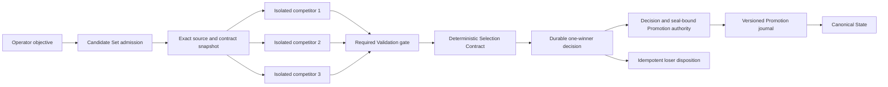

# Competing Futures architecture

## Purpose

Phase 9 turns Candidate State isolation into a deterministic optimization primitive.
One Candidate Set explores bounded sibling futures from one exact source, excludes every Candidate that fails a required Validation, persists a reproducible winner decision, and promotes at most one winner.

ADR 0011 is accepted, and this document describes the implemented behavior and its remaining environment-only release gates.

## Trust and authority flow



The operator authorizes the objective, bounded competitors, Selection Contract, and loser policy.
The Runtime may create Candidate content but has no selection or Promotion authority.
The trusted evaluators produce bounded criterion inputs.
The Selection engine applies only the snapshotted deterministic contract.
Canonical advancement requires the conjunction of the Candidate Set Selection Decision, selected sealed Candidate, and the matching versioned Promotion-journal authority.

## Aggregate model

### Candidate Set

A Candidate Set contains:

- A schema version and stable set identifier.
- The Agent identifier and operator objective.
- The exact source state identifier, composite hash, Codex thread identifier, and sorted provider-version vector.
- The complete snapshotted Outcome Contract.
- The complete snapshotted Selection Contract.
- Two through eight unique competitor specifications.
- A bounded concurrency limit and aggregate execution budget.
- The loser policy `retain` or `discard`.
- Monotonic phase, timestamps, scorecard, selected competitor identifier, winner Promotion Run identifier, and bounded recovery error.

### Competitor

A competitor contains:

- A stable identifier whose byte ordering is the final tie-break.
- A unique Run Transaction identifier.
- A trusted executor-profile identifier and a bounded strategy instruction.
- Status, timestamps, usage, and the ordinary Run Transaction evidence produced by evaluation.
- A sealed Candidate reference for an eligible Candidate or a Quarantine or Discard reference for an ineligible or failed Candidate.
- Criterion inputs, normalized integer values, eligibility exclusions, and loser disposition.

Executor profiles are trusted control-plane configuration identifiers.
They never carry a model key, provider credential, environment value, or arbitrary Runtime option in durable Candidate Set input.

Admission divides the aggregate total-token budget into deterministic positive per-competitor reservations before any Runtime begins.
The reservations sum to no more than the aggregate budget and travel across the trusted `AgentRunner` boundary.
Candidate Set admission requires an explicit provider-boundary token-enforcement capability and fails before persistence or Runtime launch when that capability is absent.
The zero-cost Codex fixture transports and checks the allowance before simulated execution.
The bundled ordinary Codex and container Runners do not claim this capability because their current provider path reports usage only after completion, so they cannot execute Competing Futures until a hard total-token provider control is added.
`/api/system` exposes the capability and bounded reason so the Playground disables Explore futures and explains the unavailable provider boundary before an operator submits work.
Missing usage, invalid usage, or reported usage above a reservation fails that competitor closed before Selection.

### Selection Contract

The first schema supports an ordered list of closed criteria:

| Criterion | Source | Direction | Bound |
| --- | --- | --- | --- |
| `quality-assertion` | Versioned trusted evaluator | Maximize | `0..1_000_000` |
| `changed-files` | Persisted workspace change evidence | Minimize | `0..10_000` |
| `added-bytes` | Persisted workspace change evidence | Minimize | `0..100_000_000` |
| `latency-ms` | Trusted monotonic execution measurement | Minimize | `0..3_600_000` |
| `total-tokens` | Trusted Runtime usage response | Minimize | `0..10_000_000` |

Every raw value is parsed as an integer and clamped only by rejection, never silent truncation.
For a maximize criterion, the normalized score equals the raw value.
For a minimize criterion with declared maximum `M`, the normalized score equals `M - rawValue`.
Candidates are compared lexicographically by the ordered normalized vector and then by ascending competitor identifier.
No floating-point value, locale comparison, current timestamp, map iteration order, or unrecorded model output may affect the result.

If an eligible Candidate lacks a required criterion input, it is excluded with a named reason.
If every Candidate is excluded or fails a required Validation, the set completes with `no-winner` and Canonical State remains unchanged.

## Evaluation and Promotion seam

The existing Runner exposes one compatible ordinary-Run operation and two explicit sealed-Candidate operations:

```ts
run(request, onProgress, { deferPromotionFor }): Promise<AirlockRunResult>

selectCandidates(candidateSetEvidence): CandidateSelectionDecision

promoteSealedCandidate(request, transaction, result, seal, authority, onProgress): Promise<AirlockRunResult>

disposeSealedCandidate(request, transaction, seal, loserPolicy, onProgress): Promise<RunTransaction>
```

`run` with `deferPromotionFor` may prepare resources, execute Runtime, rescan confinement boundaries, validate built-in and provider resources, parse deferred intents, and seal or quarantine the Candidate.
It may not plan or execute Promotion, write a Promotion journal, dispatch effects, or change Canonical State.

An eligible seal commits to:

- Candidate manifest and exact source fields.
- Workspace, Codex session, SQLite, outbox, and composite fingerprints.
- Sorted provider Candidate handles and candidate fingerprints.
- Full Outcome Contract and Validation evidence hashes.
- Parsed External Action Intent evidence hash.
- Runtime result hash and bounded usage.

The seal does not make an external provider Candidate physically immutable.
Therefore `promoteSealedCandidate` repeats built-in and provider description, required Validation, exact change evidence, outbox evidence, and fingerprint comparison before accepting Promotion plans.
Any drift after selection produces `recovery-error` for the chosen future rather than selecting a runner-up.

Ordinary `run` retains the existing immediate Promotion branch when `deferPromotionFor` is absent.
Regression tests prove its persisted evidence and HTTP behavior remain unchanged.

## Set-scoped isolation

The workspace manager resolves the Canonical source once and prepares every sibling from its immutable version root.
Preparation fails the complete set if any sibling manifest names a different source state, composite hash, thread identifier, Outcome Contract version, or provider vector.

Each competitor receives only:

- Its own workspace and Codex home.
- Its own empty outbox derived for that Run identifier.
- Its own provider Candidate roots and handles.
- Its own disposable Repair reference only if a later ADR explicitly permits competing Repair.
- Its own bounded strategy instruction plus the shared objective.

Sibling roots are never mounted together.
Runtime environment names identify resource kinds but contain no set path or sibling identifier that could be resolved into another Candidate.
Post-Runtime confinement rescans remain mandatory for every competitor.

## Persistence and recovery

Candidate Sets live in database version 9 inside the trusted control-plane store, outside every Runtime mount, and every mutation uses atomic JSON replacement.
Version 9 startup strictly parses Candidate Set and competitor fields, bounds, seals, Run cross-references, and Selection Decision structure before recovery.
The strict HTTP admission schema rejects unknown or oversized input before persistence, Candidate Set fields remain bounded and credential-checked, and the deterministic Selection Decision carries a replayable digest before it can authorize Promotion.
One immutable Candidate Set Decision Authority is published before the mutable Selection projection and commits the exact source, contracts, bounded competitor evidence, Selection Decision, selected competitor, winner Run, and decision timestamp.
Promotion journal schema 2 stores a versioned authority that names the exact Candidate Set, competitor, winner Run, decision digest, seal digest, source identifier, and source content hash.
Startup deterministically replays the persisted Selection Decision and compares the complete expected authority before any Promotion recovery step may install state, advance Canonical State, or dispatch effects.

| Durable phase | Recovery action |
| --- | --- |
| `admitted` | Normalize every unstarted or interrupted evaluation without invoking Runtime again, then select only from complete sealed evidence. |
| `evaluating` | Preserve complete sealed competitors and mark every partial competitor ineligible with restart evidence. |
| `evaluated` | Restore an existing immutable Selection authority exactly, or compute and publish one authority before the mutable Selection projection. |
| `selected` | Recheck source freshness and start Promotion for only the named winner. |
| `promoting` | Delegate to the existing winner Promotion journal and never select another competitor. |
| `promoted` | Verify the accepted Canonical State names the winner, then resume loser cleanup. |
| `no-winner` | Preserve Canonical State and resume the declared loser dispositions. |
| `cleaning-losers` | Retry provider Discard or retain Quarantine one competitor at a time with durable progress. |
| `completed` | Reconstruct missing control-plane status without new execution, selection, Promotion, or effects. |
| `stale` or `recovery-error` | Preserve Canonical State and all unresolved evidence for operator diagnosis. |

The Candidate Set journal protects every unresolved sibling from retention cleanup.
Any pending competitor disposition or Run Transaction disposition keeps the Agent admission lease closed, including after restart.
Cleanup failure publishes `recovery-error` and cannot reopen the Agent as `ready` until every disposition is durably resolved.
If the winner Promotion journal exists, its plan and the Candidate Set selection digest must name the same set, competitor, source, and seal.
Any contradiction fails recovery closed.
Resource Registry onboarding and generation commit remain unavailable while either Promotion recovery or Candidate Set recovery has any unresolved failure.

## Service and API boundary

The Agent service holds one Agent-level lease for the complete Candidate Set.
The set scheduler may execute siblings concurrently up to the snapshotted bound without registering each sibling as an independent active Agent operation.
Ordinary Run, Repair, configuration update, archive, stop, and another Candidate Set conflict with that lease.
Archive is additionally refused while a Promotion journal or retained Quarantine is unresolved, and a credential-free lifecycle tombstone preserves Run dispositions plus Selection and seal digests after successful deletion.

The initial HTTP boundary is:

```text
GET  /api/agents/:agentId/candidate-sets
POST /api/agents/:agentId/candidate-sets
GET  /api/candidate-sets/:candidateSetId
POST /api/candidate-sets/:candidateSetId/cancel
```

Admission accepts an objective, two through eight trusted competitor profile identifiers, a Selection Contract, and loser policy.
It rejects credentials, unknown fields, duplicate competitor identifiers, unbounded strategy text, unsupported evaluator versions, an inactive Agent, an active Agent operation, an uncommitted Resource Registry generation, or a stale Canonical source.

Cancellation before a winner decision quarantines or discards every sibling according to policy and leaves Canonical State unchanged.
Each terminal cancellation and loser-cleanup branch publishes immutable Decision Authority before its Run or competitor metadata, and Candidate Set completion never reconstructs missing authority from the mutable aggregate.
After immutable Selection authority is published, every already-terminal competitor receives a final Candidate Set-bound authority before mutable Selection becomes visible.
Cancellation after a winner decision cannot reverse the durable selection or approved Promotion and instead follows existing forward-recovery semantics.

## Initial deterministic proof

The no-cost fixture creates three strategies from one source:

1. `unsafe-fast` finishes quickly but deletes a protected file and is ineligible.
2. `broad-valid` passes every required Validation but changes more files and bytes.
3. `focused-valid` passes every required Validation and wins the declared quality, changed-file, and byte criteria.

The production-bundle browser specification shows why `unsafe-fast` could not enter ranking, every raw and normalized score component, evaluator version, the deterministic tie-break rule, the complete decision digest, the one winner, and each loser disposition at desktop and 390-pixel widths.
The server acceptance suite covers pre-decision cancellation with independently verifiable terminal receipts, immutable Selection restoration after loss of its mutable projection, exact terminal Quarantine replay, preflight token reservation, unsupported-Runner rejection before launch, all-invalid completion, winner seal tampering, Candidate Set versus journal authority contradiction, deletion refusal during interrupted Promotion, historical-provider recovery, Registry Transition blocking, and the existing winner Promotion journal seams.
Additional crash injection at every non-authoritative presentation-only phase remains a defense-in-depth expansion rather than a claim of the delivered gate.

## Required acceptance matrix

- Two sibling Runtimes probe for each other's workspace, Codex home, outbox, and provider paths and find none.
- Every sibling manifest records the same source identifiers, hashes, thread, contract, and provider vector.
- Competitor scheduling order and completion order do not change the scorecard or winner.
- A competitor that exceeds its duration budget is cancelled by exact execution identity without cancelling a healthy sibling and cannot enter Selection.
- A required Validation failure remains ineligible even with the highest quality value and lowest cost.
- Missing, negative, floating-point, oversized, or unknown criterion inputs fail closed.
- A byte-identical replay produces a byte-identical scorecard and selection digest.
- A canonical change before the decision produces `stale` with no Promotion journal.
- A canonical change after the decision but before Promotion preserves the decision and produces `stale` with no runner-up.
- Crash recovery before selection never replays Runtime and cannot invent eligibility from partial evaluation evidence.
- Crash recovery after selection promotes only the named winner.
- A journal whose Candidate Set, competitor, winner Run, decision digest, seal digest, or source differs from the replayed Candidate Set authority cannot perform physical recovery.
- A Candidate Set recovery failure prevents a new provider generation from being onboarded or committed.
- Crash recovery after canonical advancement dispatches only winner intents and completes loser cleanup.
- Crash recovery after physical loser Quarantine or removal but before terminal metadata reconciles that exact disposition without recreating Candidate State.
- A terminal Candidate Set Run and its competitor lifecycle status become visible together at the child boundary.
- The Agent deliberately remains busy until the aggregate Candidate Set completes Selection, winner Promotion, and loser cleanup.
- A restart after immutable terminal authority publication replays that exact transaction or enters `recovery-error`; it never synthesizes a conflicting cancellation.
- Winner Promotion contradiction produces `recovery-error` and never promotes a runner-up.
- Retained losers remain Repair-ineligible until a later explicit lineage decision.
- Ordinary Run and Repair regression suites remain byte-compatible.
- All proofs run with deterministic local fixtures and no ModelArk credential, paid provider, or public blockchain transaction.

## Delivered verification

- `npm run check:phase9:selection` runs strict admission and database parsing, deterministic Selection, token reservation, HTTP-to-CodexRunner, scoped duration cancellation, operator cancellation, terminal evidence, no-winner, tamper, authority-bound restart, loser cleanup, and provider-generation acceptance tests.
- `npm run check:phase9:boundaries` rejects nondeterministic Selection dependencies and verifies that the sealed branch precedes Promotion planning and journaling.
- `npm run test:phase9:ui` builds the production web bundle and verifies the explainable winner journey and mobile width in production Chrome.
- `npm run demo:phase9 -- --reset` starts the credential-free Phase 8 provider fixture and deterministic Phase 9 application without paid inference.
- The production Chrome journey and exact clean-clone launcher both pass in the current local environment without paid inference.
