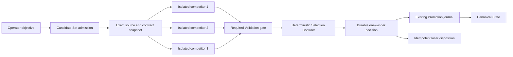

# Competing Futures architecture

## Purpose

Phase 9 turns Candidate State isolation into a deterministic optimization primitive.
One Candidate Set explores bounded sibling futures from one exact source, excludes every Candidate that fails a required Validation, persists a reproducible winner decision, and promotes at most one winner.

ADR 0011 is proposed and this document is an implementation-ready design, not yet accepted behavior.

## Trust and authority flow



The operator authorizes the objective, bounded competitors, Selection Contract, and loser policy.
The Runtime may create Candidate content but has no selection or Promotion authority.
The trusted evaluators produce bounded criterion inputs.
The Selection engine applies only the snapshotted deterministic contract.
The existing Promotion journal remains the authority for canonical advancement and supported effects.

## Aggregate model

### Candidate Set

A Candidate Set contains:

- A schema version and stable set identifier.
- The Agent identifier and operator objective.
- The exact source state identifier, composite hash, Codex thread identifier, and sorted provider-version vector.
- The complete snapshotted Outcome Contract.
- The complete snapshotted Selection Contract.
- Two through eight unique competitor specifications.
- A bounded concurrency limit and aggregate execution budget.
- The loser policy `retain` or `discard`.
- Monotonic phase, timestamps, scorecard, selected competitor identifier, winner Promotion Run identifier, and bounded recovery error.

### Competitor

A competitor contains:

- A stable identifier whose byte ordering is the final tie-break.
- A unique Run Transaction identifier.
- A trusted executor-profile identifier and a bounded strategy instruction.
- Status, timestamps, usage, and the ordinary Run Transaction evidence produced by evaluation.
- A sealed Candidate reference for an eligible Candidate or a Quarantine or Discard reference for an ineligible or failed Candidate.
- Criterion inputs, normalized integer values, eligibility exclusions, and loser disposition.

Executor profiles are trusted control-plane configuration identifiers.
They never carry a model key, provider credential, environment value, or arbitrary Runtime option in durable Candidate Set input.

### Selection Contract

The first schema supports an ordered list of closed criteria:

| Criterion | Source | Direction | Bound |
| --- | --- | --- | --- |
| `quality-assertion` | Versioned trusted evaluator | Maximize | `0..1_000_000` |
| `changed-files` | Persisted workspace change evidence | Minimize | `0..10_000` |
| `added-bytes` | Persisted workspace change evidence | Minimize | `0..100_000_000` |
| `latency-ms` | Trusted monotonic execution measurement | Minimize | `0..3_600_000` |
| `total-tokens` | Trusted Runtime usage response | Minimize | `0..10_000_000` |

Every raw value is parsed as an integer and clamped only by rejection, never silent truncation.
For a maximize criterion, the normalized score equals the raw value.
For a minimize criterion with declared maximum `M`, the normalized score equals `M - rawValue`.
Candidates are compared lexicographically by the ordered normalized vector and then by ascending competitor identifier.
No floating-point value, locale comparison, current timestamp, map iteration order, or unrecorded model output may affect the result.

If an eligible Candidate lacks a required criterion input, it is excluded with a named reason.
If every Candidate is excluded or fails a required Validation, the set completes with `no-winner` and Canonical State remains unchanged.

## Evaluation and Promotion seam

The existing combined method becomes three explicit operations:

```ts
evaluateCandidate(request, transaction, onProgress): Promise<EvaluatedCandidate>

selectCandidates(candidateSet, evaluatedCandidates): CandidateSelectionDecision

promoteEvaluatedCandidate(
  evaluatedCandidate,
  selectionDecision,
  onProgress,
): Promise<AirlockRunResult>
```

`evaluateCandidate` may prepare resources, execute Runtime, rescan confinement boundaries, validate built-in and provider resources, parse deferred intents, and seal or quarantine the Candidate.
It may not plan or execute Promotion, write a Promotion journal, dispatch effects, or change Canonical State.

An eligible seal commits to:

- Candidate manifest and exact source fields.
- Workspace, Codex session, SQLite, outbox, and composite fingerprints.
- Sorted provider Candidate handles and candidate fingerprints.
- Full Outcome Contract and Validation evidence hashes.
- Parsed External Action Intent evidence hash.
- Runtime result hash and bounded usage.

The seal does not make an external provider Candidate physically immutable.
Therefore `promoteEvaluatedCandidate` repeats provider description, required Validation, and exact fingerprint comparison before accepting provider Promotion plans.
Any drift after selection produces `recovery-error` for the chosen future rather than selecting a runner-up.

Ordinary `run` becomes a compatibility composition of `evaluateCandidate` and `promoteEvaluatedCandidate` with a one-candidate decision.
Compatibility tests must prove its persisted evidence and HTTP behavior remain unchanged.

## Set-scoped isolation

The workspace manager resolves the Canonical source once and prepares every sibling from its immutable version root.
Preparation fails the complete set if any sibling manifest names a different source state, composite hash, thread identifier, Outcome Contract version, or provider vector.

Each competitor receives only:

- Its own workspace and Codex home.
- Its own empty outbox derived for that Run identifier.
- Its own provider Candidate roots and handles.
- Its own disposable Repair reference only if a later ADR explicitly permits competing Repair.
- Its own bounded strategy instruction plus the shared objective.

Sibling roots are never mounted together.
Runtime environment names identify resource kinds but contain no set path or sibling identifier that could be resolved into another Candidate.
Post-Runtime confinement rescans remain mandatory for every competitor.

## Persistence and recovery

Candidate Set journals live outside every Runtime mount and are written with atomic replacement.
Every journal is strictly parsed, bounded, credential-checked, and validated against deterministic set and decision digests before it can authorize Promotion or cleanup.

| Durable phase | Recovery action |
| --- | --- |
| `admitted` | Resume or safely start missing sibling evaluations from the exact source. |
| `evaluating` | Reconcile each competitor independently and never infer a passing evaluation from partial evidence. |
| `evaluated` | Recompute the scorecard from persisted evidence and require the exact stored digest before selection. |
| `selected` | Recheck source freshness and start Promotion for only the named winner. |
| `promoting` | Delegate to the existing winner Promotion journal and never select another competitor. |
| `promoted` | Verify the accepted Canonical State names the winner, then resume loser cleanup. |
| `no-winner` | Preserve Canonical State and resume the declared loser dispositions. |
| `cleaning-losers` | Retry provider Discard or retain Quarantine one competitor at a time with durable progress. |
| `completed` | Reconstruct missing control-plane status without new execution, selection, Promotion, or effects. |
| `stale` or `recovery-error` | Preserve Canonical State and all unresolved evidence for operator diagnosis. |

The Candidate Set journal protects every unresolved sibling from retention cleanup.
If the winner Promotion journal exists, its plan and the Candidate Set selection digest must name the same set, competitor, source, and seal.
Any contradiction fails recovery closed.

## Service and API boundary

The Agent service holds one Agent-level lease for the complete Candidate Set.
The set scheduler may execute siblings concurrently up to the snapshotted bound without registering each sibling as an independent active Agent operation.
Ordinary Run, Repair, configuration update, archive, stop, and another Candidate Set conflict with that lease.

The initial HTTP boundary is:

```text
POST /api/agents/:agentId/candidate-sets
GET  /api/candidate-sets/:candidateSetId
POST /api/candidate-sets/:candidateSetId/cancel
```

Admission accepts an objective, two through eight trusted competitor profile identifiers, a Selection Contract, and loser policy.
It rejects credentials, unknown fields, duplicate competitor identifiers, unbounded strategy text, unsupported evaluator versions, an inactive Agent, an active Agent operation, an uncommitted Resource Registry generation, or a stale Canonical source.

Cancellation before a winner decision quarantines or discards every sibling according to policy and leaves Canonical State unchanged.
Cancellation after a winner decision cannot reverse the durable selection or approved Promotion and instead follows existing forward-recovery semantics.

## Initial deterministic proof

The no-cost fixture creates three strategies from one source:

1. `unsafe-fast` finishes quickly but deletes a protected file and is ineligible.
2. `broad-valid` passes every required Validation but changes more files and bytes.
3. `focused-valid` passes every required Validation and wins the declared quality, changed-file, and byte criteria.

The browser must show why `unsafe-fast` could not enter ranking, every score component for both eligible Candidates, the deterministic tie-break rule, the one winner, and each loser disposition.
Restart injection covers every Candidate Set journal phase and every existing winner Promotion phase.

## Required acceptance matrix

- Two sibling Runtimes probe for each other's workspace, Codex home, outbox, and provider paths and find none.
- Every sibling manifest records the same source identifiers, hashes, thread, contract, and provider vector.
- Competitor scheduling order and completion order do not change the scorecard or winner.
- A required Validation failure remains ineligible even with the highest quality value and lowest cost.
- Missing, negative, floating-point, oversized, or unknown criterion inputs fail closed.
- A byte-identical replay produces a byte-identical scorecard and selection digest.
- A canonical change before the decision produces `stale` with no Promotion journal.
- A canonical change after the decision but before Promotion preserves the decision and produces `stale` with no runner-up.
- Crash recovery before selection may resume evaluation but cannot invent eligibility.
- Crash recovery after selection promotes only the named winner.
- Crash recovery after canonical advancement dispatches only winner intents and completes loser cleanup.
- Winner Promotion contradiction produces `recovery-error` and never promotes a runner-up.
- Retained losers remain Repair-ineligible until a later explicit lineage decision.
- Ordinary Run and Repair regression suites remain byte-compatible.
- All proofs run with deterministic local fixtures and no ModelArk credential, paid provider, or public blockchain transaction.

