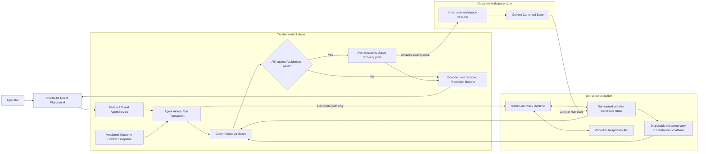

# Agent Airlock one-page architecture

## Falsifiable guarantee

An Agent Run may freely mutate its isolated Candidate State, but it cannot change Canonical State unless every required Validation in the snapshotted Outcome Contract passes.

## One Run, one decision

1. Airlock resolves and verifies the current immutable Canonical State.
2. Airlock copies it into a Run-owned Candidate State and gives only that path to the existing Runtime.
3. The Agent uses Codex and ModelArk normally and may write files or run tools inside Candidate State.
4. Airlock calculates a bounded change set and evaluates path safety, protected and required paths, change limits, secret patterns, and configured commands.
5. Project commands run against a disposable copy with no network, no application credentials, a read-only root, dropped capabilities, and resource limits.
6. A pass moves the candidate into a new immutable version and atomically advances `canonical.json`.
7. A failure, Runtime error, or cancellation quarantines or removes the candidate while the canonical identifier and fingerprint remain unchanged.
8. The Playground receives a terminal receipt whose disposition, evidence hash, timeline, change summary, and decisive failure agree with persisted state.

## Trust and recovery boundary

The Fastify control plane, Airlock state manager, and canonical manifest are trusted in this proof of concept.
The Agent Runtime, generated project content, and project validation commands are untrusted.
The atomic canonical manifest is the Phase 2 recovery point and the only source of accepted state.
Canonical workspace versions are never mounted writable into the Runtime or validation container.

## Implemented and tested in Phases 0-2

- Starter-kit Agent CRUD, lifecycle controls, Playground chat, persistence, Codex runner seam, and container path remain intact.
- Promotion, destructive Quarantine, Runtime failure, and cancellation preserve the documented canonical-state invariant.
- Outcome Contracts are versioned and snapshotted per Run.
- Validation evidence is size bounded, duration bounded, and redacted before persistence.
- A production-browser journey proves safe Promotion followed by destructive Quarantine and unchanged accepted reality.
- An opt-in real-container suite proves validation containment without an Ark key or writable canonical mount.

## Deliberate non-claims

This phase does not yet make the Codex session a transactional resource, dispatch external actions, repair quarantined candidates, or reconcile promotion through a crash journal.
Those are explicit later phases rather than hidden assumptions in the qualifying guarantee.
