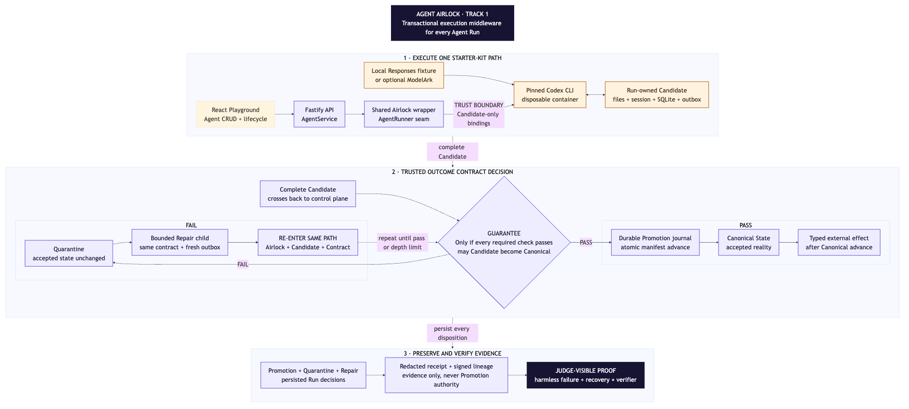
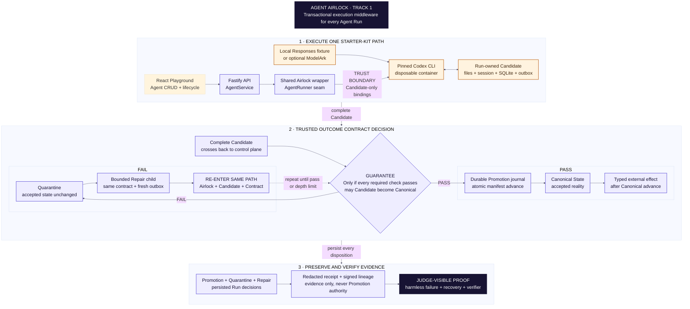

# Agent Airlock one-page architecture

**Selected track:** Track 1 - Agent Launchpad: Design and Build Lightweight Agent Middleware.

## One reusable capability

Agent Airlock adds one transactional execution boundary to the starter kit's shared `AgentRunner` seam, so the same isolation, Validation, Promotion, Quarantine, and Repair rules apply to every Agent Run.
The official scoring lens is 40% end-to-end middleware behavior, 25% technical design and integration, 20% verification and robustness, and 15% demo and reproducibility.

## Falsifiable guarantee

An Agent Run may freely mutate its isolated workspace, Codex session, SQLite data, and supported action outbox, but none can change Canonical State unless every required Validation passes.

The standalone Mermaid source is [agent-airlock-one-page.mmd](agent-airlock-one-page.mmd).
The complete implementation architecture remains in [agent-airlock.md](../architecture/agent-airlock.md).

## Five-step flow

1. The operator sends any Agent task through the existing React Playground, Fastify API, and `AgentService`, which route it through the shared Airlock wrapper at the `AgentRunner` seam.
2. Airlock copies the immutable Canonical workspace, Codex session, and SQLite snapshot into Run-owned Candidate State, creates a fresh outbox, and gives the disposable Codex container no mutable Canonical State path.
3. Airlock snapshots the Agent's versioned Outcome Contract and validates the complete Candidate, including file policy, SQLite integrity, bounded action intents, secret scanning, and constrained project commands.
4. A pass records durable approval, installs one immutable version, and atomically advances `canonical.json`, while a failure quarantines every Candidate resource and a Repair child must re-enter the same boundary with the original contract, exact failure evidence, verified Canonical reference, and fresh outbox.
5. Supported effects become claimable only after the manifest advances, while the receipt and optional signed decision chain preserve evidence without becoming Promotion authority.

## What is real in the canonical proof

The React UI, Fastify API, `AgentService`, `AgentRunner`, pinned Codex CLI, disposable container, Candidate file mutation, `.airlock/demo.sqlite` mutation, persistent session, outbox, Validation, Promotion journal, atomic manifest change, Quarantine, Repair, and browser-local verification are real.
Only remote inference is replaced by the disclosed local deterministic Responses fixture.
ModelArk remains a separate optional conformance path when free capacity is available and is not required for the Track 1 middleware proof.

## Trust and recovery boundary

The Fastify control plane, Airlock state manager, Outcome Contract source, Promotion journal, and atomic canonical manifest are trusted for this proof of concept.
The Agent Runtime, generated project content, project validation commands, and all Candidate resources are untrusted.
Canonical workspace, Codex-session, and SQLite versions are never mounted writable into the Runtime or validation container.
Startup recovery may finish only the exact durable approved decision recorded before interruption and fails closed on physical fingerprint contradiction.

## Deliberate limitations

- Exactly-once delivery ends at the supported atomic local consumer and is not a distributed transaction with arbitrary providers.
- Unrestricted Runtime traffic outside the typed outbox is not transactionally controlled.
- The journal targets one local control-plane process and does not claim distributed consensus or power-loss durability.
- Ordinary containers are not hardened multi-tenant isolation.
- Signatures prove artifact integrity and lineage, not Runtime correctness, signer identity, or policy sufficiency.
- Live ModelArk availability and model quality are not claimed by the deterministic core recording.
