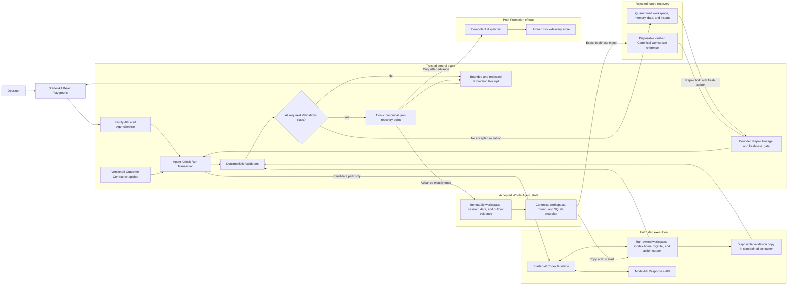

# Agent Airlock one-page architecture

## Falsifiable guarantee

An Agent Run may freely mutate its isolated workspace, reasoning, SQLite data, and supported action outbox, but none can change accepted reality unless every required Validation passes.

## One Run, one decision

1. Airlock resolves and verifies the current immutable Canonical State.
2. Airlock copies its workspace, Codex home, and SQLite database into Run-owned Candidate State and creates a fresh dedicated outbox.
3. The Agent uses Codex and ModelArk normally and may change files, data, reasoning, and supported action intents inside Candidate State.
4. Airlock calculates a bounded change set and evaluates workspace policy, SQLite integrity and schema, semantic data secrets, and strict action-intent limits.
5. Project commands run against a disposable copy with no network, no application credentials, a read-only root, dropped capabilities, and resource limits.
6. A pass moves the complete candidate into a new immutable version and atomically advances `canonical.json`.
7. Only after that advance may the idempotent mock consumer claim a validated notification intent.
8. A failure, Runtime error, or cancellation quarantines all candidate resources and produces no mock effect.
9. The Playground receives one disposition whose resource fingerprints, data snapshot, effect status, evidence hash, and decisive failure agree with persisted state.
10. The operator may discard mutable Quarantine state or fork one bounded Repair Run that resumes rejected memory, preserves useful work, uses a fresh outbox, and must pass the original contract before Promotion.

## Trust and recovery boundary

The Fastify control plane, Airlock state manager, and canonical manifest are trusted in this proof of concept.
The Agent Runtime, generated project content, and project validation commands are untrusted.
The atomic canonical manifest is the Phase 2 recovery point and the only source of accepted state.
Canonical workspace, Codex-session, and SQLite versions are never mounted writable into the Runtime or validation container.
The platform-owned delivery store is never mounted into either execution boundary.

## Implemented and tested in Phases 0-5

- Starter-kit Agent CRUD, lifecycle controls, Playground chat, persistence, Codex runner seam, and container path remain intact.
- Promotion, destructive Quarantine, Runtime failure, and cancellation preserve the documented canonical-state invariant.
- Outcome Contracts are versioned and snapshotted per Run.
- Validation evidence is size bounded, duration bounded, and redacted before persistence.
- A production-browser journey proves safe Promotion followed by destructive Quarantine and unchanged accepted reality.
- The same journey stores rejected reasoning in Quarantine and proves that the next turn resumes only accepted reasoning.
- A Whole-Agent resource ledger shows one disposition across workspace, Agent memory, SQLite, and supported external actions.
- A promoted multi-resource fixture changes code and data and produces one mock notification under duplicate dispatch attempts.
- A rejected multi-resource fixture preserves its changed database and intent in Quarantine while canonical data and delivery count remain unchanged.
- A repaired child starts from the exact Quarantine, restores protected canonical content from a verified disposable reference, retains useful rejected work, intentionally resubmits its action, and promotes with ancestry in its receipt.
- Stale, missing, duplicate-child, and exhausted-depth repairs fail before execution, while discard is idempotent and retains decision evidence.
- An opt-in real-container suite proves validation containment without an Ark key or writable canonical mount.

## Deliberate non-claims

The exactly-once guarantee ends at the atomic mock consumer and does not claim a distributed transaction with arbitrary providers.
Unrestricted Runtime network egress can bypass the supported outbox.
Promotion crash-journal reconciliation remains an explicit Phase 6 target.
A local-process Repair Run receives a disposable canonical copy whose integrity is promotion-gated, while the container provider additionally mounts that copy read-only.
