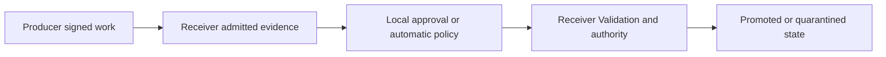

# Offline receiver custody proof room

## Decision summary

Agent Airlock should extend the existing zero-upload verifier into an offline receiver custody proof room.
The proof room should render a concise causal story only from a successful browser verifier report and a new bounded verified-story projection.
It should never let presentation code derive claims directly from untrusted packet JSON.

The primary judge experience should take less than one minute:

1. Import the downloaded receiver custody packet.
2. See the producer and receiver signatures verify locally.
3. Follow the exact Admission, optional Approval, terminal authority, and state-disposition path.
4. See organizational trust remain explicitly unevaluated until separate evaluator policy is supplied.
5. Attack a disposable copy and watch the first violated boundary fail closed.

This phase makes existing guarantees legible and falsifiable.
It does not add new execution authority, online trust, or blockchain dependence.

## Repository-grounded inventory

The existing `ReceiptVerifier` already provides:

- Local JSON file selection with no upload path.
- A 4 MB input limit for receipts, evidence packets, and decision chains.
- Browser Web Crypto verification for canonical SHA-256 digests and Ed25519 signatures.
- Separate cryptographic and organizational-trust verdicts for ordinary receipts.
- Evaluator-pinned policy authority fingerprints, optional authority rotation, and signed policy import.
- Explicit unsupported claims.
- Responsive one-column layouts below the existing mobile breakpoint.
- Production browser coverage for valid, invalid, trust-policy, lineage, and mobile states.

The Phase 19 receiver custody implementation already provides:

- A strict `agent-airlock/portable-receiver-chain-of-custody` version 1 packet.
- A custody-specific receiver signature domain.
- Typed producer and receiver record descriptors.
- Exact producer Federated Work Bundle verification.
- Exact receiver Admission and optional Approval commitments.
- A privacy-bounded terminal Decision Authority commitment.
- A separately signed receiver Promotion Receipt.
- Promoted and quarantined Canonical State handoff checks.
- Safe diagnostic strings and forbidden-evidence rejection.
- Node and browser verification paths.

The current gap is that `PortableVerifierArtifact` does not include a receiver custody packet and `ReceiptVerifier.verifySource` does not dispatch to its verifier.
The federation panel can verify and download the packet, but a downloaded packet cannot be reopened in the independent verifier.

## Product model

The proof room should answer three different questions in order.

### 1. Is the packet mathematically intact?

This verdict comes only from `verifyReceiverCustodyPacketJsonInBrowser`.
It covers the signed manifest, every typed record commitment, nested producer evidence, receiver receipt, and authority bindings.

### 2. What receiver decision path does the valid packet prove?

This story comes only from a bounded projection returned by the verifier after every required cryptographic and authority check passes.
The UI must not parse raw records to construct this story.

### 3. Does this evaluator authorize both organizations?

This is an optional second verdict.
The evaluator supplies producer and receiver trust roots and signed policies separately from the packet.
A mathematically valid packet remains visibly `trust not evaluated` until both roles are assessed under different policy identities.

## Verified story projection

The browser verifier should add a nullable `story` field to the receiver custody report.
It must remain `null` unless the complete packet is valid.

The projection should contain only bounded values already covered by the verified custody bindings:

```ts
interface ReceiverCustodyVerifiedStory {
  disposition: "promoted" | "quarantined";
  approval: "automatic" | "operator-approved";
  producer: {
    producerId: string;
    keyId: ReceiptDigest;
    receiptDigest: ReceiptDigest;
    artifactDigest: ReceiptDigest;
  };
  receiver: {
    agentId: string;
    runId: string;
    keyId: ReceiptDigest;
    receiptDigest: ReceiptDigest;
  };
  authority: {
    admissionId: ReceiptDigest;
    admissionRecordDigest: ReceiptDigest;
    approvalDecisionDigest: ReceiptDigest | null;
    decisionContextDigest: ReceiptDigest | null;
    terminalAuthorityDigest: ReceiptDigest;
    outcomeContractDigest: ReceiptDigest;
    validationEvidenceRoot: ReceiptDigest;
  };
  state: {
    canonicalAdvanced: boolean;
    beforeStateId: string;
    afterStateId: string;
    beforeCompositeHash: ReceiptDigest;
    afterCompositeHash: ReceiptDigest;
  };
}
```

The projection must not include raw prompts, Runtime output, Validation output, file contents, operations, local paths, or embedded trust policy.

## Visual hierarchy

The first viewport should contain only the local boundary, file control, primary verdict, and one causal chain.
Raw check cards and identifiers should follow under progressive disclosure.

The causal chain should use five compact nodes:



Each node may be green only when its mapped verifier checks passed.
The terminal node uses distinct language rather than treating Quarantine as a failed proof.

- Promoted: `Canonical State advanced to the verified receiver state.`
- Quarantined: `Canonical State remained at the verified before-state.`

The story should show `Cryptographically valid` and `Organizational trust not evaluated` as separate adjacent verdicts.
This prevents an included public key from appearing self-authorizing.

## Screen states

| State | Primary message | Required behavior |
| --- | --- | --- |
| Empty | `Drop a receiver custody proof` | Explain local-only processing, accepted schema, and 16 MB custody limit. |
| Verifying | `Verifying every custody hop locally` | Disable replacement and tamper actions until verification settles. |
| Valid promoted | `Receiver custody path complete` | Render all five nodes and a terminal Canonical advancement. |
| Valid quarantined | `Receiver containment path complete` | Render all five nodes and prove identical before and after state commitments. |
| Valid, trust unevaluated | `Signatures valid, organizations not yet authorized` | Keep mathematical proof green and organizational trust neutral. |
| Valid, both roles trusted | `Both trust domains authorized by evaluator policy` | Name both distinct policy identifiers and role scopes. |
| Valid, one role untrusted | `Organizational trust failed for producer or receiver` | Preserve mathematical validity and identify only the failed role. |
| Invalid structure | `Unsupported or incomplete custody packet` | Show one safe structural diagnostic and no story projection. |
| Invalid cryptography | `Custody proof rejected` | Show the first failed check and never render committed claims as verified. |
| Tampered copy | `Attack detected at <boundary>` | Compare original-valid and disposable-copy-invalid states without changing the original. |

## Claim mapping

| Visual claim | Required verifier evidence |
| --- | --- |
| Exact manifest is intact | `manifest-digest` and `receiver-signature` pass. |
| Receiver signer identity is internally consistent | `receiver-key-id` passes. |
| Every carried record is the committed record | `record-commitments` passes. |
| Producer signed the exact receipt and artifact handoff | `producer-evidence` passes. |
| Receiver signed the terminal receipt | `receiver-terminal-receipt` passes. |
| Admission, review, authority, Validation, and disposition form one path | `authority-links` passes. |
| Canonical State advanced | Valid story disposition is `promoted` and the verified receiver receipt names the after-state. |
| Canonical State did not advance | Valid story disposition is `quarantined` and before and after state commitments are identical. |
| Producer is organizationally trusted | Producer policy signature and evaluator root pass, then producer receipt key scope passes. |
| Receiver is organizationally trusted | Receiver policy signature and evaluator root pass, then receiver receipt key scope passes. |

## Non-claims

The proof room must say that it does not establish:

- That Runtime isolation was sufficient.
- That the receiver Outcome Contract was sufficient.
- That Validation commands were trustworthy.
- That an unsigned Admission or Approval record existed before receiver export.
- That either signer clock was externally synchronized.
- That a mathematically valid included key is organizationally trusted.
- That undisclosed committed evidence is safe or correct.
- That transparency or blockchain publication granted Admission or Promotion authority.

## Evaluator trust interaction

Producer and receiver trust controls should be collapsed by default under `Evaluate organizational trust`.
Each role receives its own pinned policy-authority fingerprint, optional authority rotation, and signed policy file.
The two signed policies must have different policy identifiers.

The role verdicts are independent:

- `Producer trusted, receiver not evaluated` is valid and incomplete.
- `Producer trusted, receiver rejected` preserves the green cryptographic verdict while showing a red receiver trust verdict.
- `Both trusted` requires both policies to authorize the exact role signer, Agent scope, disposition, and evaluation time.

No packet field may prefill a trusted authority fingerprint.

## Bounded tamper lab

The tamper lab should operate only on `structuredClone` output held in component memory.
The original source string and original valid report remain immutable until the user selects another file.

The first release should include three deterministic attacks:

| Attack | Mutation | Expected first boundary |
| --- | --- | --- |
| Remove receiver Admission | Delete the Admission record from the cloned packet. | `packet-structure` fails for a missing committed record. |
| Alter reviewed evidence | Flip one character in the Approval record canonical bytes. | `record-commitments` or `packet-structure` fails before the altered decision can be interpreted. |
| Rewrite final disposition | Change the manifest binding disposition without a new receiver signature. | `manifest-digest` and receiver signature fail. |

The UI should label these as attacks against a disposable copy, not as editing or repairing evidence.
The verifier should report the first violated boundary and allow one-click reset to the still-valid original.

The proof room should not expose a general JSON editor.
A general editor adds clutter, weakens the judge story, and can accidentally render unverified fields as meaningful.

## Privacy and lifecycle

- Accept custody packets up to the protocol's 16 MB maximum rather than the existing generic 4 MB limit.
- Read files through the browser `File` API only.
- Perform no fetch, XMLHttpRequest, beacon, service-worker publication, clipboard write, or storage write.
- Keep source bytes in component memory only while the proof room is open.
- Clear source, parsed packet, cloned attacks, trust policy sources, and reports on close.
- Keep every diagnostic bounded through the existing safe diagnostic path.
- Never display raw canonical record bytes.
- Never display values rejected by the forbidden-evidence scan.

## Accessibility and mobile behavior

- The primary verdict must use text and iconography rather than color alone.
- The causal nodes must be an ordered list in the accessibility tree.
- Each node needs a concise name and one sentence of evidence.
- The 390 CSS pixel layout should stack nodes vertically and remove decorative arrows from the accessibility tree.
- Focus should move to the primary verdict after verification and to the failed boundary after a tamper action.
- The close action must restore focus to the control that opened the proof room.
- Long digests should be visually truncated while remaining available through an explicit copy control.

## Implementation sequence

### Slice 1: Protocol-owned story

- Add the nullable verified-story projection to the receiver custody browser report.
- Populate it only after every custody check passes.
- Add tests proving invalid and unsafe packets cannot produce a story.

### Slice 2: Offline proof room

- Add receiver custody packets to `PortableVerifierArtifact` and verifier dispatch.
- Render the five-node promoted and quarantined stories.
- Keep detailed cryptographic checks under progressive disclosure.
- Reuse the existing local-only boundary treatment.

### Slice 3: Separate trust domains

- Add distinct producer and receiver evaluator trust controls.
- Reuse the existing signed trust-policy and authority-rotation verifiers.
- Evaluate the exact producer and receiver receipt envelopes without creating a second custody verifier.

### Slice 4: Attack the proof

- Add the three deterministic in-memory attacks and reset behavior.
- Display the first failed verifier boundary and preserve the original report.

### Slice 5: Release proof

- Extend production UI tests for promoted, quarantined, invalid, tampered, and separate-trust states.
- Extend the real two-instance journey to reopen the downloaded packet in the independent verifier.
- Disconnect the page from its backend before the final verification assertion.
- Run the complete local and hosted release gates on the final revision.

## Acceptance matrix

| Scenario | Expected evidence | Expected state |
| --- | --- | --- |
| Promoted packet | Every custody check passes and story is non-null. | Green promoted chain and neutral trust verdict. |
| Quarantined packet | Every custody check passes and before equals after. | Green containment chain and neutral trust verdict. |
| Missing Admission | Structural check fails. | No story and red rejection. |
| Changed Approval bytes | Record commitment fails. | No story and attack boundary identified. |
| Changed disposition | Manifest and signature checks fail. | No story and attack boundary identified. |
| Unsafe path or credential string | Evidence-boundary check fails. | No story and safe diagnostic only. |
| Producer policy only | Producer authorization passes. | Receiver trust remains explicitly unevaluated. |
| Both policies authorize exact keys | Both role evaluations pass. | Separate green producer and receiver trust verdicts. |
| One policy uses the other role's key | Role evaluation fails. | Mathematical proof remains green and role trust is red. |
| Backend disconnected after file selection | Browser verification still completes. | Same result as connected mode with zero network requests. |

## Recommendation

Proceed with the five slices in order.
Do not begin with animation or tamper controls before the protocol-owned story projection exists.
The winning interaction is one honest causal chain with a button that lets the judge break it, not a larger dashboard.
